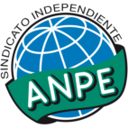

Solicitud de oposiciones 2016
======================================================

  
  
Este informe contiene un listado detallado de las localidades y centros por cada
localidad ordenando todo en función de la distancia/tiempo aproximados que se
necesitaría para desplazarte desde tu localidad de residencia (en tu caso,
nos has indicado **Casarrubios del Monte**).

Por favor, recuerda que el cálculo es aproximado y que aunque hemos
intentado verificar todos los códigos es posible que hayamos cometido algún
error. Dado que la solicitud electrónica también te muestra los pueblos, por
favor asegúrate de que introduces la petición de un centro o localidad que
te interese. En este documento
*no hemos incluido ningún codigo de centro penitenciario*, por lo que si deseas
solicitar alguno te rogamos los busques en la solicitud.

Si crees que hemos cometido algún error,te agradeceríamos que nos lo comentases
escribiendo a afiliados@anpecr.com.

Esperamos que este documento te resulte de utilidad.

Listado de códigos
-------------------

- ``906313`` Valmojado  (7 minutos, 6 km)

  -``320310`` Aula de Educación de Adultos de Valmojado
    

  -``320132`` Colegio de Educación Infantil y Primaria Santo Domingo de Guzmán
    

  -``320221`` Instituto de Educación Secundaria Cañada Real
    

- ``907034`` Las Ventas de Retamosa  (12 minutos, 10 km)

  -``320777`` Colegio de Educación Infantil y Primaria Santiago Paniego
    

- ``899496`` Palomeque  (13 minutos, 12 km)

  -``303856`` Colegio de Educación Infantil y Primaria San Juan Bautista
    

- ``857450`` Cedillo del Condado  (14 minutos, 14 km)

  -``282344`` Colegio de Educación Infantil y Primaria Nuestra Señora de la Natividad
    

- ``858716`` Chozas de Canales  (14 minutos, 13 km)

  -``283154`` Colegio de Educación Infantil y Primaria Santa María Magdalena
    

- ``855107`` Calypo Fado  (16 minutos, 12 km)

  -``275232`` Colegio de Educación Infantil y Primaria Calypo
    

- ``865283`` Lominchar  (16 minutos, 19 km)

  -``295039`` Colegio de Educación Infantil y Primaria Ramón y Cajal
    

- ``910183`` El Viso de San Juan  (16 minutos, 16 km)

  -``323107`` Colegio de Educación Infantil y Primaria Fernando de Alarcón
    

  -``323296`` Colegio de Educación Infantil y Primaria Miguel Delibes
    

- ``855385`` Camarena  (17 minutos, 17 km)

  -``276131`` Colegio de Educación Infantil y Primaria Alonso Rodríguez
    

  -``276042`` Colegio de Educación Infantil y Primaria María del Mar
    

  -``276220`` Instituto de Educación Secundaria Blas de Prado
    

- ``903160`` Santa Cruz del Retamar  (19 minutos, 25 km)

  -``308084`` Colegio de Educación Infantil y Primaria Nuestra Señora de la Paz
    

- ``879878`` Mentrida  (20 minutos, 17 km)

  -``299547`` Colegio de Educación Infantil y Primaria Luis Solana
    

  -``299636`` Instituto de Educación Secundaria Antonio Jiménez-Landi
    

- ``901451`` Recas  (20 minutos, 23 km)

  -``306731`` Colegio de Educación Infantil y Primaria Cesar Cabañas Caballero
    

  -``306820`` Instituto de Educación Secundaria Arcipreste de Canales
    

- ``911260`` Yuncos  (20 minutos, 19 km)

  -``324462`` Colegio de Educación Infantil y Primaria Guillermo Plaza
    

  -``324284`` Colegio de Educación Infantil y Primaria Nuestra Señora del Consuelo
    

  -``324551`` Colegio de Educación Infantil y Primaria Villa de Yuncos
    

  -``324373`` Instituto de Educación Secundaria la Cañuela
    

- ``856373`` Carranque  (22 minutos, 20 km)

  -``280279`` Colegio de Educación Infantil y Primaria Guadarrama
    

  -``281089`` Colegio de Educación Infantil y Primaria Villa de Materno
    

  -``280368`` Instituto de Educación Secundaria Libertad
    

- ``901273`` Quismondo  (22 minutos, 32 km)

  -``306553`` Colegio de Educación Infantil y Primaria Pedro Zamorano
    

- ``911082`` Yuncler  (22 minutos, 26 km)

  -``324006`` Colegio de Educación Infantil y Primaria Remigio Laín
    

- ``852599`` Arcicollar  (23 minutos, 23 km)

  -``271180`` Colegio de Educación Infantil y Primaria San Blas
    

- ``864295`` Illescas  (23 minutos, 32 km)

  -``292331`` Centro Público de Educación de Personas Adultas Pedro Gumiel
    

  -``293230`` Colegio de Educación Infantil y Primaria Clara Campoamor
    

  -``293141`` Colegio de Educación Infantil y Primaria Ilarcuris
    

  -``292242`` Colegio de Educación Infantil y Primaria la Constitución
    

  -``292064`` Colegio de Educación Infantil y Primaria Martín Chico
    

  -``293052`` Instituto de Educación Secundaria Condestable Álvaro de Luna
    

  -``292153`` Instituto de Educación Secundaria Juan de Padilla
    

- ``903527`` El Señorio de Illescas  (23 minutos, 32 km)

  -``308351`` Colegio de Educación Infantil y Primaria el Greco
    

- ``910361`` Yeles  (23 minutos, 32 km)

  -``323652`` Colegio de Educación Infantil y Primaria San Antonio
    

- ``866360`` Maqueda  (24 minutos, 38 km)

  -``297104`` Colegio de Educación Infantil y Primaria Don Álvaro de Luna
    

- ``898319`` Numancia de la Sagra  (24 minutos, 21 km)

  -``302223`` Colegio de Educación Infantil y Primaria Santísimo Cristo de la Misericordia
    

  -``302312`` Instituto de Educación Secundaria Profesor Emilio Lledó
    

- ``899585`` Pantoja  (24 minutos, 34 km)

  -``304021`` Colegio de Educación Infantil y Primaria Marqueses de Manzanedo
    

- ``900007`` Portillo de Toledo  (24 minutos, 31 km)

  -``304666`` Colegio de Educación Infantil y Primaria Conde de Ruiseñada
    

- ``911171`` Yunclillos  (24 minutos, 26 km)

  -``324195`` Colegio de Educación Infantil y Primaria Nuestra Señora de la Salud
    

- ``854397`` Cabañas de la Sagra  (25 minutos, 30 km)

  -``274244`` Colegio de Educación Infantil y Primaria San Isidro Labrador
    

- ``898130`` Noves  (25 minutos, 33 km)

  -``302134`` Colegio de Educación Infantil y Primaria Nuestra Señora de la Monjia
    

- ``855474`` Camarenilla  (26 minutos, 28 km)

  -``277030`` Colegio de Educación Infantil y Primaria Nuestra Señora del Rosario
    

- ``906135`` Ugena  (26 minutos, 23 km)

  -``318705`` Colegio de Educación Infantil y Primaria Miguel de Cervantes
    

  -``318894`` Colegio de Educación Infantil y Primaria Tres Torres
    

- ``907490`` Villaluenga de la Sagra  (26 minutos, 29 km)

  -``321765`` Colegio de Educación Infantil y Primaria Juan Palarea
    

  -``321854`` Instituto de Educación Secundaria Castillo del Águila
    

- ``851144`` Alameda de la Sagra  (27 minutos, 40 km)

  -``267043`` Colegio de Educación Infantil y Primaria Nuestra Señora de la Asunción
    

- ``854575`` Calalberche  (27 minutos, 23 km)

  -``275054`` Colegio de Educación Infantil y Primaria Ribera del Alberche
    

- ``861220`` Fuensalida  (28 minutos, 33 km)

  -``289649`` Aula de Educación de Adultos de Fuensalida
    

  -``289738`` Colegio de Educación Infantil y Primaria Condes de Fuensalida
    

  -``288839`` Colegio de Educación Infantil y Primaria Tomás Romojaro
    

  -``289460`` Instituto de Educación Secundaria Aldebarán
    

- ``859615`` Cobeja  (29 minutos, 31 km)

  -``283332`` Colegio de Educación Infantil y Primaria San Juan Bautista
    

- ``861131`` Esquivias  (29 minutos, 38 km)

  -``288650`` Colegio de Educación Infantil y Primaria Catalina de Palacios
    

  -``288472`` Colegio de Educación Infantil y Primaria Miguel de Cervantes
    

  -``288561`` Instituto de Educación Secundaria Alonso Quijada
    

- ``866093`` Magan  (30 minutos, 38 km)

  -``296205`` Colegio de Educación Infantil y Primaria Santa Marina
    

- ``898597`` Olias del Rey  (30 minutos, 39 km)

  -``303211`` Colegio de Educación Infantil y Primaria Pedro Melendo García
    

- ``903349`` Santa Olalla  (30 minutos, 45 km)

  -``308173`` Colegio de Educación Infantil y Primaria Nuestra Señora de la Piedad
    

- ``852310`` Añover de Tajo  (31 minutos, 46 km)

  -``270370`` Colegio de Educación Infantil y Primaria Conde de Mayalde
    

  -``271091`` Instituto de Educación Secundaria San Blas
    

- ``903438`` Santo Domingo-Caudilla  (31 minutos, 46 km)

  -``308262`` Colegio de Educación Infantil y Primaria Santa Ana
    

- ``851411`` Alcabon  (32 minutos, 47 km)

  -``267310`` Colegio de Educación Infantil y Primaria Nuestra Señora de la Aurora
    

- ``853587`` Borox  (32 minutos, 42 km)

  -``273345`` Colegio de Educación Infantil y Primaria Nuestra Señora de la Salud
    

- ``908022`` Villamiel de Toledo  (32 minutos, 34 km)

  -``322119`` Colegio de Educación Infantil y Primaria Nuestra Señora de la Redonda
    

- ``863396`` Hormigos  (33 minutos, 51 km)

  -``291165`` Colegio de Educación Infantil y Primaria Virgen de la Higuera
    

- ``864017`` Huecas  (33 minutos, 33 km)

  -``291254`` Colegio de Educación Infantil y Primaria Gregorio Marañón
    

- ``905414`` Torrijos  (33 minutos, 42 km)

  -``318349`` Centro Público de Educación de Personas Adultas Teresa Enríquez
    

  -``318438`` Colegio de Educación Infantil y Primaria Lazarillo de Tormes
    

  -``317806`` Colegio de Educación Infantil y Primaria Villa de Torrijos
    

  -``318071`` Instituto de Educación Secundaria Alonso de Covarrubias
    

  -``318160`` Instituto de Educación Secundaria Juan de Padilla
    

- ``856551`` El Casar de Escalona  (35 minutos, 55 km)

  -``281267`` Colegio de Educación Infantil y Primaria Nuestra Señora de Hortum Sancho
    

- ``899763`` Las Perdices  (35 minutos, 46 km)

  -``304399`` Colegio de Educación Infantil y Primaria Pintor Tomás Camarero
    

- ``904159`` Seseña  (35 minutos, 44 km)

  -``308440`` Colegio de Educación Infantil y Primaria Gabriel Uriarte
    

  -``310056`` Colegio de Educación Infantil y Primaria Juan Carlos I
    

  -``308807`` Colegio de Educación Infantil y Primaria Sisius
    

  -``308718`` Instituto de Educación Secundaria las Salinas
    

  -``308629`` Instituto de Educación Secundaria Margarita Salas
    

- ``853120`` Barcience  (36 minutos, 46 km)

  -``272268`` Colegio de Educación Infantil y Primaria Santa María la Blanca
    

- ``853309`` Bargas  (36 minutos, 40 km)

  -``272357`` Colegio de Educación Infantil y Primaria Santísimo Cristo de la Sala
    

  -``273078`` Instituto de Educación Secundaria Julio Verne
    

- ``860143`` Domingo Perez  (36 minutos, 57 km)

  -``286307`` Colegio Rural Agrupado Campos de Castilla
    

- ``886980`` Mocejon  (36 minutos, 41 km)

  -``300069`` Aula de Educación de Adultos de Mocejon
    

  -``299903`` Colegio de Educación Infantil y Primaria Miguel de Cervantes
    

- ``905236`` Toledo  (36 minutos, 48 km)

  -``317083`` Centro de Educación Especial Ciudad de Toledo
    

  -``315730`` Centro Público de Educación de Personas Adultas Gustavo Adolfo Bécquer
    

  -``317172`` Centro Público de Educación de Personas Adultas Polígono
    

  -``315007`` Colegio de Educación Infantil y Primaria Alfonso Vi
    

  -``314108`` Colegio de Educación Infantil y Primaria Ángel del Alcázar
    

  -``316540`` Colegio de Educación Infantil y Primaria Ciudad de Aquisgrán
    

  -``315463`` Colegio de Educación Infantil y Primaria Ciudad de Nara
    

  -``316273`` Colegio de Educación Infantil y Primaria Escultor Alberto Sánchez
    

  -``317539`` Colegio de Educación Infantil y Primaria Europa
    

  -``314297`` Colegio de Educación Infantil y Primaria Fábrica de Armas
    

  -``315285`` Colegio de Educación Infantil y Primaria Garcilaso de la Vega
    

  -``315374`` Colegio de Educación Infantil y Primaria Gómez Manrique
    

  -``316362`` Colegio de Educación Infantil y Primaria Gregorio Marañón
    

  -``314742`` Colegio de Educación Infantil y Primaria Jaime de Foxa
    

  -``316095`` Colegio de Educación Infantil y Primaria Juan de Padilla
    

  -``314019`` Colegio de Educación Infantil y Primaria la Candelaria
    

  -``315552`` Colegio de Educación Infantil y Primaria San Lucas y María
    

  -``314386`` Colegio de Educación Infantil y Primaria Santa Teresa
    

  -``317628`` Colegio de Educación Infantil y Primaria Valparaíso
    

  -``315196`` Instituto de Educación Secundaria Alfonso X el Sabio
    

  -``314653`` Instituto de Educación Secundaria Azarquiel
    

  -``316818`` Instituto de Educación Secundaria Carlos III
    

  -``314564`` Instituto de Educación Secundaria el Greco
    

  -``315641`` Instituto de Educación Secundaria Juanelo Turriano
    

  -``317261`` Instituto de Educación Secundaria María Pacheco
    

  -``317350`` Instituto de Educación Secundaria Obligatoria Princesa Galiana
    

  -``316451`` Instituto de Educación Secundaria Sefarad
    

  -``314475`` Instituto de Educación Secundaria Universidad Laboral
    

- ``905325`` La Torre de Esteban Hambran  (36 minutos, 48 km)

  -``317717`` Colegio de Educación Infantil y Primaria Juan Aguado
    

- ``909744`` Villaseca de la Sagra  (36 minutos, 40 km)

  -``322753`` Colegio de Educación Infantil y Primaria Virgen de las Angustias
    

- ``860321`` Escalona  (37 minutos, 52 km)

  -``287117`` Colegio de Educación Infantil y Primaria Inmaculada Concepción
    

  -``287206`` Instituto de Educación Secundaria Lazarillo de Tormes
    

- ``901540`` Rielves  (38 minutos, 50 km)

  -``307096`` Colegio de Educación Infantil y Primaria Maximina Felisa Gómez Aguero
    

- ``904248`` Seseña Nuevo  (38 minutos, 49 km)

  -``310323`` Centro Público de Educación de Personas Adultas de Seseña Nuevo
    

  -``310412`` Colegio de Educación Infantil y Primaria el Quiñón
    

  -``310145`` Colegio de Educación Infantil y Primaria Fernando de Rojas
    

  -``310234`` Colegio de Educación Infantil y Primaria Gloria Fuertes
    

- ``856195`` Carmena  (39 minutos, 54 km)

  -``279929`` Colegio de Educación Infantil y Primaria Cristo de la Cueva
    

- ``862308`` Gerindote  (39 minutos, 44 km)

  -``290177`` Colegio de Educación Infantil y Primaria San José
    

- ``851233`` Albarreal de Tajo  (40 minutos, 53 km)

  -``267132`` Colegio de Educación Infantil y Primaria Benjamín Escalonilla
    

- ``852221`` Almorox  (40 minutos, 59 km)

  -``270281`` Colegio de Educación Infantil y Primaria Silvano Cirujano
    

- ``854119`` Burguillos de Toledo  (40 minutos, 57 km)

  -``274066`` Colegio de Educación Infantil y Primaria Victorio Macho
    

- ``856462`` Carriches  (40 minutos, 55 km)

  -``281178`` Colegio de Educación Infantil y Primaria Doctor Cesar González Gómez
    

- ``857272`` Cazalegas  (40 minutos, 68 km)

  -``282077`` Colegio de Educación Infantil y Primaria Miguel de Cervantes
    

- ``867359`` La Mata  (40 minutos, 56 km)

  -``298559`` Colegio de Educación Infantil y Primaria Severo Ochoa
    

- ``858627`` Los Cerralbos  (41 minutos, 62 km)

  -``283065`` Colegio Rural Agrupado Entrerríos
    

- ``888788`` Nambroca  (41 minutos, 59 km)

  -``300514`` Colegio de Educación Infantil y Primaria la Fuente
    

- ``854208`` Burujon  (42 minutos, 54 km)

  -``274155`` Colegio de Educación Infantil y Primaria Juan XXIII
    

- ``859704`` Cobisa  (42 minutos, 59 km)

  -``284053`` Colegio de Educación Infantil y Primaria Cardenal Tavera
    

  -``284142`` Colegio de Educación Infantil y Primaria Gloria Fuertes
    

- ``861042`` Escalonilla  (42 minutos, 55 km)

  -``287395`` Colegio de Educación Infantil y Primaria Sagrados Corazones
    

- ``853031`` Arges  (45 minutos, 63 km)

  -``272179`` Colegio de Educación Infantil y Primaria Miguel de Cervantes
    

  -``271369`` Colegio de Educación Infantil y Primaria Tirso de Molina
    

- ``856284`` El Carpio de Tajo  (45 minutos, 62 km)

  -``280090`` Colegio de Educación Infantil y Primaria Nuestra Señora de Ronda
    

- ``866182`` Malpica de Tajo  (45 minutos, 68 km)

  -``296394`` Colegio de Educación Infantil y Primaria Fulgencio Sánchez Cabezudo
    

- ``898041`` Nombela  (46 minutos, 62 km)

  -``302045`` Colegio de Educación Infantil y Primaria Cristo de la Nava
    

- ``852132`` Almonacid de Toledo  (47 minutos, 69 km)

  -``270192`` Colegio de Educación Infantil y Primaria Virgen de la Oliva
    

- ``863029`` Guadamur  (47 minutos, 67 km)

  -``290266`` Colegio de Educación Infantil y Primaria Nuestra Señora de la Natividad
    

- ``910450`` Yepes  (47 minutos, 64 km)

  -``323741`` Colegio de Educación Infantil y Primaria Rafael García Valiño
    

  -``323830`` Instituto de Educación Secundaria Carpetania
    

- ``851055`` Ajofrin  (48 minutos, 67 km)

  -``266322`` Colegio de Educación Infantil y Primaria Jacinto Guerrero
    

- ``857361`` Cebolla  (48 minutos, 68 km)

  -``282166`` Colegio de Educación Infantil y Primaria Nuestra Señora de la Antigua
    

  -``282255`` Instituto de Educación Secundaria Arenales del Tajo
    

- ``865005`` Layos  (48 minutos, 66 km)

  -``294229`` Colegio de Educación Infantil y Primaria María Magdalena
    

- ``909833`` Villasequilla  (48 minutos, 63 km)

  -``322842`` Colegio de Educación Infantil y Primaria San Isidro Labrador
    

- ``899852`` Polan  (49 minutos, 69 km)

  -``304577`` Aula de Educación de Adultos de Polan
    

  -``304488`` Colegio de Educación Infantil y Primaria José María Corcuera
    

- ``858805`` Ciruelos  (50 minutos, 72 km)

  -``283243`` Colegio de Educación Infantil y Primaria Santísimo Cristo de la Misericordia
    

- ``869602`` Mazarambroz  (50 minutos, 71 km)

  -``298648`` Colegio de Educación Infantil y Primaria Nuestra Señora del Sagrario
    

- ``900285`` La Puebla de Montalban  (50 minutos, 62 km)

  -``305476`` Aula de Educación de Adultos de Puebla de Montalban (La)
    

  -``305298`` Colegio de Educación Infantil y Primaria Fernando de Rojas
    

  -``305387`` Instituto de Educación Secundaria Juan de Lucena
    

- ``902539`` San Roman de los Montes  (50 minutos, 85 km)

  -``307541`` Colegio de Educación Infantil y Primaria Nuestra Señora del Buen Camino
    

- ``908111`` Villaminaya  (50 minutos, 75 km)

  -``322208`` Colegio de Educación Infantil y Primaria Santo Domingo de Silos
    

- ``867170`` Mascaraque  (51 minutos, 76 km)

  -``297382`` Colegio de Educación Infantil y Primaria Juan de Padilla
    

- ``904337`` Sonseca  (51 minutos, 73 km)

  -``310879`` Centro Público de Educación de Personas Adultas Cum Laude
    

  -``310968`` Colegio de Educación Infantil y Primaria Peñamiel
    

  -``310501`` Colegio de Educación Infantil y Primaria San Juan Evangelista
    

  -``310690`` Instituto de Educación Secundaria la Sisla
    

- ``899129`` Ontigola  (52 minutos, 70 km)

  -``303300`` Colegio de Educación Infantil y Primaria Virgen del Rosario
    

- ``900374`` La Pueblanueva  (52 minutos, 86 km)

  -``305565`` Colegio de Educación Infantil y Primaria San Isidro
    

- ``864106`` Huerta de Valdecarabanos  (53 minutos, 70 km)

  -``291343`` Colegio de Educación Infantil y Primaria Virgen del Rosario de Pastores
    

- ``899218`` Orgaz  (53 minutos, 79 km)

  -``303589`` Colegio de Educación Infantil y Primaria Conde de Orgaz
    

- ``901362`` El Real de San Vicente  (53 minutos, 79 km)

  -``306642`` Colegio Rural Agrupado Tierras de Viriato
    

- ``904426`` Talavera de la Reina  (53 minutos, 80 km)

  -``313487`` Centro de Educación Especial Bios
    

  -``312677`` Centro Público de Educación de Personas Adultas Río Tajo
    

  -``312588`` Colegio de Educación Infantil y Primaria Antonio Machado
    

  -``313576`` Colegio de Educación Infantil y Primaria Bartolomé Nicolau
    

  -``311044`` Colegio de Educación Infantil y Primaria Federico García Lorca
    

  -``311311`` Colegio de Educación Infantil y Primaria Fray Hernando de Talavera
    

  -``312121`` Colegio de Educación Infantil y Primaria Hernán Cortés
    

  -``312499`` Colegio de Educación Infantil y Primaria José Bárcena
    

  -``311222`` Colegio de Educación Infantil y Primaria Nuestra Señora del Prado
    

  -``312855`` Colegio de Educación Infantil y Primaria Pablo Iglesias
    

  -``311400`` Colegio de Educación Infantil y Primaria San Ildefonso
    

  -``311689`` Colegio de Educación Infantil y Primaria San Juan de Dios
    

  -``311133`` Colegio de Educación Infantil y Primaria Santa María
    

  -``312210`` Instituto de Educación Secundaria Gabriel Alonso de Herrera
    

  -``311867`` Instituto de Educación Secundaria Juan Antonio Castro
    

  -``311778`` Instituto de Educación Secundaria Padre Juan de Mariana
    

  -``313020`` Instituto de Educación Secundaria Puerta de Cuartos
    

  -``313209`` Instituto de Educación Secundaria Ribera del Tajo
    

  -``312032`` Instituto de Educación Secundaria San Isidro
    

- ``866271`` Manzaneque  (54 minutos, 84 km)

  -``297015`` Colegio de Educación Infantil y Primaria Álvarez de Toledo
    

- ``869791`` Mejorada  (54 minutos, 91 km)

  -``298737`` Colegio Rural Agrupado Ribera del Guadyerbas
    

- ``898408`` Ocaña  (54 minutos, 76 km)

  -``302868`` Centro Público de Educación de Personas Adultas Gutierre de Cárdenas
    

  -``303122`` Colegio de Educación Infantil y Primaria Pastor Poeta
    

  -``302401`` Colegio de Educación Infantil y Primaria San José de Calasanz
    

  -``302590`` Instituto de Educación Secundaria Alonso de Ercilla
    

  -``302779`` Instituto de Educación Secundaria Miguel Hernández
    

- ``908200`` Villamuelas  (54 minutos, 70 km)

  -``322397`` Colegio de Educación Infantil y Primaria Santa María Magdalena
    

- ``888699`` Mora  (55 minutos, 80 km)

  -``300425`` Aula de Educación de Adultos de Mora
    

  -``300247`` Colegio de Educación Infantil y Primaria Fernando Martín
    

  -``300158`` Colegio de Educación Infantil y Primaria José Ramón Villa
    

  -``300336`` Instituto de Educación Secundaria Peñas Negras
    

- ``889954`` Noez  (55 minutos, 76 km)

  -``301780`` Colegio de Educación Infantil y Primaria Santísimo Cristo de la Salud
    

- ``902261`` San Martin de Pusa  (55 minutos, 84 km)

  -``307363`` Colegio Rural Agrupado Río Pusa
    

- ``862219`` Gamonal  (56 minutos, 96 km)

  -``290088`` Colegio de Educación Infantil y Primaria Don Cristóbal López
    

- ``904515`` Talavera la Nueva  (56 minutos, 95 km)

  -``313665`` Colegio de Educación Infantil y Primaria San Isidro
    

- ``906402`` Velada  (56 minutos, 98 km)

  -``320599`` Colegio de Educación Infantil y Primaria Andrés Arango
    

- ``851322`` Alberche del Caudillo  (57 minutos, 99 km)

  -``267221`` Colegio de Educación Infantil y Primaria San Isidro
    

- ``860232`` Dosbarrios  (57 minutos, 84 km)

  -``287028`` Colegio de Educación Infantil y Primaria San Isidro Labrador
    

- ``855018`` Calera y Chozas  (58 minutos, 103 km)

  -``275143`` Colegio de Educación Infantil y Primaria Santísimo Cristo de Chozas
    

- ``900552`` Pulgar  (58 minutos, 78 km)

  -``305743`` Colegio de Educación Infantil y Primaria Nuestra Señora de la Blanca
    

- ``905503`` Totanes  (58 minutos, 82 km)

  -``318527`` Colegio de Educación Infantil y Primaria Inmaculada Concepción
    

- ``862030`` Galvez  (59 minutos, 83 km)

  -``289827`` Colegio de Educación Infantil y Primaria San Juan de la Cruz
    

  -``289916`` Instituto de Educación Secundaria Montes de Toledo
    

- ``889865`` Noblejas  (59 minutos, 85 km)

  -``301691`` Aula de Educación de Adultos de Noblejas
    

  -``301502`` Colegio de Educación Infantil y Primaria Santísimo Cristo de las Injurias
    

- ``860054`` Cuerva  (1h 1min, 88 km)

  -``286218`` Colegio de Educación Infantil y Primaria Soledad Alonso Dorado
    

- ``909655`` Villarrubia de Santiago  (1h 2min, 90 km)

  -``322664`` Colegio de Educación Infantil y Primaria Nuestra Señora del Castellar
    

- ``889598`` Los Navalmorales  (1h 3min, 91 km)

  -``301146`` Colegio de Educación Infantil y Primaria San Francisco
    

  -``301235`` Instituto de Educación Secundaria los Navalmorales
    

- ``908578`` Villanueva de Bogas  (1h 3min, 82 km)

  -``322575`` Colegio de Educación Infantil y Primaria Santa Ana
    

- ``910094`` Villatobas  (1h 3min, 94 km)

  -``323018`` Colegio de Educación Infantil y Primaria Sagrado Corazón de Jesús
    

- ``863118`` La Guardia  (1h 4min, 86 km)

  -``290355`` Colegio de Educación Infantil y Primaria Valentín Escobar
    

- ``863207`` Las Herencias  (1h 4min, 94 km)

  -``291076`` Colegio de Educación Infantil y Primaria Vera Cruz
    

- ``910272`` Los Yebenes  (1h 4min, 88 km)

  -``323563`` Aula de Educación de Adultos de Yebenes (Los)
    

  -``323385`` Colegio de Educación Infantil y Primaria San José de Calasanz
    

  -``323474`` Instituto de Educación Secundaria Guadalerzas
    

- ``879789`` Menasalbas  (1h 5min, 90 km)

  -``299458`` Colegio de Educación Infantil y Primaria Nuestra Señora de Fátima
    

- ``889776`` Navamorcuende  (1h 5min, 101 km)

  -``301413`` Colegio Rural Agrupado Sierra de San Vicente
    

- ``902172`` San Martin de Montalban  (1h 5min, 81 km)

  -``307274`` Colegio de Educación Infantil y Primaria Santísimo Cristo de la Luz
    

- ``859893`` Consuegra  (1h 6min, 108 km)

  -``285130`` Centro Público de Educación de Personas Adultas Castillo de Consuegra
    

  -``284320`` Colegio de Educación Infantil y Primaria Miguel de Cervantes
    

  -``284231`` Colegio de Educación Infantil y Primaria Santísimo Cristo de la Vera Cruz
    

  -``285041`` Instituto de Educación Secundaria Consaburum
    

- ``899307`` Oropesa  (1h 6min, 118 km)

  -``303678`` Colegio de Educación Infantil y Primaria Martín Gallinar
    

  -``303767`` Instituto de Educación Secundaria Alonso de Orozco
    

- ``906046`` Turleque  (1h 6min, 101 km)

  -``318616`` Colegio de Educación Infantil y Primaria Fernán González
    

- ``899674`` Parrillas  (1h 7min, 113 km)

  -``304110`` Colegio de Educación Infantil y Primaria Nuestra Señora de la Luz
    

- ``906591`` Las Ventas con Peña Aguilera  (1h 7min, 94 km)

  -``320688`` Colegio de Educación Infantil y Primaria Nuestra Señora del Águila
    

- ``864384`` Lagartera  (1h 8min, 119 km)

  -``294040`` Colegio de Educación Infantil y Primaria Jacinto Guerrero
    

- ``867081`` Marjaliza  (1h 8min, 96 km)

  -``297293`` Colegio de Educación Infantil y Primaria San Juan
    

- ``905058`` Tembleque  (1h 8min, 106 km)

  -``313754`` Colegio de Educación Infantil y Primaria Antonia González
    

- ``842501`` Azuqueca de Henares  (1h 9min, 96 km)

  -``241575`` Centro Público de Educación de Personas Adultas Clara Campoamor
    

  -``242107`` Colegio de Educación Infantil y Primaria la Espiga
    

  -``242018`` Colegio de Educación Infantil y Primaria la Paloma
    

  -``241119`` Colegio de Educación Infantil y Primaria la Paz
    

  -``241664`` Colegio de Educación Infantil y Primaria Maestra Plácida Herranz
    

  -``241842`` Colegio de Educación Infantil y Primaria Siglo XXI
    

  -``241208`` Colegio de Educación Infantil y Primaria Virgen de la Soledad
    

  -``241397`` Instituto de Educación Secundaria Arcipreste de Hita
    

  -``241753`` Instituto de Educación Secundaria Profesor Domínguez Ortiz
    

  -``241486`` Instituto de Educación Secundaria San Isidro
    

- ``855296`` La Calzada de Oropesa  (1h 9min, 125 km)

  -``275321`` Colegio Rural Agrupado Campo Arañuelo
    

- ``842145`` Alovera  (1h 10min, 103 km)

  -``240676`` Aula de Educación de Adultos de Alovera
    

  -``240587`` Colegio de Educación Infantil y Primaria Campiña Verde
    

  -``240309`` Colegio de Educación Infantil y Primaria Parque Vallejo
    

  -``240120`` Colegio de Educación Infantil y Primaria Virgen de la Paz
    

  -``240498`` Instituto de Educación Secundaria Carmen Burgos de Seguí
    

- ``850334`` Villanueva de la Torre  (1h 10min, 102 km)

  -``255347`` Colegio de Educación Infantil y Primaria Gloria Fuertes
    

  -``255258`` Colegio de Educación Infantil y Primaria Paco Rabal
    

  -``255436`` Instituto de Educación Secundaria Newton-Salas
    

- ``851500`` Alcaudete de la Jara  (1h 10min, 102 km)

  -``269931`` Colegio de Educación Infantil y Primaria Rufino Mansi
    

- ``869880`` El Membrillo  (1h 10min, 99 km)

  -``298826`` Colegio de Educación Infantil y Primaria Ortega Pérez
    

- ``889687`` Los Navalucillos  (1h 10min, 99 km)

  -``301324`` Colegio de Educación Infantil y Primaria Nuestra Señora de las Saleras
    

- ``843400`` Chiloeches  (1h 11min, 104 km)

  -``243551`` Colegio de Educación Infantil y Primaria José Inglés
    

  -``243640`` Instituto de Educación Secundaria Peñalba
    

- ``847463`` Quer  (1h 11min, 104 km)

  -``252828`` Colegio de Educación Infantil y Primaria Villa de Quer
    

- ``852043`` Alcolea de Tajo  (1h 11min, 120 km)

  -``270003`` Colegio Rural Agrupado Río Tajo
    

- ``903071`` Santa Cruz de la Zarza  (1h 11min, 107 km)

  -``307630`` Colegio de Educación Infantil y Primaria Eduardo Palomo Rodríguez
    

  -``307819`` Instituto de Educación Secundaria Obligatoria Velsinia
    

- ``849806`` Torrejon del Rey  (1h 12min, 99 km)

  -``254359`` Colegio de Educación Infantil y Primaria Virgen de las Candelas
    

- ``888966`` Navahermosa  (1h 12min, 102 km)

  -``300970`` Centro Público de Educación de Personas Adultas la Raña
    

  -``300792`` Colegio de Educación Infantil y Primaria San Miguel Arcángel
    

  -``300881`` Instituto de Educación Secundaria Obligatoria Manuel de Guzmán
    

- ``889409`` Navalcan  (1h 12min, 116 km)

  -``301057`` Colegio de Educación Infantil y Primaria Blas Tello
    

- ``845020`` Guadalajara  (1h 13min, 109 km)

  -``245716`` Centro de Educación Especial Virgen del Amparo
    

  -``246615`` Centro Público de Educación de Personas Adultas Río Sorbe
    

  -``244639`` Colegio de Educación Infantil y Primaria Alcarria
    

  -``245805`` Colegio de Educación Infantil y Primaria Alvar Fáñez de Minaya
    

  -``246437`` Colegio de Educación Infantil y Primaria Badiel
    

  -``246070`` Colegio de Educación Infantil y Primaria Balconcillo
    

  -``244728`` Colegio de Educación Infantil y Primaria Cardenal Mendoza
    

  -``246259`` Colegio de Educación Infantil y Primaria el Doncel
    

  -``245082`` Colegio de Educación Infantil y Primaria Isidro Almazán
    

  -``247514`` Colegio de Educación Infantil y Primaria las Lomas
    

  -``246526`` Colegio de Educación Infantil y Primaria Ocejón
    

  -``247792`` Colegio de Educación Infantil y Primaria Parque de la Muñeca
    

  -``245171`` Colegio de Educación Infantil y Primaria Pedro Sanz Vázquez
    

  -``247158`` Colegio de Educación Infantil y Primaria Río Henares
    

  -``246704`` Colegio de Educación Infantil y Primaria Río Tajo
    

  -``245260`` Colegio de Educación Infantil y Primaria Rufino Blanco
    

  -``244817`` Colegio de Educación Infantil y Primaria San Pedro Apóstol
    

  -``247425`` Instituto de Educación Secundaria Aguas Vivas
    

  -``245627`` Instituto de Educación Secundaria Antonio Buero Vallejo
    

  -``245449`` Instituto de Educación Secundaria Brianda de Mendoza
    

  -``246348`` Instituto de Educación Secundaria Castilla
    

  -``247336`` Instituto de Educación Secundaria José Luis Sampedro
    

  -``246893`` Instituto de Educación Secundaria Liceo Caracense
    

  -``245538`` Instituto de Educación Secundaria Luis de Lucena
    

- ``847374`` Pozo de Guadalajara  (1h 13min, 103 km)

  -``252739`` Colegio de Educación Infantil y Primaria Santa Brígida
    

- ``865372`` Madridejos  (1h 13min, 115 km)

  -``296027`` Aula de Educación de Adultos de Madridejos
    

  -``296116`` Centro de Educación Especial Mingoliva
    

  -``295128`` Colegio de Educación Infantil y Primaria Garcilaso de la Vega
    

  -``295306`` Colegio de Educación Infantil y Primaria Santa Ana
    

  -``295217`` Instituto de Educación Secundaria Valdehierro
    

- ``902083`` El Romeral  (1h 13min, 96 km)

  -``307185`` Colegio de Educación Infantil y Primaria Silvano Cirujano
    

- ``845487`` Iriepal  (1h 14min, 112 km)

  -``250396`` Colegio Rural Agrupado Francisco Ibáñez
    

- ``856006`` Camuñas  (1h 14min, 124 km)

  -``277308`` Colegio de Educación Infantil y Primaria Cardenal Cisneros
    

- ``859982`` Corral de Almaguer  (1h 14min, 116 km)

  -``285319`` Colegio de Educación Infantil y Primaria Nuestra Señora de la Muela
    

  -``286129`` Instituto de Educación Secundaria la Besana
    

- ``900463`` El Puente del Arzobispo  (1h 14min, 123 km)

  -``305654`` Colegio Rural Agrupado Villas del Tajo
    

- ``842234`` La Arboleda  (1h 15min, 109 km)

  -``240765`` Colegio de Educación Infantil y Primaria la Arboleda de Pioz
    

- ``842323`` Los Arenales  (1h 15min, 109 km)

  -``240854`` Colegio de Educación Infantil y Primaria María Montessori
    

- ``843133`` Cabanillas del Campo  (1h 15min, 108 km)

  -``242830`` Colegio de Educación Infantil y Primaria la Senda
    

  -``242741`` Colegio de Educación Infantil y Primaria los Olivos
    

  -``242563`` Colegio de Educación Infantil y Primaria San Blas
    

  -``242652`` Instituto de Educación Secundaria Ana María Matute
    

- ``843222`` El Casar  (1h 15min, 102 km)

  -``243195`` Aula de Educación de Adultos de Casar (El)
    

  -``243006`` Colegio de Educación Infantil y Primaria Maestros del Casar
    

  -``243284`` Instituto de Educación Secundaria Campiña Alta
    

  -``243373`` Instituto de Educación Secundaria Juan García Valdemora
    

- ``844210`` El Coto  (1h 15min, 101 km)

  -``244272`` Colegio de Educación Infantil y Primaria el Coto
    

- ``853498`` Belvis de la Jara  (1h 15min, 110 km)

  -``273167`` Colegio de Educación Infantil y Primaria Fernando Jiménez de Gregorio
    

  -``273256`` Instituto de Educación Secundaria Obligatoria la Jara
    

- ``865194`` Lillo  (1h 15min, 103 km)

  -``294318`` Colegio de Educación Infantil y Primaria Marcelino Murillo
    

- ``906224`` Urda  (1h 15min, 118 km)

  -``320043`` Colegio de Educación Infantil y Primaria Santo Cristo
    

- ``846297`` Marchamalo  (1h 16min, 111 km)

  -``251106`` Aula de Educación de Adultos de Marchamalo
    

  -``250841`` Colegio de Educación Infantil y Primaria Cristo de la Esperanza
    

  -``251017`` Colegio de Educación Infantil y Primaria Maestra Teodora
    

  -``250930`` Instituto de Educación Secundaria Alejo Vera
    

- ``847196`` Pioz  (1h 16min, 107 km)

  -``252461`` Colegio de Educación Infantil y Primaria Castillo de Pioz
    

- ``902350`` San Pablo de los Montes  (1h 16min, 102 km)

  -``307452`` Colegio de Educación Infantil y Primaria Nuestra Señora de Gracia
    

- ``844588`` Galapagos  (1h 17min, 105 km)

  -``244450`` Colegio de Educación Infantil y Primaria Clara Sánchez
    

- ``846564`` Parque de las Castillas  (1h 17min, 100 km)

  -``252005`` Colegio de Educación Infantil y Primaria las Castillas
    

- ``849995`` Tortola de Henares  (1h 18min, 119 km)

  -``254448`` Colegio de Educación Infantil y Primaria Sagrado Corazón de Jesús
    

- ``845209`` Horche  (1h 19min, 118 km)

  -``250029`` Colegio de Educación Infantil y Primaria Nº 2
    

  -``247881`` Colegio de Educación Infantil y Primaria San Roque
    

- ``844499`` Fontanar  (1h 20min, 121 km)

  -``244361`` Colegio de Educación Infantil y Primaria Virgen de la Soledad
    

- ``854486`` Cabezamesada  (1h 20min, 125 km)

  -``274333`` Colegio de Educación Infantil y Primaria Alonso de Cárdenas
    

- ``820362`` Herencia  (1h 21min, 135 km)

  -``155350`` Aula de Educación de Adultos de Herencia
    

  -``155172`` Colegio de Educación Infantil y Primaria Carrasco Alcalde
    

  -``155261`` Instituto de Educación Secundaria Hermógenes Rodríguez
    

- ``838731`` Tarancon  (1h 21min, 122 km)

  -``227173`` Centro Público de Educación de Personas Adultas Altomira
    

  -``227084`` Colegio de Educación Infantil y Primaria Duque de Riánsares
    

  -``227262`` Colegio de Educación Infantil y Primaria Gloria Fuertes
    

  -``227351`` Instituto de Educación Secundaria la Hontanilla
    

- ``849717`` Torija  (1h 21min, 126 km)

  -``254170`` Colegio de Educación Infantil y Primaria Virgen del Amparo
    

- ``850512`` Yunquera de Henares  (1h 21min, 122 km)

  -``255892`` Colegio de Educación Infantil y Primaria Nº 2
    

  -``255614`` Colegio de Educación Infantil y Primaria Virgen de la Granja
    

  -``255703`` Instituto de Educación Secundaria Clara Campoamor
    

- ``907301`` Villafranca de los Caballeros  (1h 21min, 136 km)

  -``321587`` Colegio de Educación Infantil y Primaria Miguel de Cervantes
    

  -``321676`` Instituto de Educación Secundaria Obligatoria la Falcata
    

- ``846019`` Lupiana  (1h 22min, 119 km)

  -``250663`` Colegio de Educación Infantil y Primaria Miguel de la Cuesta
    

- ``833324`` Fuente de Pedro Naharro  (1h 23min, 130 km)

  -``220780`` Colegio Rural Agrupado Retama
    

- ``907212`` Villacañas  (1h 23min, 123 km)

  -``321498`` Aula de Educación de Adultos de Villacañas
    

  -``321031`` Colegio de Educación Infantil y Primaria Santa Bárbara
    

  -``321309`` Instituto de Educación Secundaria Enrique de Arfe
    

  -``321120`` Instituto de Educación Secundaria Garcilaso de la Vega
    

- ``850067`` Trijueque  (1h 24min, 131 km)

  -``254626`` Aula de Educación de Adultos de Trijueque
    

  -``254537`` Colegio de Educación Infantil y Primaria San Bernabé
    

- ``820184`` Fuente el Fresno  (1h 25min, 129 km)

  -``154818`` Colegio de Educación Infantil y Primaria Miguel Delibes
    

- ``830260`` Villarta de San Juan  (1h 25min, 141 km)

  -``199828`` Colegio de Educación Infantil y Primaria Nuestra Señora de la Paz
    

- ``846475`` Mondejar  (1h 25min, 115 km)

  -``251651`` Centro Público de Educación de Personas Adultas Alcarria Baja
    

  -``251562`` Colegio de Educación Infantil y Primaria José Maldonado y Ayuso
    

  -``251740`` Instituto de Educación Secundaria Alcarria Baja
    

- ``813439`` Alcazar de San Juan  (1h 27min, 148 km)

  -``137808`` Centro Público de Educación de Personas Adultas Enrique Tierno Galván
    

  -``137719`` Colegio de Educación Infantil y Primaria Alces
    

  -``137085`` Colegio de Educación Infantil y Primaria el Santo
    

  -``140223`` Colegio de Educación Infantil y Primaria Gloria Fuertes
    

  -``140401`` Colegio de Educación Infantil y Primaria Jardín de Arena
    

  -``137263`` Colegio de Educación Infantil y Primaria Jesús Ruiz de la Fuente
    

  -``137174`` Colegio de Educación Infantil y Primaria Juan de Austria
    

  -``139973`` Colegio de Educación Infantil y Primaria Pablo Ruiz Picasso
    

  -``137352`` Colegio de Educación Infantil y Primaria Santa Clara
    

  -``137530`` Instituto de Educación Secundaria Juan Bosco
    

  -``140045`` Instituto de Educación Secundaria María Zambrano
    

  -``137441`` Instituto de Educación Secundaria Miguel de Cervantes Saavedra
    

- ``815326`` Arenas de San Juan  (1h 27min, 144 km)

  -``143387`` Colegio Rural Agrupado de Arenas de San Juan
    

- ``831259`` Barajas de Melo  (1h 27min, 140 km)

  -``214667`` Colegio Rural Agrupado Fermín Caballero
    

- ``837298`` Saelices  (1h 27min, 142 km)

  -``226185`` Colegio Rural Agrupado Segóbriga
    

- ``849628`` Tendilla  (1h 27min, 132 km)

  -``254081`` Colegio Rural Agrupado Valles del Tajuña
    

- ``888877`` La Nava de Ricomalillo  (1h 27min, 126 km)

  -``300603`` Colegio de Educación Infantil y Primaria Nuestra Señora del Amor de Dios
    

- ``907123`` La Villa de Don Fadrique  (1h 27min, 117 km)

  -``320866`` Colegio de Educación Infantil y Primaria Ramón y Cajal
    

  -``320955`` Instituto de Educación Secundaria Obligatoria Leonor de Guzmán
    

- ``845398`` Humanes  (1h 28min, 132 km)

  -``250207`` Aula de Educación de Adultos de Humanes
    

  -``250118`` Colegio de Educación Infantil y Primaria Nuestra Señora de Peñahora
    

- ``901184`` Quintanar de la Orden  (1h 28min, 141 km)

  -``306375`` Centro Público de Educación de Personas Adultas Luis Vives
    

  -``306464`` Colegio de Educación Infantil y Primaria Antonio Machado
    

  -``306008`` Colegio de Educación Infantil y Primaria Cristóbal Colón
    

  -``306286`` Instituto de Educación Secundaria Alonso Quijano
    

  -``306197`` Instituto de Educación Secundaria Infante Don Fadrique
    

- ``850245`` Uceda  (1h 29min, 124 km)

  -``255169`` Colegio de Educación Infantil y Primaria García Lorca
    

- ``908489`` Villanueva de Alcardete  (1h 30min, 135 km)

  -``322486`` Colegio de Educación Infantil y Primaria Nuestra Señora de la Piedad
    

- ``821172`` Llanos del Caudillo  (1h 31min, 157 km)

  -``156071`` Colegio de Educación Infantil y Primaria el Oasis
    

- ``834134`` Horcajo de Santiago  (1h 31min, 139 km)

  -``221312`` Aula de Educación de Adultos de Horcajo de Santiago
    

  -``221223`` Colegio de Educación Infantil y Primaria José Montalvo
    

  -``221401`` Instituto de Educación Secundaria Orden de Santiago
    

- ``900196`` La Puebla de Almoradiel  (1h 31min, 145 km)

  -``305109`` Aula de Educación de Adultos de Puebla de Almoradiel (La)
    

  -``304755`` Colegio de Educación Infantil y Primaria Ramón y Cajal
    

  -``304844`` Instituto de Educación Secundaria Aldonza Lorenzo
    

- ``879967`` Miguel Esteban  (1h 32min, 147 km)

  -``299725`` Colegio de Educación Infantil y Primaria Cervantes
    

  -``299814`` Instituto de Educación Secundaria Obligatoria Juan Patiño Torres
    

- ``817035`` Campo de Criptana  (1h 33min, 156 km)

  -``146807`` Aula de Educación de Adultos de Campo de Criptana
    

  -``146629`` Colegio de Educación Infantil y Primaria Domingo Miras
    

  -``146351`` Colegio de Educación Infantil y Primaria Sagrado Corazón
    

  -``146262`` Colegio de Educación Infantil y Primaria Virgen de Criptana
    

  -``146173`` Colegio de Educación Infantil y Primaria Virgen de la Paz
    

  -``146440`` Instituto de Educación Secundaria Isabel Perillán y Quirós
    

- ``821350`` Malagon  (1h 33min, 139 km)

  -``156616`` Aula de Educación de Adultos de Malagon
    

  -``156349`` Colegio de Educación Infantil y Primaria Cañada Real
    

  -``156438`` Colegio de Educación Infantil y Primaria Santa Teresa
    

  -``156527`` Instituto de Educación Secundaria Estados del Duque
    

- ``825046`` Retuerta del Bullaque  (1h 33min, 128 km)

  -``177133`` Colegio Rural Agrupado Montes de Toledo
    

- ``832425`` Carrascosa del Campo  (1h 33min, 149 km)

  -``216009`` Aula de Educación de Adultos de Carrascosa del Campo
    

- ``905147`` El Toboso  (1h 33min, 150 km)

  -``313843`` Colegio de Educación Infantil y Primaria Miguel de Cervantes
    

- ``830171`` Villarrubia de los Ojos  (1h 34min, 149 km)

  -``199739`` Aula de Educación de Adultos de Villarrubia de los Ojos
    

  -``198740`` Colegio de Educación Infantil y Primaria Rufino Blanco
    

  -``199461`` Colegio de Educación Infantil y Primaria Virgen de la Sierra
    

  -``199550`` Instituto de Educación Secundaria Guadiana
    

- ``842780`` Brihuega  (1h 34min, 141 km)

  -``242296`` Colegio de Educación Infantil y Primaria Nuestra Señora de la Peña
    

  -``242385`` Instituto de Educación Secundaria Obligatoria Briocense
    

- ``818023`` Cinco Casas  (1h 35min, 159 km)

  -``147617`` Colegio Rural Agrupado Alciares
    

- ``835300`` Mota del Cuervo  (1h 35min, 160 km)

  -``223666`` Aula de Educación de Adultos de Mota del Cuervo
    

  -``223844`` Colegio de Educación Infantil y Primaria Santa Rita
    

  -``223577`` Colegio de Educación Infantil y Primaria Virgen de Manjavacas
    

  -``223755`` Instituto de Educación Secundaria Julián Zarco
    

- ``855563`` El Campillo de la Jara  (1h 35min, 136 km)

  -``277219`` Colegio Rural Agrupado la Jara
    

- ``901095`` Quero  (1h 35min, 151 km)

  -``305832`` Colegio de Educación Infantil y Primaria Santiago Cabañas
    

- ``819834`` Fernan Caballero  (1h 37min, 145 km)

  -``154451`` Colegio de Educación Infantil y Primaria Manuel Sastre Velasco
    

- ``841068`` Villamayor de Santiago  (1h 37min, 146 km)

  -``230400`` Aula de Educación de Adultos de Villamayor de Santiago
    

  -``230311`` Colegio de Educación Infantil y Primaria Gúzquez
    

  -``230689`` Instituto de Educación Secundaria Obligatoria Ítaca
    

- ``818579`` Cortijos de Arriba  (1h 39min, 131 km)

  -``153285`` Colegio de Educación Infantil y Primaria Nuestra Señora de las Mercedes
    

- ``842056`` Almoguera  (1h 39min, 128 km)

  -``240031`` Colegio Rural Agrupado Pimafad
    

- ``821539`` Manzanares  (1h 40min, 170 km)

  -``157426`` Centro Público de Educación de Personas Adultas San Blas
    

  -``156894`` Colegio de Educación Infantil y Primaria Altagracia
    

  -``156705`` Colegio de Educación Infantil y Primaria Divina Pastora
    

  -``157515`` Colegio de Educación Infantil y Primaria Enrique Tierno Galván
    

  -``157337`` Colegio de Educación Infantil y Primaria la Candelaria
    

  -``157248`` Instituto de Educación Secundaria Azuer
    

  -``157159`` Instituto de Educación Secundaria Pedro Álvarez Sotomayor
    

- ``844121`` Cogolludo  (1h 40min, 149 km)

  -``244183`` Colegio Rural Agrupado la Encina
    

- ``827022`` El Torno  (1h 41min, 141 km)

  -``191179`` Colegio de Educación Infantil y Primaria Nuestra Señora de Guadalupe
    

- ``834223`` Huete  (1h 41min, 162 km)

  -``221868`` Aula de Educación de Adultos de Huete
    

  -``221779`` Colegio Rural Agrupado Campos de la Alcarria
    

  -``221590`` Instituto de Educación Secundaria Obligatoria Ciudad de Luna
    

- ``819745`` Daimiel  (1h 42min, 164 km)

  -``154273`` Centro Público de Educación de Personas Adultas Miguel de Cervantes
    

  -``154362`` Colegio de Educación Infantil y Primaria Albuera
    

  -``154184`` Colegio de Educación Infantil y Primaria Calatrava
    

  -``153552`` Colegio de Educación Infantil y Primaria Infante Don Felipe
    

  -``153641`` Colegio de Educación Infantil y Primaria la Espinosa
    

  -``153463`` Colegio de Educación Infantil y Primaria San Isidro
    

  -``154095`` Instituto de Educación Secundaria Juan D&#39;Opazo
    

  -``153730`` Instituto de Educación Secundaria Ojos del Guadiana
    

- ``836021`` Palomares del Campo  (1h 42min, 165 km)

  -``224565`` Colegio Rural Agrupado San José de Calasanz
    

- ``841335`` Villares del Saz  (1h 42min, 171 km)

  -``231121`` Colegio Rural Agrupado el Quijote
    

  -``231032`` Instituto de Educación Secundaria los Sauces
    

- ``846108`` Mandayona  (1h 42min, 163 km)

  -``250752`` Colegio de Educación Infantil y Primaria la Cobatilla
    

- ``847007`` Pastrana  (1h 42min, 136 km)

  -``252372`` Aula de Educación de Adultos de Pastrana
    

  -``252283`` Colegio Rural Agrupado de Pastrana
    

  -``252194`` Instituto de Educación Secundaria Leandro Fernández Moratín
    

- ``822527`` Pedro Muñoz  (1h 43min, 164 km)

  -``164082`` Aula de Educación de Adultos de Pedro Muñoz
    

  -``164171`` Colegio de Educación Infantil y Primaria Hospitalillo
    

  -``163272`` Colegio de Educación Infantil y Primaria Maestro Juan de Ávila
    

  -``163094`` Colegio de Educación Infantil y Primaria María Luisa Cañas
    

  -``163183`` Colegio de Educación Infantil y Primaria Nuestra Señora de los Ángeles
    

  -``163361`` Instituto de Educación Secundaria Isabel Martínez Buendía
    

- ``826490`` Tomelloso  (1h 43min, 176 km)

  -``188753`` Centro de Educación Especial Ponce de León
    

  -``189652`` Centro Público de Educación de Personas Adultas Simienza
    

  -``189563`` Colegio de Educación Infantil y Primaria Almirante Topete
    

  -``186221`` Colegio de Educación Infantil y Primaria Carmelo Cortés
    

  -``186310`` Colegio de Educación Infantil y Primaria Doña Crisanta
    

  -``188575`` Colegio de Educación Infantil y Primaria Embajadores
    

  -``190369`` Colegio de Educación Infantil y Primaria Felix Grande
    

  -``187031`` Colegio de Educación Infantil y Primaria José Antonio
    

  -``186132`` Colegio de Educación Infantil y Primaria José María del Moral
    

  -``186043`` Colegio de Educación Infantil y Primaria Miguel de Cervantes
    

  -``188842`` Colegio de Educación Infantil y Primaria San Antonio
    

  -``188664`` Colegio de Educación Infantil y Primaria San Isidro
    

  -``188486`` Colegio de Educación Infantil y Primaria San José de Calasanz
    

  -``190091`` Colegio de Educación Infantil y Primaria Virgen de las Viñas
    

  -``189830`` Instituto de Educación Secundaria Airén
    

  -``190180`` Instituto de Educación Secundaria Alto Guadiana
    

  -``187120`` Instituto de Educación Secundaria Eladio Cabañero
    

  -``187309`` Instituto de Educación Secundaria Francisco García Pavón
    

- ``836110`` El Pedernoso  (1h 43min, 178 km)

  -``224654`` Colegio de Educación Infantil y Primaria Juan Gualberto Avilés
    

- ``815415`` Argamasilla de Alba  (1h 44min, 173 km)

  -``143743`` Aula de Educación de Adultos de Argamasilla de Alba
    

  -``143654`` Colegio de Educación Infantil y Primaria Azorín
    

  -``143476`` Colegio de Educación Infantil y Primaria Divino Maestro
    

  -``143565`` Colegio de Educación Infantil y Primaria Nuestra Señora de Peñarroya
    

  -``143832`` Instituto de Educación Secundaria Vicente Cano
    

- ``847552`` Sacedon  (1h 44min, 158 km)

  -``253182`` Aula de Educación de Adultos de Sacedon
    

  -``253093`` Colegio de Educación Infantil y Primaria la Isabela
    

  -``253271`` Instituto de Educación Secundaria Obligatoria Mar de Castilla
    

- ``818201`` Consolacion  (1h 45min, 181 km)

  -``153007`` Colegio de Educación Infantil y Primaria Virgen de Consolación
    

- ``831348`` Belmonte  (1h 45min, 179 km)

  -``214756`` Colegio de Educación Infantil y Primaria Fray Luis de León
    

  -``214845`` Instituto de Educación Secundaria San Juan del Castillo
    

- ``833502`` Los Hinojosos  (1h 45min, 161 km)

  -``221045`` Colegio Rural Agrupado Airén
    

- ``822071`` Membrilla  (1h 46min, 177 km)

  -``157882`` Aula de Educación de Adultos de Membrilla
    

  -``157793`` Colegio de Educación Infantil y Primaria San José de Calasanz
    

  -``157604`` Colegio de Educación Infantil y Primaria Virgen del Espino
    

  -``159958`` Instituto de Educación Secundaria Marmaria
    

- ``836399`` Las Pedroñeras  (1h 46min, 181 km)

  -``225008`` Aula de Educación de Adultos de Pedroñeras (Las)
    

  -``224743`` Colegio de Educación Infantil y Primaria Adolfo Martínez Chicano
    

  -``224832`` Instituto de Educación Secundaria Fray Luis de León
    

- ``843044`` Budia  (1h 46min, 155 km)

  -``242474`` Colegio Rural Agrupado Santa Lucía
    

- ``845576`` Jadraque  (1h 46min, 155 km)

  -``250485`` Colegio de Educación Infantil y Primaria Romualdo de Toledo
    

  -``250574`` Instituto de Educación Secundaria Valle del Henares
    

- ``841424`` Albalate de Zorita  (1h 48min, 165 km)

  -``237616`` Aula de Educación de Adultos de Albalate de Zorita
    

  -``237705`` Colegio Rural Agrupado la Colmena
    

- ``826212`` La Solana  (1h 49min, 183 km)

  -``184245`` Colegio de Educación Infantil y Primaria el Humilladero
    

  -``184067`` Colegio de Educación Infantil y Primaria el Santo
    

  -``185233`` Colegio de Educación Infantil y Primaria Federico Romero
    

  -``184334`` Colegio de Educación Infantil y Primaria Javier Paulino Pérez
    

  -``185055`` Colegio de Educación Infantil y Primaria la Moheda
    

  -``183346`` Colegio de Educación Infantil y Primaria Romero Peña
    

  -``183257`` Colegio de Educación Infantil y Primaria Sagrado Corazón
    

  -``185144`` Instituto de Educación Secundaria Clara Campoamor
    

  -``184156`` Instituto de Educación Secundaria Modesto Navarro
    

- ``817124`` Carrion de Calatrava  (1h 50min, 159 km)

  -``147072`` Colegio de Educación Infantil y Primaria Nuestra Señora de la Encarnación
    

- ``827111`` Torralba de Calatrava  (1h 50min, 181 km)

  -``191268`` Colegio de Educación Infantil y Primaria Cristo del Consuelo
    

- ``844032`` Cifuentes  (1h 50min, 175 km)

  -``243829`` Colegio de Educación Infantil y Primaria San Francisco
    

  -``244094`` Instituto de Educación Secundaria Don Juan Manuel
    

- ``823426`` Porzuna  (1h 51min, 155 km)

  -``166336`` Aula de Educación de Adultos de Porzuna
    

  -``166247`` Colegio de Educación Infantil y Primaria Nuestra Señora del Rosario
    

  -``167057`` Instituto de Educación Secundaria Ribera del Bullaque
    

- ``825135`` El Robledo  (1h 51min, 148 km)

  -``177222`` Aula de Educación de Adultos de Robledo (El)
    

  -``177311`` Colegio Rural Agrupado Valle del Bullaque
    

- ``835033`` Las Mesas  (1h 51min, 179 km)

  -``222856`` Aula de Educación de Adultos de Mesas (Las)
    

  -``222767`` Colegio de Educación Infantil y Primaria Hermanos Amorós Fernández
    

  -``223021`` Instituto de Educación Secundaria Obligatoria de Mesas (Las)
    

- ``818112`` Ciudad Real  (1h 52min, 162 km)

  -``150677`` Centro de Educación Especial Puerta de Santa María
    

  -``151665`` Centro Público de Educación de Personas Adultas Antonio Gala
    

  -``147706`` Colegio de Educación Infantil y Primaria Alcalde José Cruz Prado
    

  -``152742`` Colegio de Educación Infantil y Primaria Alcalde José Maestro
    

  -``150032`` Colegio de Educación Infantil y Primaria Ángel Andrade
    

  -``151020`` Colegio de Educación Infantil y Primaria Carlos Eraña
    

  -``152019`` Colegio de Educación Infantil y Primaria Carlos Vázquez
    

  -``149960`` Colegio de Educación Infantil y Primaria Ciudad Jardín
    

  -``152386`` Colegio de Educación Infantil y Primaria Cristóbal Colón
    

  -``152831`` Colegio de Educación Infantil y Primaria Don Quijote
    

  -``150121`` Colegio de Educación Infantil y Primaria Dulcinea del Toboso
    

  -``152108`` Colegio de Educación Infantil y Primaria Ferroviario
    

  -``150499`` Colegio de Educación Infantil y Primaria Jorge Manrique
    

  -``150210`` Colegio de Educación Infantil y Primaria José María de la Fuente
    

  -``151487`` Colegio de Educación Infantil y Primaria Juan Alcaide
    

  -``152653`` Colegio de Educación Infantil y Primaria María de Pacheco
    

  -``151398`` Colegio de Educación Infantil y Primaria Miguel de Cervantes
    

  -``147895`` Colegio de Educación Infantil y Primaria Pérez Molina
    

  -``150588`` Colegio de Educación Infantil y Primaria Pío XII
    

  -``152564`` Colegio de Educación Infantil y Primaria Santo Tomás de Villanueva Nº 16
    

  -``152475`` Instituto de Educación Secundaria Atenea
    

  -``151576`` Instituto de Educación Secundaria Hernán Pérez del Pulgar
    

  -``150766`` Instituto de Educación Secundaria Maestre de Calatrava
    

  -``150855`` Instituto de Educación Secundaria Maestro Juan de Ávila
    

  -``150944`` Instituto de Educación Secundaria Santa María de Alarcos
    

  -``152297`` Instituto de Educación Secundaria Torreón del Alcázar
    

- ``840169`` Villaescusa de Haro  (1h 52min, 185 km)

  -``227807`` Colegio Rural Agrupado Alonso Quijano
    

- ``825402`` San Carlos del Valle  (1h 53min, 194 km)

  -``180282`` Colegio de Educación Infantil y Primaria San Juan Bosco
    

- ``828655`` Valdepeñas  (1h 53min, 198 km)

  -``195131`` Centro de Educación Especial María Luisa Navarro Margati
    

  -``194232`` Centro Público de Educación de Personas Adultas Francisco de Quevedo
    

  -``192256`` Colegio de Educación Infantil y Primaria Jesús Baeza
    

  -``193066`` Colegio de Educación Infantil y Primaria Jesús Castillo
    

  -``192345`` Colegio de Educación Infantil y Primaria Lorenzo Medina
    

  -``193155`` Colegio de Educación Infantil y Primaria Lucero
    

  -``193244`` Colegio de Educación Infantil y Primaria Luis Palacios
    

  -``194143`` Colegio de Educación Infantil y Primaria Maestro Juan Alcaide
    

  -``193333`` Instituto de Educación Secundaria Bernardo de Balbuena
    

  -``194321`` Instituto de Educación Secundaria Francisco Nieva
    

  -``194054`` Instituto de Educación Secundaria Gregorio Prieto
    

- ``817302`` Las Casas  (1h 54min, 165 km)

  -``147250`` Colegio de Educación Infantil y Primaria Nuestra Señora del Rosario
    

- ``836577`` El Provencio  (1h 54min, 193 km)

  -``225553`` Aula de Educación de Adultos de Provencio (El)
    

  -``225375`` Colegio de Educación Infantil y Primaria Infanta Cristina
    

  -``225464`` Instituto de Educación Secundaria Obligatoria Tomás de la Fuente Jurado
    

- ``837476`` San Lorenzo de la Parrilla  (1h 54min, 186 km)

  -``226541`` Colegio Rural Agrupado Gloria Fuertes
    

- ``841513`` Alcolea del Pinar  (1h 54min, 185 km)

  -``237894`` Colegio Rural Agrupado Sierra Ministra
    

- ``848818`` Siguenza  (1h 54min, 180 km)

  -``253727`` Aula de Educación de Adultos de Siguenza
    

  -``253549`` Colegio de Educación Infantil y Primaria San Antonio de Portaceli
    

  -``253638`` Instituto de Educación Secundaria Martín Vázquez de Arce
    

- ``816225`` Bolaños de Calatrava  (1h 55min, 188 km)

  -``145274`` Aula de Educación de Adultos de Bolaños de Calatrava
    

  -``144731`` Colegio de Educación Infantil y Primaria Arzobispo Calzado
    

  -``144642`` Colegio de Educación Infantil y Primaria Fernando III el Santo
    

  -``145185`` Colegio de Educación Infantil y Primaria Molino de Viento
    

  -``144820`` Colegio de Educación Infantil y Primaria Virgen del Monte
    

  -``145096`` Instituto de Educación Secundaria Berenguela de Castilla
    

- ``848729`` Señorio de Muriel  (1h 55min, 163 km)

  -``253360`` Colegio de Educación Infantil y Primaria el Señorío de Muriel
    

- ``826123`` Socuellamos  (1h 56min, 198 km)

  -``183168`` Aula de Educación de Adultos de Socuellamos
    

  -``183079`` Colegio de Educación Infantil y Primaria Carmen Arias
    

  -``182269`` Colegio de Educación Infantil y Primaria el Coso
    

  -``182080`` Colegio de Educación Infantil y Primaria Gerardo Martínez
    

  -``182358`` Instituto de Educación Secundaria Fernando de Mena
    

- ``814427`` Alhambra  (1h 58min, 201 km)

  -``141122`` Colegio de Educación Infantil y Primaria Nuestra Señora de Fátima
    

- ``821083`` Horcajo de los Montes  (1h 58min, 159 km)

  -``155806`` Colegio Rural Agrupado San Isidro
    

  -``155717`` Instituto de Educación Secundaria Montes de Cabañeros
    

- ``830538`` La Alberca de Zancara  (1h 58min, 200 km)

  -``214578`` Colegio Rural Agrupado Jorge Manrique
    

- ``834045`` Honrubia  (1h 59min, 206 km)

  -``221134`` Colegio Rural Agrupado los Girasoles
    

- ``822160`` Miguelturra  (2h, 166 km)

  -``161107`` Aula de Educación de Adultos de Miguelturra
    

  -``161018`` Colegio de Educación Infantil y Primaria Benito Pérez Galdós
    

  -``161296`` Colegio de Educación Infantil y Primaria Clara Campoamor
    

  -``160119`` Colegio de Educación Infantil y Primaria el Pradillo
    

  -``160208`` Colegio de Educación Infantil y Primaria Santísimo Cristo de la Misericordia
    

  -``160397`` Instituto de Educación Secundaria Campo de Calatrava
    

- ``823159`` Picon  (2h, 172 km)

  -``164260`` Colegio de Educación Infantil y Primaria José María del Moral
    

- ``823515`` Pozo de la Serna  (2h, 202 km)

  -``167146`` Colegio de Educación Infantil y Primaria Sagrado Corazón
    

- ``833235`` Cuenca  (2h, 205 km)

  -``218263`` Centro de Educación Especial Infanta Elena
    

  -``218085`` Centro Público de Educación de Personas Adultas Lucas Aguirre
    

  -``217542`` Colegio de Educación Infantil y Primaria Casablanca
    

  -``220502`` Colegio de Educación Infantil y Primaria Ciudad Encantada
    

  -``216643`` Colegio de Educación Infantil y Primaria el Carmen
    

  -``218441`` Colegio de Educación Infantil y Primaria Federico Muelas
    

  -``217631`` Colegio de Educación Infantil y Primaria Fray Luis de León
    

  -``218719`` Colegio de Educación Infantil y Primaria Fuente del Oro
    

  -``220324`` Colegio de Educación Infantil y Primaria Hermanos Valdés
    

  -``220691`` Colegio de Educación Infantil y Primaria Isaac Albéniz
    

  -``216732`` Colegio de Educación Infantil y Primaria la Paz
    

  -``216821`` Colegio de Educación Infantil y Primaria Ramón y Cajal
    

  -``218808`` Colegio de Educación Infantil y Primaria San Fernando
    

  -``218530`` Colegio de Educación Infantil y Primaria San Julian
    

  -``217097`` Colegio de Educación Infantil y Primaria Santa Ana
    

  -``218174`` Colegio de Educación Infantil y Primaria Santa Teresa
    

  -``217186`` Instituto de Educación Secundaria Alfonso ViII
    

  -``217720`` Instituto de Educación Secundaria Fernando Zóbel
    

  -``217275`` Instituto de Educación Secundaria Lorenzo Hervás y Panduro
    

  -``217453`` Instituto de Educación Secundaria Pedro Mercedes
    

  -``217364`` Instituto de Educación Secundaria San José
    

  -``220146`` Instituto de Educación Secundaria Santiago Grisolía
    

- ``837387`` San Clemente  (2h, 211 km)

  -``226452`` Centro Público de Educación de Personas Adultas Campos del Záncara
    

  -``226274`` Colegio de Educación Infantil y Primaria Rafael López de Haro
    

  -``226363`` Instituto de Educación Secundaria Diego Torrente Pérez
    

- ``850156`` Trillo  (2h, 186 km)

  -``254804`` Aula de Educación de Adultos de Trillo
    

  -``254715`` Colegio de Educación Infantil y Primaria Ciudad de Capadocia
    

- ``823337`` Poblete  (2h 1min, 169 km)

  -``166158`` Colegio de Educación Infantil y Primaria la Alameda
    

- ``824058`` Pozuelo de Calatrava  (2h 1min, 194 km)

  -``167324`` Aula de Educación de Adultos de Pozuelo de Calatrava
    

  -``167235`` Colegio de Educación Infantil y Primaria José María de la Fuente
    

- ``815059`` Almagro  (2h 2min, 197 km)

  -``142577`` Aula de Educación de Adultos de Almagro
    

  -``142021`` Colegio de Educación Infantil y Primaria Diego de Almagro
    

  -``141856`` Colegio de Educación Infantil y Primaria Miguel de Cervantes Saavedra
    

  -``142488`` Colegio de Educación Infantil y Primaria Paseo Viejo de la Florida
    

  -``142110`` Instituto de Educación Secundaria Antonio Calvín
    

  -``142399`` Instituto de Educación Secundaria Clavero Fernández de Córdoba
    

- ``822438`` Moral de Calatrava  (2h 2min, 213 km)

  -``162373`` Aula de Educación de Adultos de Moral de Calatrava
    

  -``162006`` Colegio de Educación Infantil y Primaria Agustín Sanz
    

  -``162195`` Colegio de Educación Infantil y Primaria Manuel Clemente
    

  -``162284`` Instituto de Educación Secundaria Peñalba
    

- ``826034`` Santa Cruz de Mudela  (2h 2min, 215 km)

  -``181270`` Aula de Educación de Adultos de Santa Cruz de Mudela
    

  -``181092`` Colegio de Educación Infantil y Primaria Cervantes
    

  -``181181`` Instituto de Educación Secundaria Máximo Laguna
    

- ``813528`` Alcoba  (2h 3min, 167 km)

  -``140590`` Colegio de Educación Infantil y Primaria Don Rodrigo
    

- ``828833`` Valverde  (2h 3min, 172 km)

  -``196030`` Colegio de Educación Infantil y Primaria Alarcos
    

- ``839908`` Valverde de Jucar  (2h 3min, 204 km)

  -``227718`` Colegio Rural Agrupado Ribera del Júcar
    

- ``807226`` Minaya  (2h 4min, 219 km)

  -``116746`` Colegio de Educación Infantil y Primaria Diego Ciller Montoya
    

- ``812262`` Villarrobledo  (2h 4min, 217 km)

  -``123580`` Centro Público de Educación de Personas Adultas Alonso Quijano
    

  -``124112`` Colegio de Educación Infantil y Primaria Barranco Cafetero
    

  -``123769`` Colegio de Educación Infantil y Primaria Diego Requena
    

  -``122681`` Colegio de Educación Infantil y Primaria Don Francisco Giner de los Ríos
    

  -``122770`` Colegio de Educación Infantil y Primaria Graciano Atienza
    

  -``123035`` Colegio de Educación Infantil y Primaria Jiménez de Córdoba
    

  -``123302`` Colegio de Educación Infantil y Primaria Virgen de la Caridad
    

  -``123124`` Colegio de Educación Infantil y Primaria Virrey Morcillo
    

  -``124023`` Instituto de Educación Secundaria Cencibel
    

  -``123491`` Instituto de Educación Secundaria Octavio Cuartero
    

  -``123213`` Instituto de Educación Secundaria Virrey Morcillo
    

- ``817213`` Carrizosa  (2h 4min, 212 km)

  -``147161`` Colegio de Educación Infantil y Primaria Virgen del Salido
    

- ``828744`` Valenzuela de Calatrava  (2h 4min, 203 km)

  -``195220`` Colegio de Educación Infantil y Primaria Nuestra Señora del Rosario
    

- ``833057`` Casas de Fernando Alonso  (2h 4min, 222 km)

  -``216287`` Colegio Rural Agrupado Tomás y Valiente
    

- ``820273`` Granatula de Calatrava  (2h 5min, 205 km)

  -``155083`` Colegio de Educación Infantil y Primaria Nuestra Señora Oreto y Zuqueca
    

- ``823248`` Piedrabuena  (2h 5min, 171 km)

  -``166069`` Centro Público de Educación de Personas Adultas Montes Norte
    

  -``165259`` Colegio de Educación Infantil y Primaria Luis Vives
    

  -``165070`` Colegio de Educación Infantil y Primaria Miguel de Cervantes
    

  -``165348`` Instituto de Educación Secundaria Mónico Sánchez
    

- ``841246`` Villar de Olalla  (2h 6min, 212 km)

  -``230956`` Colegio Rural Agrupado Elena Fortún
    

- ``827489`` Torrenueva  (2h 7min, 214 km)

  -``192078`` Colegio de Educación Infantil y Primaria Santiago el Mayor
    

- ``830082`` Villanueva de los Infantes  (2h 7min, 215 km)

  -``198651`` Centro Público de Educación de Personas Adultas Miguel de Cervantes
    

  -``197396`` Colegio de Educación Infantil y Primaria Arqueólogo García Bellido
    

  -``198473`` Instituto de Educación Secundaria Francisco de Quevedo
    

  -``198562`` Instituto de Educación Secundaria Ramón Giraldo
    

- ``814249`` Alcubillas  (2h 8min, 211 km)

  -``140957`` Colegio de Educación Infantil y Primaria Nuestra Señora del Rosario
    

- ``815237`` Almuradiel  (2h 8min, 229 km)

  -``143298`` Colegio de Educación Infantil y Primaria Santiago Apóstol
    

- ``837565`` Sisante  (2h 8min, 228 km)

  -``226630`` Colegio de Educación Infantil y Primaria Fernández Turégano
    

  -``226819`` Instituto de Educación Secundaria Obligatoria Camino Romano
    

- ``818390`` Corral de Calatrava  (2h 9min, 182 km)

  -``153196`` Colegio de Educación Infantil y Primaria Nuestra Señora de la Paz
    

- ``832158`` Cañaveras  (2h 9min, 198 km)

  -``215477`` Colegio Rural Agrupado los Olivos
    

- ``814060`` Alcolea de Calatrava  (2h 10min, 181 km)

  -``140868`` Aula de Educación de Adultos de Alcolea de Calatrava
    

  -``140779`` Colegio de Educación Infantil y Primaria Tomasa Gallardo
    

- ``825224`` Ruidera  (2h 10min, 220 km)

  -``180004`` Colegio de Educación Infantil y Primaria Juan Aguilar Molina
    

- ``839819`` Valera de Abajo  (2h 10min, 212 km)

  -``227440`` Colegio de Educación Infantil y Primaria Virgen del Rosario
    

  -``227629`` Instituto de Educación Secundaria Duque de Alarcón
    

- ``808214`` Ossa de Montiel  (2h 11min, 215 km)

  -``118277`` Aula de Educación de Adultos de Ossa de Montiel
    

  -``118099`` Colegio de Educación Infantil y Primaria Enriqueta Sánchez
    

  -``118188`` Instituto de Educación Secundaria Obligatoria Belerma
    

- ``810286`` La Roda  (2h 11min, 235 km)

  -``120338`` Aula de Educación de Adultos de Roda (La)
    

  -``119443`` Colegio de Educación Infantil y Primaria José Antonio
    

  -``119532`` Colegio de Educación Infantil y Primaria Juan Ramón Ramírez
    

  -``120249`` Colegio de Educación Infantil y Primaria Miguel Hernández
    

  -``120060`` Colegio de Educación Infantil y Primaria Tomás Navarro Tomás
    

  -``119621`` Instituto de Educación Secundaria Doctor Alarcón Santón
    

  -``119710`` Instituto de Educación Secundaria Maestro Juan Rubio
    

- ``830449`` Viso del Marques  (2h 13min, 234 km)

  -``199917`` Colegio de Educación Infantil y Primaria Nuestra Señora del Valle
    

  -``200072`` Instituto de Educación Secundaria los Batanes
    

- ``814338`` Aldea del Rey  (2h 14min, 193 km)

  -``141033`` Colegio de Educación Infantil y Primaria Maestro Navas
    

- ``816136`` Ballesteros de Calatrava  (2h 14min, 191 km)

  -``144553`` Colegio de Educación Infantil y Primaria José María del Moral
    

- ``840347`` Villalba de la Sierra  (2h 14min, 224 km)

  -``230133`` Colegio Rural Agrupado Miguel Delibes
    

- ``815504`` Argamasilla de Calatrava  (2h 15min, 199 km)

  -``144286`` Aula de Educación de Adultos de Argamasilla de Calatrava
    

  -``144008`` Colegio de Educación Infantil y Primaria Rodríguez Marín
    

  -``144197`` Colegio de Educación Infantil y Primaria Virgen del Socorro
    

  -``144375`` Instituto de Educación Secundaria Alonso Quijano
    

- ``819656`` Cozar  (2h 16min, 224 km)

  -``153374`` Colegio de Educación Infantil y Primaria Santísimo Cristo de la Veracruz
    

- ``829643`` Villahermosa  (2h 16min, 227 km)

  -``196219`` Colegio de Educación Infantil y Primaria San Agustín
    

- ``807593`` Munera  (2h 17min, 227 km)

  -``117378`` Aula de Educación de Adultos de Munera
    

  -``117289`` Colegio de Educación Infantil y Primaria Cervantes
    

  -``117467`` Instituto de Educación Secundaria Obligatoria Bodas de Camacho
    

- ``816592`` Calzada de Calatrava  (2h 17min, 218 km)

  -``146084`` Aula de Educación de Adultos de Calzada de Calatrava
    

  -``145630`` Colegio de Educación Infantil y Primaria Ignacio de Loyola
    

  -``145541`` Colegio de Educación Infantil y Primaria Santa Teresa de Jesús
    

  -``145819`` Instituto de Educación Secundaria Eduardo Valencia
    

- ``817491`` Castellar de Santiago  (2h 17min, 227 km)

  -``147439`` Colegio de Educación Infantil y Primaria San Juan de Ávila
    

- ``821261`` Luciana  (2h 17min, 184 km)

  -``156160`` Colegio de Educación Infantil y Primaria Isabel la Católica
    

- ``829821`` Villamayor de Calatrava  (2h 17min, 192 km)

  -``197029`` Colegio de Educación Infantil y Primaria Inocente Martín
    

- ``805428`` La Gineta  (2h 18min, 252 km)

  -``113771`` Colegio de Educación Infantil y Primaria Mariano Munera
    

- ``822349`` Montiel  (2h 18min, 228 km)

  -``161385`` Colegio de Educación Infantil y Primaria Gutiérrez de la Vega
    

- ``824147`` Los Pozuelos de Calatrava  (2h 18min, 192 km)

  -``170017`` Colegio de Educación Infantil y Primaria Santa Quiteria
    

- ``842412`` Atienza  (2h 18min, 200 km)

  -``240943`` Colegio Rural Agrupado Serranía de Atienza
    

- ``811541`` Villalgordo del Júcar  (2h 19min, 247 km)

  -``122136`` Colegio de Educación Infantil y Primaria San Roque
    

- ``816047`` Arroba de los Montes  (2h 19min, 183 km)

  -``144464`` Colegio Rural Agrupado Río San Marcos
    

- ``832514`` Casas de Benitez  (2h 19min, 238 km)

  -``216198`` Colegio Rural Agrupado Molinos del Júcar
    

- ``816403`` Cabezarados  (2h 21min, 205 km)

  -``145452`` Colegio de Educación Infantil y Primaria Nuestra Señora de Finibusterre
    

- ``824503`` Puertollano  (2h 21min, 204 km)

  -``174347`` Centro Público de Educación de Personas Adultas Antonio Machado
    

  -``175157`` Colegio de Educación Infantil y Primaria Ángel Andrade
    

  -``171194`` Colegio de Educación Infantil y Primaria Calderón de la Barca
    

  -``171005`` Colegio de Educación Infantil y Primaria Cervantes
    

  -``175068`` Colegio de Educación Infantil y Primaria David Jiménez Avendaño
    

  -``172360`` Colegio de Educación Infantil y Primaria Doctor Limón
    

  -``175335`` Colegio de Educación Infantil y Primaria Enrique Tierno Galván
    

  -``172093`` Colegio de Educación Infantil y Primaria Giner de los Ríos
    

  -``172182`` Colegio de Educación Infantil y Primaria Gonzalo de Berceo
    

  -``174258`` Colegio de Educación Infantil y Primaria Juan Ramón Jiménez
    

  -``171283`` Colegio de Educación Infantil y Primaria Menéndez Pelayo
    

  -``171372`` Colegio de Educación Infantil y Primaria Miguel de Unamuno
    

  -``172271`` Colegio de Educación Infantil y Primaria Ramón y Cajal
    

  -``173081`` Colegio de Educación Infantil y Primaria Severo Ochoa
    

  -``170384`` Colegio de Educación Infantil y Primaria Vicente Aleixandre
    

  -``176234`` Instituto de Educación Secundaria Comendador Juan de Távora
    

  -``174169`` Instituto de Educación Secundaria Dámaso Alonso
    

  -``173170`` Instituto de Educación Secundaria Fray Andrés
    

  -``176323`` Instituto de Educación Secundaria Galileo Galilei
    

  -``176056`` Instituto de Educación Secundaria Leonardo Da Vinci
    

- ``827200`` Torre de Juan Abad  (2h 22min, 232 km)

  -``191357`` Colegio de Educación Infantil y Primaria Francisco de Quevedo
    

- ``835589`` Motilla del Palancar  (2h 22min, 240 km)

  -``224387`` Centro Público de Educación de Personas Adultas Cervantes
    

  -``224109`` Colegio de Educación Infantil y Primaria San Gil Abad
    

  -``224298`` Instituto de Educación Secundaria Jorge Manrique
    

- ``836488`` Priego  (2h 22min, 208 km)

  -``225286`` Colegio Rural Agrupado Guadiela
    

  -``225197`` Instituto de Educación Secundaria Diego Jesús Jiménez
    

- ``803352`` El Bonillo  (2h 23min, 237 km)

  -``110896`` Aula de Educación de Adultos de Bonillo (El)
    

  -``110618`` Colegio de Educación Infantil y Primaria Antón Díaz
    

  -``110707`` Instituto de Educación Secundaria las Sabinas
    

- ``815148`` Almodovar del Campo  (2h 23min, 209 km)

  -``143109`` Aula de Educación de Adultos de Almodovar del Campo
    

  -``142666`` Colegio de Educación Infantil y Primaria Maestro Juan de Ávila
    

  -``142755`` Colegio de Educación Infantil y Primaria Virgen del Carmen
    

  -``142844`` Instituto de Educación Secundaria San Juan Bautista de la Concepción
    

- ``833146`` Casasimarro  (2h 24min, 247 km)

  -``216465`` Aula de Educación de Adultos de Casasimarro
    

  -``216376`` Colegio de Educación Infantil y Primaria Luis de Mateo
    

  -``216554`` Instituto de Educación Secundaria Obligatoria Publio López Mondejar
    

- ``803085`` Barrax  (2h 25min, 257 km)

  -``110251`` Aula de Educación de Adultos de Barrax
    

  -``110162`` Colegio de Educación Infantil y Primaria Benjamín Palencia
    

- ``812440`` Abenojar  (2h 25min, 211 km)

  -``136453`` Colegio de Educación Infantil y Primaria Nuestra Señora de la Encarnación
    

- ``841157`` Villanueva de la Jara  (2h 25min, 250 km)

  -``230778`` Colegio de Educación Infantil y Primaria Hermenegildo Moreno
    

  -``230867`` Instituto de Educación Secundaria Obligatoria de Villanueva de la Jara
    

- ``806416`` Lezuza  (2h 26min, 241 km)

  -``116012`` Aula de Educación de Adultos de Lezuza
    

  -``115847`` Colegio Rural Agrupado Camino de Aníbal
    

- ``813250`` Albaladejo  (2h 27min, 239 km)

  -``136720`` Colegio Rural Agrupado Orden de Santiago
    

- ``824325`` Puebla del Principe  (2h 27min, 235 km)

  -``170295`` Colegio de Educación Infantil y Primaria Miguel González Calero
    

- ``811185`` Tarazona de la Mancha  (2h 28min, 260 km)

  -``121237`` Aula de Educación de Adultos de Tarazona de la Mancha
    

  -``121059`` Colegio de Educación Infantil y Primaria Eduardo Sanchiz
    

  -``121148`` Instituto de Educación Secundaria José Isbert
    

- ``829732`` Villamanrique  (2h 28min, 239 km)

  -``196308`` Colegio de Educación Infantil y Primaria Nuestra Señora de Gracia
    

- ``832069`` Cañamares  (2h 29min, 215 km)

  -``215388`` Colegio Rural Agrupado los Sauces
    

- ``826301`` Terrinches  (2h 30min, 241 km)

  -``185322`` Colegio de Educación Infantil y Primaria Miguel de Cervantes
    

- ``829910`` Villanueva de la Fuente  (2h 30min, 245 km)

  -``197118`` Colegio de Educación Infantil y Primaria Inmaculada Concepción
    

  -``197207`` Instituto de Educación Secundaria Obligatoria Mentesa Oretana
    

- ``832336`` Carboneras de Guadazaon  (2h 30min, 247 km)

  -``215833`` Colegio Rural Agrupado Miguel Cervantes
    

  -``215744`` Instituto de Educación Secundaria Obligatoria Juan de Valdés
    

- ``846386`` Molina  (2h 30min, 245 km)

  -``251473`` Aula de Educación de Adultos de Molina
    

  -``251295`` Colegio de Educación Infantil y Primaria Virgen de la Hoz
    

  -``251384`` Instituto de Educación Secundaria Molina de Aragón
    

- ``850423`` Villel de Mesa  (2h 30min, 233 km)

  -``255525`` Colegio Rural Agrupado el Rincón de Castilla
    

- ``801376`` Albacete  (2h 32min, 270 km)

  -``106848`` Aula de Educación de Adultos de Albacete
    

  -``103873`` Centro de Educación Especial Eloy Camino
    

  -``104049`` Centro Público de Educación de Personas Adultas los Llanos
    

  -``103695`` Colegio de Educación Infantil y Primaria Ana Soto
    

  -``103239`` Colegio de Educación Infantil y Primaria Antonio Machado
    

  -``103417`` Colegio de Educación Infantil y Primaria Benjamín Palencia
    

  -``100442`` Colegio de Educación Infantil y Primaria Carlos V
    

  -``103328`` Colegio de Educación Infantil y Primaria Castilla-la Mancha
    

  -``100620`` Colegio de Educación Infantil y Primaria Cervantes
    

  -``100531`` Colegio de Educación Infantil y Primaria Cristóbal Colón
    

  -``100809`` Colegio de Educación Infantil y Primaria Cristóbal Valera
    

  -``100998`` Colegio de Educación Infantil y Primaria Diego Velázquez
    

  -``101074`` Colegio de Educación Infantil y Primaria Doctor Fleming
    

  -``103506`` Colegio de Educación Infantil y Primaria Federico Mayor Zaragoza
    

  -``105493`` Colegio de Educación Infantil y Primaria Feria-Isabel Bonal
    

  -``106570`` Colegio de Educación Infantil y Primaria Francisco Giner de los Ríos
    

  -``106203`` Colegio de Educación Infantil y Primaria Gloria Fuertes
    

  -``101252`` Colegio de Educación Infantil y Primaria Inmaculada Concepción
    

  -``105037`` Colegio de Educación Infantil y Primaria José Prat García
    

  -``105215`` Colegio de Educación Infantil y Primaria José Salustiano Serna
    

  -``106114`` Colegio de Educación Infantil y Primaria la Paz
    

  -``101341`` Colegio de Educación Infantil y Primaria María de los Llanos Martínez
    

  -``104316`` Colegio de Educación Infantil y Primaria Parque Sur
    

  -``104227`` Colegio de Educación Infantil y Primaria Pedro Simón Abril
    

  -``101430`` Colegio de Educación Infantil y Primaria Príncipe Felipe
    

  -``101619`` Colegio de Educación Infantil y Primaria Reina Sofía
    

  -``104594`` Colegio de Educación Infantil y Primaria San Antón
    

  -``101708`` Colegio de Educación Infantil y Primaria San Fernando
    

  -``101897`` Colegio de Educación Infantil y Primaria San Fulgencio
    

  -``104138`` Colegio de Educación Infantil y Primaria San Pablo
    

  -``101163`` Colegio de Educación Infantil y Primaria Severo Ochoa
    

  -``104772`` Colegio de Educación Infantil y Primaria Villacerrada
    

  -``102062`` Colegio de Educación Infantil y Primaria Virgen de los Llanos
    

  -``105126`` Instituto de Educación Secundaria Al-Basit
    

  -``102240`` Instituto de Educación Secundaria Alto de los Molinos
    

  -``103784`` Instituto de Educación Secundaria Amparo Sanz
    

  -``102607`` Instituto de Educación Secundaria Andrés de Vandelvira
    

  -``102429`` Instituto de Educación Secundaria Bachiller Sabuco
    

  -``104683`` Instituto de Educación Secundaria Diego de Siloé
    

  -``102796`` Instituto de Educación Secundaria Don Bosco
    

  -``105760`` Instituto de Educación Secundaria Federico García Lorca
    

  -``105304`` Instituto de Educación Secundaria Julio Rey Pastor
    

  -``104405`` Instituto de Educación Secundaria Leonardo Da Vinci
    

  -``102151`` Instituto de Educación Secundaria los Olmos
    

  -``102885`` Instituto de Educación Secundaria Parque Lineal
    

  -``105582`` Instituto de Educación Secundaria Ramón y Cajal
    

  -``102518`` Instituto de Educación Secundaria Tomás Navarro Tomás
    

  -``103050`` Instituto de Educación Secundaria Universidad Laboral
    

  -``106759`` Sección de Instituto de Educación Secundaria de Albacete
    

- ``831526`` Campillo de Altobuey  (2h 32min, 251 km)

  -``215299`` Colegio Rural Agrupado los Pinares
    

- ``833413`` Graja de Iniesta  (2h 32min, 272 km)

  -``220969`` Colegio Rural Agrupado Camino Real de Levante
    

- ``820540`` Hinojosas de Calatrava  (2h 34min, 215 km)

  -``155628`` Colegio Rural Agrupado Valle de Alcudia
    

- ``803530`` Casas de Juan Nuñez  (2h 35min, 273 km)

  -``111061`` Colegio de Educación Infantil y Primaria San Pedro Apóstol
    

- ``816314`` Brazatortas  (2h 35min, 222 km)

  -``145363`` Colegio de Educación Infantil y Primaria Cervantes
    

- ``837109`` Quintanar del Rey  (2h 35min, 270 km)

  -``225820`` Aula de Educación de Adultos de Quintanar del Rey
    

  -``226096`` Colegio de Educación Infantil y Primaria Paula Soler Sanchiz
    

  -``225642`` Colegio de Educación Infantil y Primaria Valdemembra
    

  -``225731`` Instituto de Educación Secundaria Fernando de los Ríos
    

- ``840258`` Villagarcia del Llano  (2h 35min, 270 km)

  -``230044`` Colegio de Educación Infantil y Primaria Virrey Núñez de Haro
    

- ``807048`` Madrigueras  (2h 36min, 270 km)

  -``116568`` Aula de Educación de Adultos de Madrigueras
    

  -``116290`` Colegio de Educación Infantil y Primaria Constitución Española
    

  -``116479`` Instituto de Educación Secundaria Río Júcar
    

- ``834312`` Iniesta  (2h 37min, 268 km)

  -``222211`` Aula de Educación de Adultos de Iniesta
    

  -``222122`` Colegio de Educación Infantil y Primaria María Jover
    

  -``222033`` Instituto de Educación Secundaria Cañada de la Encina
    

- ``835122`` Minglanilla  (2h 37min, 279 km)

  -``223110`` Colegio de Educación Infantil y Primaria Princesa Sofía
    

  -``223399`` Instituto de Educación Secundaria Obligatoria Puerta de Castilla
    

- ``840525`` Villalpardo  (2h 37min, 282 km)

  -``230222`` Colegio Rural Agrupado Manchuela
    

- ``802542`` Balazote  (2h 39min, 276 km)

  -``109812`` Aula de Educación de Adultos de Balazote
    

  -``109723`` Colegio de Educación Infantil y Primaria Nuestra Señora del Rosario
    

  -``110073`` Instituto de Educación Secundaria Obligatoria Vía Heraclea
    

- ``804340`` Chinchilla de Monte-Aragon  (2h 39min, 293 km)

  -``112783`` Aula de Educación de Adultos de Chinchilla de Monte-Aragon
    

  -``112505`` Colegio de Educación Infantil y Primaria Alcalde Galindo
    

  -``112694`` Instituto de Educación Secundaria Obligatoria Cinxella
    

- ``824236`` Puebla de Don Rodrigo  (2h 39min, 201 km)

  -``170106`` Colegio de Educación Infantil y Primaria San Fermín
    

- ``810464`` San Pedro  (2h 40min, 263 km)

  -``120605`` Colegio de Educación Infantil y Primaria Margarita Sotos
    

- ``801287`` Aguas Nuevas  (2h 41min, 291 km)

  -``100264`` Colegio de Educación Infantil y Primaria San Isidro Labrador
    

  -``100353`` Instituto de Educación Secundaria Pinar de Salomón
    

- ``808581`` Pozo Cañada  (2h 41min, 299 km)

  -``118633`` Aula de Educación de Adultos de Pozo Cañada
    

  -``118544`` Colegio de Educación Infantil y Primaria Virgen del Rosario
    

  -``118722`` Instituto de Educación Secundaria Obligatoria Alfonso Iniesta
    

- ``825591`` San Lorenzo de Calatrava  (2h 41min, 264 km)

  -``180371`` Colegio Rural Agrupado Sierra Morena
    

- ``807137`` Mahora  (2h 42min, 276 km)

  -``116657`` Colegio de Educación Infantil y Primaria Nuestra Señora de Gracia
    

- ``810553`` Santa Ana  (2h 42min, 289 km)

  -``120794`` Colegio de Educación Infantil y Primaria Pedro Simón Abril
    

- ``825313`` Saceruela  (2h 42min, 233 km)

  -``180193`` Colegio de Educación Infantil y Primaria Virgen de las Cruces
    

- ``834590`` Ledaña  (2h 42min, 282 km)

  -``222678`` Colegio de Educación Infantil y Primaria San Roque
    

- ``810197`` Robledo  (2h 43min, 261 km)

  -``119354`` Colegio Rural Agrupado Sierra de Alcaraz
    

- ``809847`` Pozuelo  (2h 44min, 271 km)

  -``119087`` Colegio Rural Agrupado los Llanos
    

- ``811452`` Valdeganga  (2h 45min, 295 km)

  -``122047`` Colegio Rural Agrupado Nuestra Señora del Rosario
    

- ``813072`` Agudo  (2h 45min, 236 km)

  -``136542`` Colegio de Educación Infantil y Primaria Virgen de la Estrella
    

- ``802186`` Alcaraz  (2h 46min, 268 km)

  -``107747`` Aula de Educación de Adultos de Alcaraz
    

  -``107569`` Colegio de Educación Infantil y Primaria Nuestra Señora de Cortes
    

  -``107658`` Instituto de Educación Secundaria Pedro Simón Abril
    

- ``804251`` Cenizate  (2h 47min, 284 km)

  -``112416`` Aula de Educación de Adultos de Cenizate
    

  -``112327`` Colegio Rural Agrupado Pinares de la Manchuela
    

- ``808492`` Petrola  (2h 48min, 306 km)

  -``118455`` Colegio Rural Agrupado Laguna de Pétrola
    

- ``812173`` Villapalacios  (2h 48min, 270 km)

  -``122592`` Colegio Rural Agrupado los Olivos
    

- ``827578`` Valdemanco del Esteras  (2h 48min, 241 km)

  -``192167`` Colegio de Educación Infantil y Primaria Virgen del Valle
    

- ``812084`` Villamalea  (2h 49min, 298 km)

  -``122314`` Aula de Educación de Adultos de Villamalea
    

  -``122225`` Colegio de Educación Infantil y Primaria Ildefonso Navarro
    

  -``122403`` Instituto de Educación Secundaria Obligatoria Río Cabriel
    

- ``847285`` Poveda de la Sierra  (2h 49min, 242 km)

  -``252550`` Colegio Rural Agrupado José Luis Sampedro
    

- ``832247`` Cañete  (2h 50min, 274 km)

  -``215566`` Colegio Rural Agrupado Alto Cabriel
    

  -``215655`` Instituto de Educación Secundaria Obligatoria 4 de Junio
    

- ``803263`` Bonete  (2h 51min, 320 km)

  -``110529`` Colegio de Educación Infantil y Primaria Pablo Picasso
    

- ``809669`` Pozohondo  (2h 51min, 306 km)

  -``118811`` Colegio Rural Agrupado Pozohondo
    

- ``810375`` El Salobral  (2h 51min, 290 km)

  -``120516`` Colegio de Educación Infantil y Primaria Príncipe Felipe
    

- ``806149`` Higueruela  (2h 53min, 317 km)

  -``115480`` Colegio Rural Agrupado los Molinos
    

- ``805339`` Fuentealbilla  (2h 54min, 294 km)

  -``113682`` Colegio de Educación Infantil y Primaria Cristo del Valle
    

- ``808303`` Peñas de San Pedro  (2h 55min, 286 km)

  -``118366`` Colegio Rural Agrupado Peñas
    

- ``801009`` Abengibre  (2h 57min, 295 km)

  -``100086`` Aula de Educación de Adultos de Abengibre
    

- ``811363`` Tobarra  (2h 58min, 324 km)

  -``121871`` Aula de Educación de Adultos de Tobarra
    

  -``121415`` Colegio de Educación Infantil y Primaria Cervantes
    

  -``121504`` Colegio de Educación Infantil y Primaria Cristo de la Antigua
    

  -``121782`` Colegio de Educación Infantil y Primaria Nuestra Señora de la Asunción
    

  -``121693`` Instituto de Educación Secundaria Cristóbal Pérez Pastor
    

- ``831437`` Beteta  (2h 58min, 256 km)

  -``215010`` Colegio de Educación Infantil y Primaria Virgen de la Rosa
    

- ``801554`` Alborea  (2h 59min, 307 km)

  -``107291`` Colegio Rural Agrupado la Manchuela
    

- ``820095`` Fuencaliente  (3h, 257 km)

  -``154540`` Colegio de Educación Infantil y Primaria Nuestra Señora de los Baños
    

  -``154729`` Instituto de Educación Secundaria Obligatoria Peña Escrita
    

- ``807404`` Montealegre del Castillo  (3h 1min, 330 km)

  -``117000`` Colegio de Educación Infantil y Primaria Virgen de Consolación
    

- ``802275`` Almansa  (3h 3min, 342 km)

  -``108468`` Centro Público de Educación de Personas Adultas Castillo de Almansa
    

  -``108646`` Colegio de Educación Infantil y Primaria Claudio Sánchez Albornoz
    

  -``107836`` Colegio de Educación Infantil y Primaria Duque de Alba
    

  -``109189`` Colegio de Educación Infantil y Primaria José Lloret Talens
    

  -``109278`` Colegio de Educación Infantil y Primaria Miguel Pinilla
    

  -``108190`` Colegio de Educación Infantil y Primaria Nuestra Señora de Belén
    

  -``108001`` Colegio de Educación Infantil y Primaria Príncipe de Asturias
    

  -``108557`` Instituto de Educación Secundaria Escultor José Luis Sánchez
    

  -``109367`` Instituto de Educación Secundaria Herminio Almendros
    

  -``108379`` Instituto de Educación Secundaria José Conde García
    

- ``804073`` Casas-Ibañez  (3h 3min, 308 km)

  -``111428`` Centro Público de Educación de Personas Adultas la Manchuela
    

  -``111150`` Colegio de Educación Infantil y Primaria San Agustín
    

  -``111339`` Instituto de Educación Secundaria Bonifacio Sotos
    

- ``805150`` Fuente-Alamo  (3h 3min, 327 km)

  -``113593`` Aula de Educación de Adultos de Fuente-Alamo
    

  -``113315`` Colegio de Educación Infantil y Primaria Don Quijote y Sancho
    

  -``113404`` Instituto de Educación Secundaria Miguel de Cervantes
    

- ``802364`` Alpera  (3h 4min, 341 km)

  -``109634`` Aula de Educación de Adultos de Alpera
    

  -``109456`` Colegio de Educación Infantil y Primaria Vera Cruz
    

  -``109545`` Instituto de Educación Secundaria Obligatoria Pascual Serrano
    

- ``814516`` Almaden  (3h 4min, 251 km)

  -``141767`` Centro Público de Educación de Personas Adultas de Almaden
    

  -``141300`` Colegio de Educación Infantil y Primaria Hijos de Obreros
    

  -``141211`` Colegio de Educación Infantil y Primaria Jesús Nazareno
    

  -``141678`` Instituto de Educación Secundaria Mercurio
    

  -``141589`` Instituto de Educación Secundaria Pablo Ruiz Picasso
    

- ``843311`` Checa  (3h 5min, 286 km)

  -``243462`` Colegio Rural Agrupado Sexma de la Sierra
    

- ``801465`` Albatana  (3h 6min, 343 km)

  -``107102`` Colegio Rural Agrupado Laguna de Alboraj
    

- ``805517`` Hellin  (3h 6min, 335 km)

  -``115391`` Aula de Educación de Adultos de Hellin
    

  -``114859`` Centro de Educación Especial Cruz de Mayo
    

  -``114670`` Centro Público de Educación de Personas Adultas López del Oro
    

  -``115202`` Colegio de Educación Infantil y Primaria Entre Culturas
    

  -``114036`` Colegio de Educación Infantil y Primaria Isabel la Católica
    

  -``115113`` Colegio de Educación Infantil y Primaria la Olivarera
    

  -``114125`` Colegio de Educación Infantil y Primaria Martínez Parras
    

  -``114214`` Colegio de Educación Infantil y Primaria Nuestra Señora del Rosario
    

  -``114492`` Instituto de Educación Secundaria Cristóbal Lozano
    

  -``113860`` Instituto de Educación Secundaria Izpisúa Belmonte
    

  -``114581`` Instituto de Educación Secundaria Justo Millán
    

  -``114303`` Instituto de Educación Secundaria Melchor de Macanaz
    

- ``806238`` Isso  (3h 6min, 340 km)

  -``115669`` Colegio de Educación Infantil y Primaria Santiago Apóstol
    

- ``817580`` Chillon  (3h 6min, 268 km)

  -``147528`` Colegio de Educación Infantil y Primaria Nuestra Señora del Castillo
    

- ``835211`` Mira  (3h 6min, 319 km)

  -``223488`` Colegio Rural Agrupado Fuente Vieja
    

- ``802097`` Alcala del Jucar  (3h 7min, 313 km)

  -``107380`` Colegio Rural Agrupado Ribera del Júcar
    

- ``803441`` Carcelen  (3h 7min, 322 km)

  -``110985`` Colegio Rural Agrupado los Almendros
    

- ``801198`` Agramon  (3h 8min, 347 km)

  -``100175`` Colegio Rural Agrupado Río Mundo
    

- ``808125`` Ontur  (3h 9min, 340 km)

  -``117823`` Colegio de Educación Infantil y Primaria San José de Calasanz
    

- ``834401`` Landete  (3h 9min, 302 km)

  -``222589`` Colegio Rural Agrupado Ojos de Moya
    

  -``222300`` Instituto de Educación Secundaria Serranía Baja
    

- ``810008`` Riopar  (3h 10min, 288 km)

  -``119176`` Colegio Rural Agrupado Calar del Mundo
    

  -``119265`` Sección de Instituto de Educación Secundaria de Riopar
    

- ``813161`` Alamillo  (3h 10min, 274 km)

  -``136631`` Colegio Rural Agrupado de Alamillo
    

- ``806505`` Lietor  (3h 15min, 331 km)

  -``116101`` Colegio de Educación Infantil y Primaria Martínez Parras
    

- ``804162`` Caudete  (3h 23min, 372 km)

  -``112149`` Aula de Educación de Adultos de Caudete
    

  -``111517`` Colegio de Educación Infantil y Primaria Alcázar y Serrano
    

  -``111795`` Colegio de Educación Infantil y Primaria el Paseo
    

  -``111884`` Colegio de Educación Infantil y Primaria Gloria Fuertes
    

  -``111606`` Instituto de Educación Secundaria Pintor Rafael Requena
    

- ``804529`` Elche de la Sierra  (3h 25min, 369 km)

  -``113137`` Aula de Educación de Adultos de Elche de la Sierra
    

  -``112872`` Colegio de Educación Infantil y Primaria San Blas
    

  -``113048`` Instituto de Educación Secundaria Sierra del Segura
    

- ``803174`` Bogarra  (3h 28min, 333 km)

  -``110340`` Colegio Rural Agrupado Almenara
    

- ``805061`` Ferez  (3h 35min, 373 km)

  -``113226`` Colegio de Educación Infantil y Primaria Nuestra Señora del Rosario
    

- ``807315`` Molinicos  (3h 35min, 312 km)

  -``116835`` Colegio de Educación Infantil y Primaria de Molinicos
    

- ``811096`` Socovos  (3h 35min, 374 km)

  -``120883`` Colegio de Educación Infantil y Primaria León Felipe
    

  -``120972`` Instituto de Educación Secundaria Obligatoria Encomienda de Santiago
    

- ``811274`` Tazona  (3h 41min, 382 km)

  -``121326`` Colegio de Educación Infantil y Primaria Ramón y Cajal
    

- ``806327`` Letur  (3h 43min, 385 km)

  -``115758`` Colegio de Educación Infantil y Primaria Nuestra Señora de la Asunción
    

- ``812351`` Yeste  (4h 1min, 403 km)

  -``124390`` Aula de Educación de Adultos de Yeste
    

  -``124579`` Colegio Rural Agrupado de Yeste
    

  -``124201`` Instituto de Educación Secundaria Beneche
    

- ``808036`` Nerpio  (4h 30min, 425 km)

  -``117734`` Aula de Educación de Adultos de Nerpio
    

  -``117556`` Colegio Rural Agrupado Río Taibilla
    

  -``117645`` Sección de Instituto de Educación Secundaria de Nerpio
    

