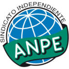

Solicitud de oposiciones 2016
======================================================

  
  
Este informe contiene un listado detallado de las localidades y centros por cada
localidad ordenando todo en función de la distancia/tiempo aproximados que se
necesitaría para desplazarte desde tu localidad de residencia (en tu caso,
nos has indicado **Porzuna**).

Por favor, recuerda que el cálculo es aproximado y que aunque hemos
intentado verificar todos los códigos es posible que hayamos cometido algún
error. Dado que la solicitud electrónica también te muestra los pueblos, por
favor asegúrate de que introduces la petición de un centro o localidad que
te interese. En este documento
*no hemos incluido ningún codigo de centro penitenciario*, por lo que si deseas
solicitar alguno te rogamos los busques en la solicitud.

Si crees que hemos cometido algún error,te agradeceríamos que nos lo comentases
escribiendo a afiliados@anpecr.com.

Esperamos que este documento te resulte de utilidad.

Listado de códigos
-------------------

- ``823159`` Picon  (14 minutos, 16 km)

  -``164260`` Colegio de Educación Infantil y Primaria José María del Moral
    

- ``825135`` El Robledo  (14 minutos, 15 km)

  -``177222`` Aula de Educación de Adultos de Robledo (El)
    

  -``177311`` Colegio Rural Agrupado Valle del Bullaque
    

- ``823248`` Piedrabuena  (15 minutos, 16 km)

  -``166069`` Centro Público de Educación de Personas Adultas Montes Norte
    

  -``165259`` Colegio de Educación Infantil y Primaria Luis Vives
    

  -``165070`` Colegio de Educación Infantil y Primaria Miguel de Cervantes
    

  -``165348`` Instituto de Educación Secundaria Mónico Sánchez
    

- ``827022`` El Torno  (15 minutos, 16 km)

  -``191179`` Colegio de Educación Infantil y Primaria Nuestra Señora de Guadalupe
    

- ``817302`` Las Casas  (19 minutos, 22 km)

  -``147250`` Colegio de Educación Infantil y Primaria Nuestra Señora del Rosario
    

- ``819834`` Fernan Caballero  (23 minutos, 25 km)

  -``154451`` Colegio de Educación Infantil y Primaria Manuel Sastre Velasco
    

- ``821350`` Malagon  (24 minutos, 30 km)

  -``156616`` Aula de Educación de Adultos de Malagon
    

  -``156349`` Colegio de Educación Infantil y Primaria Cañada Real
    

  -``156438`` Colegio de Educación Infantil y Primaria Santa Teresa
    

  -``156527`` Instituto de Educación Secundaria Estados del Duque
    

- ``814060`` Alcolea de Calatrava  (25 minutos, 25 km)

  -``140868`` Aula de Educación de Adultos de Alcolea de Calatrava
    

  -``140779`` Colegio de Educación Infantil y Primaria Tomasa Gallardo
    

- ``828833`` Valverde  (25 minutos, 32 km)

  -``196030`` Colegio de Educación Infantil y Primaria Alarcos
    

- ``813528`` Alcoba  (26 minutos, 32 km)

  -``140590`` Colegio de Educación Infantil y Primaria Don Rodrigo
    

- ``821261`` Luciana  (26 minutos, 29 km)

  -``156160`` Colegio de Educación Infantil y Primaria Isabel la Católica
    

- ``818579`` Cortijos de Arriba  (29 minutos, 26 km)

  -``153285`` Colegio de Educación Infantil y Primaria Nuestra Señora de las Mercedes
    

- ``818112`` Ciudad Real  (32 minutos, 31 km)

  -``150677`` Centro de Educación Especial Puerta de Santa María
    

  -``151665`` Centro Público de Educación de Personas Adultas Antonio Gala
    

  -``147706`` Colegio de Educación Infantil y Primaria Alcalde José Cruz Prado
    

  -``152742`` Colegio de Educación Infantil y Primaria Alcalde José Maestro
    

  -``150032`` Colegio de Educación Infantil y Primaria Ángel Andrade
    

  -``151020`` Colegio de Educación Infantil y Primaria Carlos Eraña
    

  -``152019`` Colegio de Educación Infantil y Primaria Carlos Vázquez
    

  -``149960`` Colegio de Educación Infantil y Primaria Ciudad Jardín
    

  -``152386`` Colegio de Educación Infantil y Primaria Cristóbal Colón
    

  -``152831`` Colegio de Educación Infantil y Primaria Don Quijote
    

  -``150121`` Colegio de Educación Infantil y Primaria Dulcinea del Toboso
    

  -``152108`` Colegio de Educación Infantil y Primaria Ferroviario
    

  -``150499`` Colegio de Educación Infantil y Primaria Jorge Manrique
    

  -``150210`` Colegio de Educación Infantil y Primaria José María de la Fuente
    

  -``151487`` Colegio de Educación Infantil y Primaria Juan Alcaide
    

  -``152653`` Colegio de Educación Infantil y Primaria María de Pacheco
    

  -``151398`` Colegio de Educación Infantil y Primaria Miguel de Cervantes
    

  -``147895`` Colegio de Educación Infantil y Primaria Pérez Molina
    

  -``150588`` Colegio de Educación Infantil y Primaria Pío XII
    

  -``152564`` Colegio de Educación Infantil y Primaria Santo Tomás de Villanueva Nº 16
    

  -``152475`` Instituto de Educación Secundaria Atenea
    

  -``151576`` Instituto de Educación Secundaria Hernán Pérez del Pulgar
    

  -``150766`` Instituto de Educación Secundaria Maestre de Calatrava
    

  -``150855`` Instituto de Educación Secundaria Maestro Juan de Ávila
    

  -``150944`` Instituto de Educación Secundaria Santa María de Alarcos
    

  -``152297`` Instituto de Educación Secundaria Torreón del Alcázar
    

- ``823337`` Poblete  (32 minutos, 38 km)

  -``166158`` Colegio de Educación Infantil y Primaria la Alameda
    

- ``824147`` Los Pozuelos de Calatrava  (33 minutos, 34 km)

  -``170017`` Colegio de Educación Infantil y Primaria Santa Quiteria
    

- ``820184`` Fuente el Fresno  (35 minutos, 40 km)

  -``154818`` Colegio de Educación Infantil y Primaria Miguel Delibes
    

- ``817124`` Carrion de Calatrava  (39 minutos, 39 km)

  -``147072`` Colegio de Educación Infantil y Primaria Nuestra Señora de la Encarnación
    

- ``821083`` Horcajo de los Montes  (39 minutos, 52 km)

  -``155806`` Colegio Rural Agrupado San Isidro
    

  -``155717`` Instituto de Educación Secundaria Montes de Cabañeros
    

- ``822160`` Miguelturra  (39 minutos, 35 km)

  -``161107`` Aula de Educación de Adultos de Miguelturra
    

  -``161018`` Colegio de Educación Infantil y Primaria Benito Pérez Galdós
    

  -``161296`` Colegio de Educación Infantil y Primaria Clara Campoamor
    

  -``160119`` Colegio de Educación Infantil y Primaria el Pradillo
    

  -``160208`` Colegio de Educación Infantil y Primaria Santísimo Cristo de la Misericordia
    

  -``160397`` Instituto de Educación Secundaria Campo de Calatrava
    

- ``816047`` Arroba de los Montes  (41 minutos, 49 km)

  -``144464`` Colegio Rural Agrupado Río San Marcos
    

- ``818390`` Corral de Calatrava  (42 minutos, 44 km)

  -``153196`` Colegio de Educación Infantil y Primaria Nuestra Señora de la Paz
    

- ``827111`` Torralba de Calatrava  (42 minutos, 50 km)

  -``191268`` Colegio de Educación Infantil y Primaria Cristo del Consuelo
    

- ``825046`` Retuerta del Bullaque  (43 minutos, 60 km)

  -``177133`` Colegio Rural Agrupado Montes de Toledo
    

- ``824058`` Pozuelo de Calatrava  (45 minutos, 45 km)

  -``167324`` Aula de Educación de Adultos de Pozuelo de Calatrava
    

  -``167235`` Colegio de Educación Infantil y Primaria José María de la Fuente
    

- ``830171`` Villarrubia de los Ojos  (45 minutos, 56 km)

  -``199739`` Aula de Educación de Adultos de Villarrubia de los Ojos
    

  -``198740`` Colegio de Educación Infantil y Primaria Rufino Blanco
    

  -``199461`` Colegio de Educación Infantil y Primaria Virgen de la Sierra
    

  -``199550`` Instituto de Educación Secundaria Guadiana
    

- ``906591`` Las Ventas con Peña Aguilera  (45 minutos, 61 km)

  -``320688`` Colegio de Educación Infantil y Primaria Nuestra Señora del Águila
    

- ``819745`` Daimiel  (48 minutos, 56 km)

  -``154273`` Centro Público de Educación de Personas Adultas Miguel de Cervantes
    

  -``154362`` Colegio de Educación Infantil y Primaria Albuera
    

  -``154184`` Colegio de Educación Infantil y Primaria Calatrava
    

  -``153552`` Colegio de Educación Infantil y Primaria Infante Don Felipe
    

  -``153641`` Colegio de Educación Infantil y Primaria la Espinosa
    

  -``153463`` Colegio de Educación Infantil y Primaria San Isidro
    

  -``154095`` Instituto de Educación Secundaria Juan D&#39;Opazo
    

  -``153730`` Instituto de Educación Secundaria Ojos del Guadiana
    

- ``816136`` Ballesteros de Calatrava  (49 minutos, 57 km)

  -``144553`` Colegio de Educación Infantil y Primaria José María del Moral
    

- ``828744`` Valenzuela de Calatrava  (49 minutos, 54 km)

  -``195220`` Colegio de Educación Infantil y Primaria Nuestra Señora del Rosario
    

- ``815504`` Argamasilla de Calatrava  (50 minutos, 65 km)

  -``144286`` Aula de Educación de Adultos de Argamasilla de Calatrava
    

  -``144008`` Colegio de Educación Infantil y Primaria Rodríguez Marín
    

  -``144197`` Colegio de Educación Infantil y Primaria Virgen del Socorro
    

  -``144375`` Instituto de Educación Secundaria Alonso Quijano
    

- ``816403`` Cabezarados  (50 minutos, 52 km)

  -``145452`` Colegio de Educación Infantil y Primaria Nuestra Señora de Finibusterre
    

- ``829821`` Villamayor de Calatrava  (50 minutos, 61 km)

  -``197029`` Colegio de Educación Infantil y Primaria Inocente Martín
    

- ``815059`` Almagro  (51 minutos, 56 km)

  -``142577`` Aula de Educación de Adultos de Almagro
    

  -``142021`` Colegio de Educación Infantil y Primaria Diego de Almagro
    

  -``141856`` Colegio de Educación Infantil y Primaria Miguel de Cervantes Saavedra
    

  -``142488`` Colegio de Educación Infantil y Primaria Paseo Viejo de la Florida
    

  -``142110`` Instituto de Educación Secundaria Antonio Calvín
    

  -``142399`` Instituto de Educación Secundaria Clavero Fernández de Córdoba
    

- ``860054`` Cuerva  (51 minutos, 67 km)

  -``286218`` Colegio de Educación Infantil y Primaria Soledad Alonso Dorado
    

- ``879789`` Menasalbas  (51 minutos, 68 km)

  -``299458`` Colegio de Educación Infantil y Primaria Nuestra Señora de Fátima
    

- ``906224`` Urda  (51 minutos, 64 km)

  -``320043`` Colegio de Educación Infantil y Primaria Santo Cristo
    

- ``824236`` Puebla de Don Rodrigo  (52 minutos, 65 km)

  -``170106`` Colegio de Educación Infantil y Primaria San Fermín
    

- ``812440`` Abenojar  (53 minutos, 52 km)

  -``136453`` Colegio de Educación Infantil y Primaria Nuestra Señora de la Encarnación
    

- ``814338`` Aldea del Rey  (53 minutos, 61 km)

  -``141033`` Colegio de Educación Infantil y Primaria Maestro Navas
    

- ``902350`` San Pablo de los Montes  (53 minutos, 71 km)

  -``307452`` Colegio de Educación Infantil y Primaria Nuestra Señora de Gracia
    

- ``825313`` Saceruela  (55 minutos, 66 km)

  -``180193`` Colegio de Educación Infantil y Primaria Virgen de las Cruces
    

- ``820273`` Granatula de Calatrava  (56 minutos, 66 km)

  -``155083`` Colegio de Educación Infantil y Primaria Nuestra Señora Oreto y Zuqueca
    

- ``862030`` Galvez  (56 minutos, 74 km)

  -``289827`` Colegio de Educación Infantil y Primaria San Juan de la Cruz
    

  -``289916`` Instituto de Educación Secundaria Montes de Toledo
    

- ``867081`` Marjaliza  (56 minutos, 72 km)

  -``297293`` Colegio de Educación Infantil y Primaria San Juan
    

- ``816225`` Bolaños de Calatrava  (57 minutos, 62 km)

  -``145274`` Aula de Educación de Adultos de Bolaños de Calatrava
    

  -``144731`` Colegio de Educación Infantil y Primaria Arzobispo Calzado
    

  -``144642`` Colegio de Educación Infantil y Primaria Fernando III el Santo
    

  -``145185`` Colegio de Educación Infantil y Primaria Molino de Viento
    

  -``144820`` Colegio de Educación Infantil y Primaria Virgen del Monte
    

  -``145096`` Instituto de Educación Secundaria Berenguela de Castilla
    

- ``824503`` Puertollano  (57 minutos, 70 km)

  -``174347`` Centro Público de Educación de Personas Adultas Antonio Machado
    

  -``175157`` Colegio de Educación Infantil y Primaria Ángel Andrade
    

  -``171194`` Colegio de Educación Infantil y Primaria Calderón de la Barca
    

  -``171005`` Colegio de Educación Infantil y Primaria Cervantes
    

  -``175068`` Colegio de Educación Infantil y Primaria David Jiménez Avendaño
    

  -``172360`` Colegio de Educación Infantil y Primaria Doctor Limón
    

  -``175335`` Colegio de Educación Infantil y Primaria Enrique Tierno Galván
    

  -``172093`` Colegio de Educación Infantil y Primaria Giner de los Ríos
    

  -``172182`` Colegio de Educación Infantil y Primaria Gonzalo de Berceo
    

  -``174258`` Colegio de Educación Infantil y Primaria Juan Ramón Jiménez
    

  -``171283`` Colegio de Educación Infantil y Primaria Menéndez Pelayo
    

  -``171372`` Colegio de Educación Infantil y Primaria Miguel de Unamuno
    

  -``172271`` Colegio de Educación Infantil y Primaria Ramón y Cajal
    

  -``173081`` Colegio de Educación Infantil y Primaria Severo Ochoa
    

  -``170384`` Colegio de Educación Infantil y Primaria Vicente Aleixandre
    

  -``176234`` Instituto de Educación Secundaria Comendador Juan de Távora
    

  -``174169`` Instituto de Educación Secundaria Dámaso Alonso
    

  -``173170`` Instituto de Educación Secundaria Fray Andrés
    

  -``176323`` Instituto de Educación Secundaria Galileo Galilei
    

  -``176056`` Instituto de Educación Secundaria Leonardo Da Vinci
    

- ``900552`` Pulgar  (57 minutos, 73 km)

  -``305743`` Colegio de Educación Infantil y Primaria Nuestra Señora de la Blanca
    

- ``905503`` Totanes  (57 minutos, 73 km)

  -``318527`` Colegio de Educación Infantil y Primaria Inmaculada Concepción
    

- ``815326`` Arenas de San Juan  (58 minutos, 69 km)

  -``143387`` Colegio Rural Agrupado de Arenas de San Juan
    

- ``815148`` Almodovar del Campo  (59 minutos, 75 km)

  -``143109`` Aula de Educación de Adultos de Almodovar del Campo
    

  -``142666`` Colegio de Educación Infantil y Primaria Maestro Juan de Ávila
    

  -``142755`` Colegio de Educación Infantil y Primaria Virgen del Carmen
    

  -``142844`` Instituto de Educación Secundaria San Juan Bautista de la Concepción
    

- ``822438`` Moral de Calatrava  (59 minutos, 73 km)

  -``162373`` Aula de Educación de Adultos de Moral de Calatrava
    

  -``162006`` Colegio de Educación Infantil y Primaria Agustín Sanz
    

  -``162195`` Colegio de Educación Infantil y Primaria Manuel Clemente
    

  -``162284`` Instituto de Educación Secundaria Peñalba
    

- ``902172`` San Martin de Montalban  (59 minutos, 79 km)

  -``307274`` Colegio de Educación Infantil y Primaria Santísimo Cristo de la Luz
    

- ``910272`` Los Yebenes  (1h 1min, 83 km)

  -``323563`` Aula de Educación de Adultos de Yebenes (Los)
    

  -``323385`` Colegio de Educación Infantil y Primaria San José de Calasanz
    

  -``323474`` Instituto de Educación Secundaria Guadalerzas
    

- ``816592`` Calzada de Calatrava  (1h 2min, 68 km)

  -``146084`` Aula de Educación de Adultos de Calzada de Calatrava
    

  -``145630`` Colegio de Educación Infantil y Primaria Ignacio de Loyola
    

  -``145541`` Colegio de Educación Infantil y Primaria Santa Teresa de Jesús
    

  -``145819`` Instituto de Educación Secundaria Eduardo Valencia
    

- ``821539`` Manzanares  (1h 3min, 82 km)

  -``157426`` Centro Público de Educación de Personas Adultas San Blas
    

  -``156894`` Colegio de Educación Infantil y Primaria Altagracia
    

  -``156705`` Colegio de Educación Infantil y Primaria Divina Pastora
    

  -``157515`` Colegio de Educación Infantil y Primaria Enrique Tierno Galván
    

  -``157337`` Colegio de Educación Infantil y Primaria la Candelaria
    

  -``157248`` Instituto de Educación Secundaria Azuer
    

  -``157159`` Instituto de Educación Secundaria Pedro Álvarez Sotomayor
    

- ``830260`` Villarta de San Juan  (1h 3min, 76 km)

  -``199828`` Colegio de Educación Infantil y Primaria Nuestra Señora de la Paz
    

- ``869602`` Mazarambroz  (1h 4min, 84 km)

  -``298648`` Colegio de Educación Infantil y Primaria Nuestra Señora del Sagrario
    

- ``889954`` Noez  (1h 4min, 80 km)

  -``301780`` Colegio de Educación Infantil y Primaria Santísimo Cristo de la Salud
    

- ``888966`` Navahermosa  (1h 5min, 85 km)

  -``300970`` Centro Público de Educación de Personas Adultas la Raña
    

  -``300792`` Colegio de Educación Infantil y Primaria San Miguel Arcángel
    

  -``300881`` Instituto de Educación Secundaria Obligatoria Manuel de Guzmán
    

- ``821172`` Llanos del Caudillo  (1h 6min, 93 km)

  -``156071`` Colegio de Educación Infantil y Primaria el Oasis
    

- ``899218`` Orgaz  (1h 6min, 91 km)

  -``303589`` Colegio de Educación Infantil y Primaria Conde de Orgaz
    

- ``865005`` Layos  (1h 7min, 86 km)

  -``294229`` Colegio de Educación Infantil y Primaria María Magdalena
    

- ``818201`` Consolacion  (1h 8min, 97 km)

  -``153007`` Colegio de Educación Infantil y Primaria Virgen de Consolación
    

- ``820540`` Hinojosas de Calatrava  (1h 8min, 84 km)

  -``155628`` Colegio Rural Agrupado Valle de Alcudia
    

- ``822071`` Membrilla  (1h 8min, 89 km)

  -``157882`` Aula de Educación de Adultos de Membrilla
    

  -``157793`` Colegio de Educación Infantil y Primaria San José de Calasanz
    

  -``157604`` Colegio de Educación Infantil y Primaria Virgen del Espino
    

  -``159958`` Instituto de Educación Secundaria Marmaria
    

- ``859893`` Consuegra  (1h 8min, 76 km)

  -``285130`` Centro Público de Educación de Personas Adultas Castillo de Consuegra
    

  -``284320`` Colegio de Educación Infantil y Primaria Miguel de Cervantes
    

  -``284231`` Colegio de Educación Infantil y Primaria Santísimo Cristo de la Vera Cruz
    

  -``285041`` Instituto de Educación Secundaria Consaburum
    

- ``866271`` Manzaneque  (1h 8min, 92 km)

  -``297015`` Colegio de Educación Infantil y Primaria Álvarez de Toledo
    

- ``899852`` Polan  (1h 8min, 88 km)

  -``304577`` Aula de Educación de Adultos de Polan
    

  -``304488`` Colegio de Educación Infantil y Primaria José María Corcuera
    

- ``851055`` Ajofrin  (1h 9min, 90 km)

  -``266322`` Colegio de Educación Infantil y Primaria Jacinto Guerrero
    

- ``904337`` Sonseca  (1h 9min, 89 km)

  -``310879`` Centro Público de Educación de Personas Adultas Cum Laude
    

  -``310968`` Colegio de Educación Infantil y Primaria Peñamiel
    

  -``310501`` Colegio de Educación Infantil y Primaria San Juan Evangelista
    

  -``310690`` Instituto de Educación Secundaria la Sisla
    

- ``816314`` Brazatortas  (1h 10min, 88 km)

  -``145363`` Colegio de Educación Infantil y Primaria Cervantes
    

- ``820362`` Herencia  (1h 10min, 88 km)

  -``155350`` Aula de Educación de Adultos de Herencia
    

  -``155172`` Colegio de Educación Infantil y Primaria Carrasco Alcalde
    

  -``155261`` Instituto de Educación Secundaria Hermógenes Rodríguez
    

- ``908111`` Villaminaya  (1h 11min, 98 km)

  -``322208`` Colegio de Educación Infantil y Primaria Santo Domingo de Silos
    

- ``826212`` La Solana  (1h 12min, 98 km)

  -``184245`` Colegio de Educación Infantil y Primaria el Humilladero
    

  -``184067`` Colegio de Educación Infantil y Primaria el Santo
    

  -``185233`` Colegio de Educación Infantil y Primaria Federico Romero
    

  -``184334`` Colegio de Educación Infantil y Primaria Javier Paulino Pérez
    

  -``185055`` Colegio de Educación Infantil y Primaria la Moheda
    

  -``183346`` Colegio de Educación Infantil y Primaria Romero Peña
    

  -``183257`` Colegio de Educación Infantil y Primaria Sagrado Corazón
    

  -``185144`` Instituto de Educación Secundaria Clara Campoamor
    

  -``184156`` Instituto de Educación Secundaria Modesto Navarro
    

- ``853031`` Arges  (1h 12min, 90 km)

  -``272179`` Colegio de Educación Infantil y Primaria Miguel de Cervantes
    

  -``271369`` Colegio de Educación Infantil y Primaria Tirso de Molina
    

- ``863029`` Guadamur  (1h 12min, 93 km)

  -``290266`` Colegio de Educación Infantil y Primaria Nuestra Señora de la Natividad
    

- ``907301`` Villafranca de los Caballeros  (1h 12min, 94 km)

  -``321587`` Colegio de Educación Infantil y Primaria Miguel de Cervantes
    

  -``321676`` Instituto de Educación Secundaria Obligatoria la Falcata
    

- ``865372`` Madridejos  (1h 13min, 95 km)

  -``296027`` Aula de Educación de Adultos de Madridejos
    

  -``296116`` Centro de Educación Especial Mingoliva
    

  -``295128`` Colegio de Educación Infantil y Primaria Garcilaso de la Vega
    

  -``295306`` Colegio de Educación Infantil y Primaria Santa Ana
    

  -``295217`` Instituto de Educación Secundaria Valdehierro
    

- ``814516`` Almaden  (1h 14min, 96 km)

  -``141767`` Centro Público de Educación de Personas Adultas de Almaden
    

  -``141300`` Colegio de Educación Infantil y Primaria Hijos de Obreros
    

  -``141211`` Colegio de Educación Infantil y Primaria Jesús Nazareno
    

  -``141678`` Instituto de Educación Secundaria Mercurio
    

  -``141589`` Instituto de Educación Secundaria Pablo Ruiz Picasso
    

- ``815415`` Argamasilla de Alba  (1h 14min, 109 km)

  -``143743`` Aula de Educación de Adultos de Argamasilla de Alba
    

  -``143654`` Colegio de Educación Infantil y Primaria Azorín
    

  -``143476`` Colegio de Educación Infantil y Primaria Divino Maestro
    

  -``143565`` Colegio de Educación Infantil y Primaria Nuestra Señora de Peñarroya
    

  -``143832`` Instituto de Educación Secundaria Vicente Cano
    

- ``828655`` Valdepeñas  (1h 14min, 92 km)

  -``195131`` Centro de Educación Especial María Luisa Navarro Margati
    

  -``194232`` Centro Público de Educación de Personas Adultas Francisco de Quevedo
    

  -``192256`` Colegio de Educación Infantil y Primaria Jesús Baeza
    

  -``193066`` Colegio de Educación Infantil y Primaria Jesús Castillo
    

  -``192345`` Colegio de Educación Infantil y Primaria Lorenzo Medina
    

  -``193155`` Colegio de Educación Infantil y Primaria Lucero
    

  -``193244`` Colegio de Educación Infantil y Primaria Luis Palacios
    

  -``194143`` Colegio de Educación Infantil y Primaria Maestro Juan Alcaide
    

  -``193333`` Instituto de Educación Secundaria Bernardo de Balbuena
    

  -``194321`` Instituto de Educación Secundaria Francisco Nieva
    

  -``194054`` Instituto de Educación Secundaria Gregorio Prieto
    

- ``854119`` Burguillos de Toledo  (1h 14min, 98 km)

  -``274066`` Colegio de Educación Infantil y Primaria Victorio Macho
    

- ``856006`` Camuñas  (1h 14min, 98 km)

  -``277308`` Colegio de Educación Infantil y Primaria Cardenal Cisneros
    

- ``906046`` Turleque  (1h 14min, 91 km)

  -``318616`` Colegio de Educación Infantil y Primaria Fernán González
    

- ``825402`` San Carlos del Valle  (1h 16min, 109 km)

  -``180282`` Colegio de Educación Infantil y Primaria San Juan Bosco
    

- ``859704`` Cobisa  (1h 16min, 92 km)

  -``284053`` Colegio de Educación Infantil y Primaria Cardenal Tavera
    

  -``284142`` Colegio de Educación Infantil y Primaria Gloria Fuertes
    

- ``900285`` La Puebla de Montalban  (1h 16min, 99 km)

  -``305476`` Aula de Educación de Adultos de Puebla de Montalban (La)
    

  -``305298`` Colegio de Educación Infantil y Primaria Fernando de Rojas
    

  -``305387`` Instituto de Educación Secundaria Juan de Lucena
    

- ``867170`` Mascaraque  (1h 17min, 104 km)

  -``297382`` Colegio de Educación Infantil y Primaria Juan de Padilla
    

- ``888699`` Mora  (1h 17min, 103 km)

  -``300425`` Aula de Educación de Adultos de Mora
    

  -``300247`` Colegio de Educación Infantil y Primaria Fernando Martín
    

  -``300158`` Colegio de Educación Infantil y Primaria José Ramón Villa
    

  -``300336`` Instituto de Educación Secundaria Peñas Negras
    

- ``817580`` Chillon  (1h 18min, 98 km)

  -``147528`` Colegio de Educación Infantil y Primaria Nuestra Señora del Castillo
    

- ``818023`` Cinco Casas  (1h 18min, 94 km)

  -``147617`` Colegio Rural Agrupado Alciares
    

- ``813072`` Agudo  (1h 19min, 95 km)

  -``136542`` Colegio de Educación Infantil y Primaria Virgen de la Estrella
    

- ``827578`` Valdemanco del Esteras  (1h 19min, 87 km)

  -``192167`` Colegio de Educación Infantil y Primaria Virgen del Valle
    

- ``852132`` Almonacid de Toledo  (1h 19min, 108 km)

  -``270192`` Colegio de Educación Infantil y Primaria Virgen de la Oliva
    

- ``888788`` Nambroca  (1h 19min, 105 km)

  -``300514`` Colegio de Educación Infantil y Primaria la Fuente
    

- ``826490`` Tomelloso  (1h 20min, 117 km)

  -``188753`` Centro de Educación Especial Ponce de León
    

  -``189652`` Centro Público de Educación de Personas Adultas Simienza
    

  -``189563`` Colegio de Educación Infantil y Primaria Almirante Topete
    

  -``186221`` Colegio de Educación Infantil y Primaria Carmelo Cortés
    

  -``186310`` Colegio de Educación Infantil y Primaria Doña Crisanta
    

  -``188575`` Colegio de Educación Infantil y Primaria Embajadores
    

  -``190369`` Colegio de Educación Infantil y Primaria Felix Grande
    

  -``187031`` Colegio de Educación Infantil y Primaria José Antonio
    

  -``186132`` Colegio de Educación Infantil y Primaria José María del Moral
    

  -``186043`` Colegio de Educación Infantil y Primaria Miguel de Cervantes
    

  -``188842`` Colegio de Educación Infantil y Primaria San Antonio
    

  -``188664`` Colegio de Educación Infantil y Primaria San Isidro
    

  -``188486`` Colegio de Educación Infantil y Primaria San José de Calasanz
    

  -``190091`` Colegio de Educación Infantil y Primaria Virgen de las Viñas
    

  -``189830`` Instituto de Educación Secundaria Airén
    

  -``190180`` Instituto de Educación Secundaria Alto Guadiana
    

  -``187120`` Instituto de Educación Secundaria Eladio Cabañero
    

  -``187309`` Instituto de Educación Secundaria Francisco García Pavón
    

- ``830449`` Viso del Marques  (1h 20min, 98 km)

  -``199917`` Colegio de Educación Infantil y Primaria Nuestra Señora del Valle
    

  -``200072`` Instituto de Educación Secundaria los Batanes
    

- ``826034`` Santa Cruz de Mudela  (1h 21min, 98 km)

  -``181270`` Aula de Educación de Adultos de Santa Cruz de Mudela
    

  -``181092`` Colegio de Educación Infantil y Primaria Cervantes
    

  -``181181`` Instituto de Educación Secundaria Máximo Laguna
    

- ``905236`` Toledo  (1h 21min, 98 km)

  -``317083`` Centro de Educación Especial Ciudad de Toledo
    

  -``315730`` Centro Público de Educación de Personas Adultas Gustavo Adolfo Bécquer
    

  -``317172`` Centro Público de Educación de Personas Adultas Polígono
    

  -``315007`` Colegio de Educación Infantil y Primaria Alfonso Vi
    

  -``314108`` Colegio de Educación Infantil y Primaria Ángel del Alcázar
    

  -``316540`` Colegio de Educación Infantil y Primaria Ciudad de Aquisgrán
    

  -``315463`` Colegio de Educación Infantil y Primaria Ciudad de Nara
    

  -``316273`` Colegio de Educación Infantil y Primaria Escultor Alberto Sánchez
    

  -``317539`` Colegio de Educación Infantil y Primaria Europa
    

  -``314297`` Colegio de Educación Infantil y Primaria Fábrica de Armas
    

  -``315285`` Colegio de Educación Infantil y Primaria Garcilaso de la Vega
    

  -``315374`` Colegio de Educación Infantil y Primaria Gómez Manrique
    

  -``316362`` Colegio de Educación Infantil y Primaria Gregorio Marañón
    

  -``314742`` Colegio de Educación Infantil y Primaria Jaime de Foxa
    

  -``316095`` Colegio de Educación Infantil y Primaria Juan de Padilla
    

  -``314019`` Colegio de Educación Infantil y Primaria la Candelaria
    

  -``315552`` Colegio de Educación Infantil y Primaria San Lucas y María
    

  -``314386`` Colegio de Educación Infantil y Primaria Santa Teresa
    

  -``317628`` Colegio de Educación Infantil y Primaria Valparaíso
    

  -``315196`` Instituto de Educación Secundaria Alfonso X el Sabio
    

  -``314653`` Instituto de Educación Secundaria Azarquiel
    

  -``316818`` Instituto de Educación Secundaria Carlos III
    

  -``314564`` Instituto de Educación Secundaria el Greco
    

  -``315641`` Instituto de Educación Secundaria Juanelo Turriano
    

  -``317261`` Instituto de Educación Secundaria María Pacheco
    

  -``317350`` Instituto de Educación Secundaria Obligatoria Princesa Galiana
    

  -``316451`` Instituto de Educación Secundaria Sefarad
    

  -``314475`` Instituto de Educación Secundaria Universidad Laboral
    

- ``905325`` La Torre de Esteban Hambran  (1h 21min, 98 km)

  -``317717`` Colegio de Educación Infantil y Primaria Juan Aguado
    

- ``814427`` Alhambra  (1h 22min, 116 km)

  -``141122`` Colegio de Educación Infantil y Primaria Nuestra Señora de Fátima
    

- ``905058`` Tembleque  (1h 22min, 119 km)

  -``313754`` Colegio de Educación Infantil y Primaria Antonia González
    

- ``908578`` Villanueva de Bogas  (1h 22min, 112 km)

  -``322575`` Colegio de Educación Infantil y Primaria Santa Ana
    

- ``813439`` Alcazar de San Juan  (1h 23min, 106 km)

  -``137808`` Centro Público de Educación de Personas Adultas Enrique Tierno Galván
    

  -``137719`` Colegio de Educación Infantil y Primaria Alces
    

  -``137085`` Colegio de Educación Infantil y Primaria el Santo
    

  -``140223`` Colegio de Educación Infantil y Primaria Gloria Fuertes
    

  -``140401`` Colegio de Educación Infantil y Primaria Jardín de Arena
    

  -``137263`` Colegio de Educación Infantil y Primaria Jesús Ruiz de la Fuente
    

  -``137174`` Colegio de Educación Infantil y Primaria Juan de Austria
    

  -``139973`` Colegio de Educación Infantil y Primaria Pablo Ruiz Picasso
    

  -``137352`` Colegio de Educación Infantil y Primaria Santa Clara
    

  -``137530`` Instituto de Educación Secundaria Juan Bosco
    

  -``140045`` Instituto de Educación Secundaria María Zambrano
    

  -``137441`` Instituto de Educación Secundaria Miguel de Cervantes Saavedra
    

- ``815237`` Almuradiel  (1h 23min, 103 km)

  -``143298`` Colegio de Educación Infantil y Primaria Santiago Apóstol
    

- ``861042`` Escalonilla  (1h 23min, 106 km)

  -``287395`` Colegio de Educación Infantil y Primaria Sagrados Corazones
    

- ``823515`` Pozo de la Serna  (1h 24min, 116 km)

  -``167146`` Colegio de Educación Infantil y Primaria Sagrado Corazón
    

- ``889598`` Los Navalmorales  (1h 24min, 105 km)

  -``301146`` Colegio de Educación Infantil y Primaria San Francisco
    

  -``301235`` Instituto de Educación Secundaria los Navalmorales
    

- ``854208`` Burujon  (1h 25min, 107 km)

  -``274155`` Colegio de Educación Infantil y Primaria Juan XXIII
    

- ``899763`` Las Perdices  (1h 25min, 114 km)

  -``304399`` Colegio de Educación Infantil y Primaria Pintor Tomás Camarero
    

- ``907212`` Villacañas  (1h 25min, 117 km)

  -``321498`` Aula de Educación de Adultos de Villacañas
    

  -``321031`` Colegio de Educación Infantil y Primaria Santa Bárbara
    

  -``321309`` Instituto de Educación Secundaria Enrique de Arfe
    

  -``321120`` Instituto de Educación Secundaria Garcilaso de la Vega
    

- ``856284`` El Carpio de Tajo  (1h 26min, 109 km)

  -``280090`` Colegio de Educación Infantil y Primaria Nuestra Señora de Ronda
    

- ``889687`` Los Navalucillos  (1h 26min, 107 km)

  -``301324`` Colegio de Educación Infantil y Primaria Nuestra Señora de las Saleras
    

- ``901095`` Quero  (1h 26min, 108 km)

  -``305832`` Colegio de Educación Infantil y Primaria Santiago Cabañas
    

- ``902083`` El Romeral  (1h 26min, 124 km)

  -``307185`` Colegio de Educación Infantil y Primaria Silvano Cirujano
    

- ``908200`` Villamuelas  (1h 26min, 118 km)

  -``322397`` Colegio de Educación Infantil y Primaria Santa María Magdalena
    

- ``817213`` Carrizosa  (1h 27min, 126 km)

  -``147161`` Colegio de Educación Infantil y Primaria Virgen del Salido
    

- ``853309`` Bargas  (1h 27min, 116 km)

  -``272357`` Colegio de Educación Infantil y Primaria Santísimo Cristo de la Sala
    

  -``273078`` Instituto de Educación Secundaria Julio Verne
    

- ``898597`` Olias del Rey  (1h 27min, 118 km)

  -``303211`` Colegio de Educación Infantil y Primaria Pedro Melendo García
    

- ``817035`` Campo de Criptana  (1h 28min, 115 km)

  -``146807`` Aula de Educación de Adultos de Campo de Criptana
    

  -``146629`` Colegio de Educación Infantil y Primaria Domingo Miras
    

  -``146351`` Colegio de Educación Infantil y Primaria Sagrado Corazón
    

  -``146262`` Colegio de Educación Infantil y Primaria Virgen de Criptana
    

  -``146173`` Colegio de Educación Infantil y Primaria Virgen de la Paz
    

  -``146440`` Instituto de Educación Secundaria Isabel Perillán y Quirós
    

- ``827489`` Torrenueva  (1h 28min, 107 km)

  -``192078`` Colegio de Educación Infantil y Primaria Santiago el Mayor
    

- ``902261`` San Martin de Pusa  (1h 28min, 107 km)

  -``307363`` Colegio Rural Agrupado Río Pusa
    

- ``862308`` Gerindote  (1h 29min, 112 km)

  -``290177`` Colegio de Educación Infantil y Primaria San José
    

- ``830082`` Villanueva de los Infantes  (1h 30min, 130 km)

  -``198651`` Centro Público de Educación de Personas Adultas Miguel de Cervantes
    

  -``197396`` Colegio de Educación Infantil y Primaria Arqueólogo García Bellido
    

  -``198473`` Instituto de Educación Secundaria Francisco de Quevedo
    

  -``198562`` Instituto de Educación Secundaria Ramón Giraldo
    

- ``851233`` Albarreal de Tajo  (1h 30min, 114 km)

  -``267132`` Colegio de Educación Infantil y Primaria Benjamín Escalonilla
    

- ``863118`` La Guardia  (1h 30min, 129 km)

  -``290355`` Colegio de Educación Infantil y Primaria Valentín Escobar
    

- ``907123`` La Villa de Don Fadrique  (1h 30min, 126 km)

  -``320866`` Colegio de Educación Infantil y Primaria Ramón y Cajal
    

  -``320955`` Instituto de Educación Secundaria Obligatoria Leonor de Guzmán
    

- ``813161`` Alamillo  (1h 31min, 115 km)

  -``136631`` Colegio Rural Agrupado de Alamillo
    

- ``855474`` Camarenilla  (1h 31min, 126 km)

  -``277030`` Colegio de Educación Infantil y Primaria Nuestra Señora del Rosario
    

- ``856195`` Carmena  (1h 31min, 112 km)

  -``279929`` Colegio de Educación Infantil y Primaria Cristo de la Cueva
    

- ``886980`` Mocejon  (1h 31min, 121 km)

  -``300069`` Aula de Educación de Adultos de Mocejon
    

  -``299903`` Colegio de Educación Infantil y Primaria Miguel de Cervantes
    

- ``901540`` Rielves  (1h 31min, 120 km)

  -``307096`` Colegio de Educación Infantil y Primaria Maximina Felisa Gómez Aguero
    

- ``814249`` Alcubillas  (1h 32min, 117 km)

  -``140957`` Colegio de Educación Infantil y Primaria Nuestra Señora del Rosario
    

- ``854397`` Cabañas de la Sagra  (1h 32min, 125 km)

  -``274244`` Colegio de Educación Infantil y Primaria San Isidro Labrador
    

- ``864017`` Huecas  (1h 32min, 126 km)

  -``291254`` Colegio de Educación Infantil y Primaria Gregorio Marañón
    

- ``864106`` Huerta de Valdecarabanos  (1h 32min, 127 km)

  -``291343`` Colegio de Educación Infantil y Primaria Virgen del Rosario de Pastores
    

- ``866093`` Magan  (1h 32min, 126 km)

  -``296205`` Colegio de Educación Infantil y Primaria Santa Marina
    

- ``866182`` Malpica de Tajo  (1h 32min, 119 km)

  -``296394`` Colegio de Educación Infantil y Primaria Fulgencio Sánchez Cabezudo
    

- ``867359`` La Mata  (1h 32min, 115 km)

  -``298559`` Colegio de Educación Infantil y Primaria Severo Ochoa
    

- ``908022`` Villamiel de Toledo  (1h 32min, 116 km)

  -``322119`` Colegio de Educación Infantil y Primaria Nuestra Señora de la Redonda
    

- ``909744`` Villaseca de la Sagra  (1h 32min, 125 km)

  -``322753`` Colegio de Educación Infantil y Primaria Virgen de las Angustias
    

- ``825224`` Ruidera  (1h 33min, 135 km)

  -``180004`` Colegio de Educación Infantil y Primaria Juan Aguilar Molina
    

- ``853120`` Barcience  (1h 33min, 128 km)

  -``272268`` Colegio de Educación Infantil y Primaria Santa María la Blanca
    

- ``909833`` Villasequilla  (1h 33min, 125 km)

  -``322842`` Colegio de Educación Infantil y Primaria San Isidro Labrador
    

- ``911171`` Yunclillos  (1h 33min, 121 km)

  -``324195`` Colegio de Educación Infantil y Primaria Nuestra Señora de la Salud
    

- ``865194`` Lillo  (1h 34min, 129 km)

  -``294318`` Colegio de Educación Infantil y Primaria Marcelino Murillo
    

- ``905414`` Torrijos  (1h 34min, 115 km)

  -``318349`` Centro Público de Educación de Personas Adultas Teresa Enríquez
    

  -``318438`` Colegio de Educación Infantil y Primaria Lazarillo de Tormes
    

  -``317806`` Colegio de Educación Infantil y Primaria Villa de Torrijos
    

  -``318071`` Instituto de Educación Secundaria Alonso de Covarrubias
    

  -``318160`` Instituto de Educación Secundaria Juan de Padilla
    

- ``910450`` Yepes  (1h 34min, 130 km)

  -``323741`` Colegio de Educación Infantil y Primaria Rafael García Valiño
    

  -``323830`` Instituto de Educación Secundaria Carpetania
    

- ``820095`` Fuencaliente  (1h 35min, 126 km)

  -``154540`` Colegio de Educación Infantil y Primaria Nuestra Señora de los Baños
    

  -``154729`` Instituto de Educación Secundaria Obligatoria Peña Escrita
    

- ``860232`` Dosbarrios  (1h 35min, 141 km)

  -``287028`` Colegio de Educación Infantil y Primaria San Isidro Labrador
    

- ``911082`` Yuncler  (1h 35min, 132 km)

  -``324006`` Colegio de Educación Infantil y Primaria Remigio Laín
    

- ``852599`` Arcicollar  (1h 36min, 132 km)

  -``271180`` Colegio de Educación Infantil y Primaria San Blas
    

- ``856462`` Carriches  (1h 36min, 118 km)

  -``281178`` Colegio de Educación Infantil y Primaria Doctor Cesar González Gómez
    

- ``857361`` Cebolla  (1h 36min, 123 km)

  -``282166`` Colegio de Educación Infantil y Primaria Nuestra Señora de la Antigua
    

  -``282255`` Instituto de Educación Secundaria Arenales del Tajo
    

- ``907490`` Villaluenga de la Sagra  (1h 36min, 131 km)

  -``321765`` Colegio de Educación Infantil y Primaria Juan Palarea
    

  -``321854`` Instituto de Educación Secundaria Castillo del Águila
    

- ``861220`` Fuensalida  (1h 37min, 131 km)

  -``289649`` Aula de Educación de Adultos de Fuensalida
    

  -``289738`` Colegio de Educación Infantil y Primaria Condes de Fuensalida
    

  -``288839`` Colegio de Educación Infantil y Primaria Tomás Romojaro
    

  -``289460`` Instituto de Educación Secundaria Aldebarán
    

- ``900196`` La Puebla de Almoradiel  (1h 37min, 136 km)

  -``305109`` Aula de Educación de Adultos de Puebla de Almoradiel (La)
    

  -``304755`` Colegio de Educación Infantil y Primaria Ramón y Cajal
    

  -``304844`` Instituto de Educación Secundaria Aldonza Lorenzo
    

- ``819656`` Cozar  (1h 38min, 125 km)

  -``153374`` Colegio de Educación Infantil y Primaria Santísimo Cristo de la Veracruz
    

- ``859615`` Cobeja  (1h 38min, 138 km)

  -``283332`` Colegio de Educación Infantil y Primaria San Juan Bautista
    

- ``860143`` Domingo Perez  (1h 38min, 126 km)

  -``286307`` Colegio Rural Agrupado Campos de Castilla
    

- ``865283`` Lominchar  (1h 38min, 137 km)

  -``295039`` Colegio de Educación Infantil y Primaria Ramón y Cajal
    

- ``879967`` Miguel Esteban  (1h 38min, 124 km)

  -``299725`` Colegio de Educación Infantil y Primaria Cervantes
    

  -``299814`` Instituto de Educación Secundaria Obligatoria Juan Patiño Torres
    

- ``898319`` Numancia de la Sagra  (1h 38min, 138 km)

  -``302223`` Colegio de Educación Infantil y Primaria Santísimo Cristo de la Misericordia
    

  -``302312`` Instituto de Educación Secundaria Profesor Emilio Lledó
    

- ``901451`` Recas  (1h 38min, 125 km)

  -``306731`` Colegio de Educación Infantil y Primaria Cesar Cabañas Caballero
    

  -``306820`` Instituto de Educación Secundaria Arcipreste de Canales
    

- ``903349`` Santa Olalla  (1h 38min, 125 km)

  -``308173`` Colegio de Educación Infantil y Primaria Nuestra Señora de la Piedad
    

- ``911260`` Yuncos  (1h 38min, 137 km)

  -``324462`` Colegio de Educación Infantil y Primaria Guillermo Plaza
    

  -``324284`` Colegio de Educación Infantil y Primaria Nuestra Señora del Consuelo
    

  -``324551`` Colegio de Educación Infantil y Primaria Villa de Yuncos
    

  -``324373`` Instituto de Educación Secundaria la Cañuela
    

- ``817491`` Castellar de Santiago  (1h 39min, 124 km)

  -``147439`` Colegio de Educación Infantil y Primaria San Juan de Ávila
    

- ``826123`` Socuellamos  (1h 39min, 151 km)

  -``183168`` Aula de Educación de Adultos de Socuellamos
    

  -``183079`` Colegio de Educación Infantil y Primaria Carmen Arias
    

  -``182269`` Colegio de Educación Infantil y Primaria el Coso
    

  -``182080`` Colegio de Educación Infantil y Primaria Gerardo Martínez
    

  -``182358`` Instituto de Educación Secundaria Fernando de Mena
    

- ``829643`` Villahermosa  (1h 39min, 142 km)

  -``196219`` Colegio de Educación Infantil y Primaria San Agustín
    

- ``855385`` Camarena  (1h 39min, 135 km)

  -``276131`` Colegio de Educación Infantil y Primaria Alonso Rodríguez
    

  -``276042`` Colegio de Educación Infantil y Primaria María del Mar
    

  -``276220`` Instituto de Educación Secundaria Blas de Prado
    

- ``898130`` Noves  (1h 39min, 136 km)

  -``302134`` Colegio de Educación Infantil y Primaria Nuestra Señora de la Monjia
    

- ``903438`` Santo Domingo-Caudilla  (1h 39min, 119 km)

  -``308262`` Colegio de Educación Infantil y Primaria Santa Ana
    

- ``822527`` Pedro Muñoz  (1h 40min, 154 km)

  -``164082`` Aula de Educación de Adultos de Pedro Muñoz
    

  -``164171`` Colegio de Educación Infantil y Primaria Hospitalillo
    

  -``163272`` Colegio de Educación Infantil y Primaria Maestro Juan de Ávila
    

  -``163094`` Colegio de Educación Infantil y Primaria María Luisa Cañas
    

  -``163183`` Colegio de Educación Infantil y Primaria Nuestra Señora de los Ángeles
    

  -``163361`` Instituto de Educación Secundaria Isabel Martínez Buendía
    

- ``852310`` Añover de Tajo  (1h 41min, 138 km)

  -``270370`` Colegio de Educación Infantil y Primaria Conde de Mayalde
    

  -``271091`` Instituto de Educación Secundaria San Blas
    

- ``858627`` Los Cerralbos  (1h 41min, 127 km)

  -``283065`` Colegio Rural Agrupado Entrerríos
    

- ``866360`` Maqueda  (1h 41min, 143 km)

  -``297104`` Colegio de Educación Infantil y Primaria Don Álvaro de Luna
    

- ``900007`` Portillo de Toledo  (1h 41min, 133 km)

  -``304666`` Colegio de Educación Infantil y Primaria Conde de Ruiseñada
    

- ``905147`` El Toboso  (1h 41min, 133 km)

  -``313843`` Colegio de Educación Infantil y Primaria Miguel de Cervantes
    

- ``822349`` Montiel  (1h 42min, 143 km)

  -``161385`` Colegio de Educación Infantil y Primaria Gutiérrez de la Vega
    

- ``851411`` Alcabon  (1h 42min, 122 km)

  -``267310`` Colegio de Educación Infantil y Primaria Nuestra Señora de la Aurora
    

- ``858716`` Chozas de Canales  (1h 42min, 140 km)

  -``283154`` Colegio de Educación Infantil y Primaria Santa María Magdalena
    

- ``898408`` Ocaña  (1h 42min, 150 km)

  -``302868`` Centro Público de Educación de Personas Adultas Gutierre de Cárdenas
    

  -``303122`` Colegio de Educación Infantil y Primaria Pastor Poeta
    

  -``302401`` Colegio de Educación Infantil y Primaria San José de Calasanz
    

  -``302590`` Instituto de Educación Secundaria Alonso de Ercilla
    

  -``302779`` Instituto de Educación Secundaria Miguel Hernández
    

- ``903527`` El Señorio de Illescas  (1h 42min, 144 km)

  -``308351`` Colegio de Educación Infantil y Primaria el Greco
    

- ``910361`` Yeles  (1h 42min, 145 km)

  -``323652`` Colegio de Educación Infantil y Primaria San Antonio
    

- ``851500`` Alcaudete de la Jara  (1h 43min, 130 km)

  -``269931`` Colegio de Educación Infantil y Primaria Rufino Mansi
    

- ``859982`` Corral de Almaguer  (1h 43min, 142 km)

  -``285319`` Colegio de Educación Infantil y Primaria Nuestra Señora de la Muela
    

  -``286129`` Instituto de Educación Secundaria la Besana
    

- ``864295`` Illescas  (1h 43min, 144 km)

  -``292331`` Centro Público de Educación de Personas Adultas Pedro Gumiel
    

  -``293230`` Colegio de Educación Infantil y Primaria Clara Campoamor
    

  -``293141`` Colegio de Educación Infantil y Primaria Ilarcuris
    

  -``292242`` Colegio de Educación Infantil y Primaria la Constitución
    

  -``292064`` Colegio de Educación Infantil y Primaria Martín Chico
    

  -``293052`` Instituto de Educación Secundaria Condestable Álvaro de Luna
    

  -``292153`` Instituto de Educación Secundaria Juan de Padilla
    

- ``812262`` Villarrobledo  (1h 44min, 162 km)

  -``123580`` Centro Público de Educación de Personas Adultas Alonso Quijano
    

  -``124112`` Colegio de Educación Infantil y Primaria Barranco Cafetero
    

  -``123769`` Colegio de Educación Infantil y Primaria Diego Requena
    

  -``122681`` Colegio de Educación Infantil y Primaria Don Francisco Giner de los Ríos
    

  -``122770`` Colegio de Educación Infantil y Primaria Graciano Atienza
    

  -``123035`` Colegio de Educación Infantil y Primaria Jiménez de Córdoba
    

  -``123302`` Colegio de Educación Infantil y Primaria Virgen de la Caridad
    

  -``123124`` Colegio de Educación Infantil y Primaria Virrey Morcillo
    

  -``124023`` Instituto de Educación Secundaria Cencibel
    

  -``123491`` Instituto de Educación Secundaria Octavio Cuartero
    

  -``123213`` Instituto de Educación Secundaria Virrey Morcillo
    

- ``827200`` Torre de Juan Abad  (1h 44min, 133 km)

  -``191357`` Colegio de Educación Infantil y Primaria Francisco de Quevedo
    

- ``857450`` Cedillo del Condado  (1h 44min, 142 km)

  -``282344`` Colegio de Educación Infantil y Primaria Nuestra Señora de la Natividad
    

- ``889865`` Noblejas  (1h 44min, 152 km)

  -``301691`` Aula de Educación de Adultos de Noblejas
    

  -``301502`` Colegio de Educación Infantil y Primaria Santísimo Cristo de las Injurias
    

- ``899496`` Palomeque  (1h 44min, 143 km)

  -``303856`` Colegio de Educación Infantil y Primaria San Juan Bautista
    

- ``899585`` Pantoja  (1h 44min, 142 km)

  -``304021`` Colegio de Educación Infantil y Primaria Marqueses de Manzanedo
    

- ``900374`` La Pueblanueva  (1h 44min, 135 km)

  -``305565`` Colegio de Educación Infantil y Primaria San Isidro
    

- ``901273`` Quismondo  (1h 44min, 144 km)

  -``306553`` Colegio de Educación Infantil y Primaria Pedro Zamorano
    

- ``910094`` Villatobas  (1h 44min, 157 km)

  -``323018`` Colegio de Educación Infantil y Primaria Sagrado Corazón de Jesús
    

- ``808214`` Ossa de Montiel  (1h 45min, 150 km)

  -``118277`` Aula de Educación de Adultos de Ossa de Montiel
    

  -``118099`` Colegio de Educación Infantil y Primaria Enriqueta Sánchez
    

  -``118188`` Instituto de Educación Secundaria Obligatoria Belerma
    

- ``835033`` Las Mesas  (1h 45min, 160 km)

  -``222856`` Aula de Educación de Adultos de Mesas (Las)
    

  -``222767`` Colegio de Educación Infantil y Primaria Hermanos Amorós Fernández
    

  -``223021`` Instituto de Educación Secundaria Obligatoria de Mesas (Las)
    

- ``901184`` Quintanar de la Orden  (1h 45min, 144 km)

  -``306375`` Centro Público de Educación de Personas Adultas Luis Vives
    

  -``306464`` Colegio de Educación Infantil y Primaria Antonio Machado
    

  -``306008`` Colegio de Educación Infantil y Primaria Cristóbal Colón
    

  -``306286`` Instituto de Educación Secundaria Alonso Quijano
    

  -``306197`` Instituto de Educación Secundaria Infante Don Fadrique
    

- ``903160`` Santa Cruz del Retamar  (1h 45min, 141 km)

  -``308084`` Colegio de Educación Infantil y Primaria Nuestra Señora de la Paz
    

- ``909655`` Villarrubia de Santiago  (1h 45min, 160 km)

  -``322664`` Colegio de Educación Infantil y Primaria Nuestra Señora del Castellar
    

- ``907034`` Las Ventas de Retamosa  (1h 46min, 137 km)

  -``320777`` Colegio de Educación Infantil y Primaria Santiago Paniego
    

- ``825591`` San Lorenzo de Calatrava  (1h 47min, 126 km)

  -``180371`` Colegio Rural Agrupado Sierra Morena
    

- ``851144`` Alameda de la Sagra  (1h 47min, 145 km)

  -``267043`` Colegio de Educación Infantil y Primaria Nuestra Señora de la Asunción
    

- ``856373`` Carranque  (1h 47min, 156 km)

  -``280279`` Colegio de Educación Infantil y Primaria Guadarrama
    

  -``281089`` Colegio de Educación Infantil y Primaria Villa de Materno
    

  -``280368`` Instituto de Educación Secundaria Libertad
    

- ``888877`` La Nava de Ricomalillo  (1h 47min, 112 km)

  -``300603`` Colegio de Educación Infantil y Primaria Nuestra Señora del Amor de Dios
    

- ``853498`` Belvis de la Jara  (1h 48min, 138 km)

  -``273167`` Colegio de Educación Infantil y Primaria Fernando Jiménez de Gregorio
    

  -``273256`` Instituto de Educación Secundaria Obligatoria la Jara
    

- ``858805`` Ciruelos  (1h 48min, 149 km)

  -``283243`` Colegio de Educación Infantil y Primaria Santísimo Cristo de la Misericordia
    

- ``861131`` Esquivias  (1h 48min, 150 km)

  -``288650`` Colegio de Educación Infantil y Primaria Catalina de Palacios
    

  -``288472`` Colegio de Educación Infantil y Primaria Miguel de Cervantes
    

  -``288561`` Instituto de Educación Secundaria Alonso Quijada
    

- ``906135`` Ugena  (1h 48min, 148 km)

  -``318705`` Colegio de Educación Infantil y Primaria Miguel de Cervantes
    

  -``318894`` Colegio de Educación Infantil y Primaria Tres Torres
    

- ``910183`` El Viso de San Juan  (1h 48min, 145 km)

  -``323107`` Colegio de Educación Infantil y Primaria Fernando de Alarcón
    

  -``323296`` Colegio de Educación Infantil y Primaria Miguel Delibes
    

- ``835300`` Mota del Cuervo  (1h 49min, 142 km)

  -``223666`` Aula de Educación de Adultos de Mota del Cuervo
    

  -``223844`` Colegio de Educación Infantil y Primaria Santa Rita
    

  -``223577`` Colegio de Educación Infantil y Primaria Virgen de Manjavacas
    

  -``223755`` Instituto de Educación Secundaria Julián Zarco
    

- ``856551`` El Casar de Escalona  (1h 49min, 136 km)

  -``281267`` Colegio de Educación Infantil y Primaria Nuestra Señora de Hortum Sancho
    

- ``857272`` Cazalegas  (1h 49min, 139 km)

  -``282077`` Colegio de Educación Infantil y Primaria Miguel de Cervantes
    

- ``863396`` Hormigos  (1h 49min, 154 km)

  -``291165`` Colegio de Educación Infantil y Primaria Virgen de la Higuera
    

- ``824325`` Puebla del Principe  (1h 50min, 150 km)

  -``170295`` Colegio de Educación Infantil y Primaria Miguel González Calero
    

- ``829732`` Villamanrique  (1h 50min, 140 km)

  -``196308`` Colegio de Educación Infantil y Primaria Nuestra Señora de Gracia
    

- ``853587`` Borox  (1h 50min, 155 km)

  -``273345`` Colegio de Educación Infantil y Primaria Nuestra Señora de la Salud
    

- ``908489`` Villanueva de Alcardete  (1h 50min, 153 km)

  -``322486`` Colegio de Educación Infantil y Primaria Nuestra Señora de la Piedad
    

- ``807593`` Munera  (1h 51min, 170 km)

  -``117378`` Aula de Educación de Adultos de Munera
    

  -``117289`` Colegio de Educación Infantil y Primaria Cervantes
    

  -``117467`` Instituto de Educación Secundaria Obligatoria Bodas de Camacho
    

- ``813250`` Albaladejo  (1h 51min, 154 km)

  -``136720`` Colegio Rural Agrupado Orden de Santiago
    

- ``857094`` Casarrubios del Monte  (1h 51min, 155 km)

  -``281356`` Colegio de Educación Infantil y Primaria San Juan de Dios
    

- ``899129`` Ontigola  (1h 51min, 148 km)

  -``303300`` Colegio de Educación Infantil y Primaria Virgen del Rosario
    

- ``836577`` El Provencio  (1h 52min, 180 km)

  -``225553`` Aula de Educación de Adultos de Provencio (El)
    

  -``225375`` Colegio de Educación Infantil y Primaria Infanta Cristina
    

  -``225464`` Instituto de Educación Secundaria Obligatoria Tomás de la Fuente Jurado
    

- ``854486`` Cabezamesada  (1h 52min, 151 km)

  -``274333`` Colegio de Educación Infantil y Primaria Alonso de Cárdenas
    

- ``855563`` El Campillo de la Jara  (1h 52min, 113 km)

  -``277219`` Colegio Rural Agrupado la Jara
    

- ``860321`` Escalona  (1h 52min, 156 km)

  -``287117`` Colegio de Educación Infantil y Primaria Inmaculada Concepción
    

  -``287206`` Instituto de Educación Secundaria Lazarillo de Tormes
    

- ``869880`` El Membrillo  (1h 52min, 141 km)

  -``298826`` Colegio de Educación Infantil y Primaria Ortega Pérez
    

- ``826301`` Terrinches  (1h 53min, 156 km)

  -``185322`` Colegio de Educación Infantil y Primaria Miguel de Cervantes
    

- ``829910`` Villanueva de la Fuente  (1h 53min, 160 km)

  -``197118`` Colegio de Educación Infantil y Primaria Inmaculada Concepción
    

  -``197207`` Instituto de Educación Secundaria Obligatoria Mentesa Oretana
    

- ``836399`` Las Pedroñeras  (1h 53min, 170 km)

  -``225008`` Aula de Educación de Adultos de Pedroñeras (Las)
    

  -``224743`` Colegio de Educación Infantil y Primaria Adolfo Martínez Chicano
    

  -``224832`` Instituto de Educación Secundaria Fray Luis de León
    

- ``837387`` San Clemente  (1h 53min, 183 km)

  -``226452`` Centro Público de Educación de Personas Adultas Campos del Záncara
    

  -``226274`` Colegio de Educación Infantil y Primaria Rafael López de Haro
    

  -``226363`` Instituto de Educación Secundaria Diego Torrente Pérez
    

- ``863207`` Las Herencias  (1h 53min, 144 km)

  -``291076`` Colegio de Educación Infantil y Primaria Vera Cruz
    

- ``903071`` Santa Cruz de la Zarza  (1h 53min, 177 km)

  -``307630`` Colegio de Educación Infantil y Primaria Eduardo Palomo Rodríguez
    

  -``307819`` Instituto de Educación Secundaria Obligatoria Velsinia
    

- ``904159`` Seseña  (1h 54min, 157 km)

  -``308440`` Colegio de Educación Infantil y Primaria Gabriel Uriarte
    

  -``310056`` Colegio de Educación Infantil y Primaria Juan Carlos I
    

  -``308807`` Colegio de Educación Infantil y Primaria Sisius
    

  -``308718`` Instituto de Educación Secundaria las Salinas
    

  -``308629`` Instituto de Educación Secundaria Margarita Salas
    

- ``904248`` Seseña Nuevo  (1h 54min, 159 km)

  -``310323`` Centro Público de Educación de Personas Adultas de Seseña Nuevo
    

  -``310412`` Colegio de Educación Infantil y Primaria el Quiñón
    

  -``310145`` Colegio de Educación Infantil y Primaria Fernando de Rojas
    

  -``310234`` Colegio de Educación Infantil y Primaria Gloria Fuertes
    

- ``836110`` El Pedernoso  (1h 55min, 171 km)

  -``224654`` Colegio de Educación Infantil y Primaria Juan Gualberto Avilés
    

- ``852221`` Almorox  (1h 55min, 163 km)

  -``270281`` Colegio de Educación Infantil y Primaria Silvano Cirujano
    

- ``902539`` San Roman de los Montes  (1h 55min, 151 km)

  -``307541`` Colegio de Educación Infantil y Primaria Nuestra Señora del Buen Camino
    

- ``904426`` Talavera de la Reina  (1h 55min, 145 km)

  -``313487`` Centro de Educación Especial Bios
    

  -``312677`` Centro Público de Educación de Personas Adultas Río Tajo
    

  -``312588`` Colegio de Educación Infantil y Primaria Antonio Machado
    

  -``313576`` Colegio de Educación Infantil y Primaria Bartolomé Nicolau
    

  -``311044`` Colegio de Educación Infantil y Primaria Federico García Lorca
    

  -``311311`` Colegio de Educación Infantil y Primaria Fray Hernando de Talavera
    

  -``312121`` Colegio de Educación Infantil y Primaria Hernán Cortés
    

  -``312499`` Colegio de Educación Infantil y Primaria José Bárcena
    

  -``311222`` Colegio de Educación Infantil y Primaria Nuestra Señora del Prado
    

  -``312855`` Colegio de Educación Infantil y Primaria Pablo Iglesias
    

  -``311400`` Colegio de Educación Infantil y Primaria San Ildefonso
    

  -``311689`` Colegio de Educación Infantil y Primaria San Juan de Dios
    

  -``311133`` Colegio de Educación Infantil y Primaria Santa María
    

  -``312210`` Instituto de Educación Secundaria Gabriel Alonso de Herrera
    

  -``311867`` Instituto de Educación Secundaria Juan Antonio Castro
    

  -``311778`` Instituto de Educación Secundaria Padre Juan de Mariana
    

  -``313020`` Instituto de Educación Secundaria Puerta de Cuartos
    

  -``313209`` Instituto de Educación Secundaria Ribera del Tajo
    

  -``312032`` Instituto de Educación Secundaria San Isidro
    

- ``855107`` Calypo Fado  (1h 56min, 155 km)

  -``275232`` Colegio de Educación Infantil y Primaria Calypo
    

- ``906313`` Valmojado  (1h 56min, 145 km)

  -``320310`` Aula de Educación de Adultos de Valmojado
    

  -``320132`` Colegio de Educación Infantil y Primaria Santo Domingo de Guzmán
    

  -``320221`` Instituto de Educación Secundaria Cañada Real
    

- ``807226`` Minaya  (1h 57min, 188 km)

  -``116746`` Colegio de Educación Infantil y Primaria Diego Ciller Montoya
    

- ``803352`` El Bonillo  (1h 58min, 174 km)

  -``110896`` Aula de Educación de Adultos de Bonillo (El)
    

  -``110618`` Colegio de Educación Infantil y Primaria Antón Díaz
    

  -``110707`` Instituto de Educación Secundaria las Sabinas
    

- ``833057`` Casas de Fernando Alonso  (1h 58min, 195 km)

  -``216287`` Colegio Rural Agrupado Tomás y Valiente
    

- ``841068`` Villamayor de Santiago  (1h 58min, 165 km)

  -``230400`` Aula de Educación de Adultos de Villamayor de Santiago
    

  -``230311`` Colegio de Educación Infantil y Primaria Gúzquez
    

  -``230689`` Instituto de Educación Secundaria Obligatoria Ítaca
    

- ``879878`` Mentrida  (1h 58min, 161 km)

  -``299547`` Colegio de Educación Infantil y Primaria Luis Solana
    

  -``299636`` Instituto de Educación Secundaria Antonio Jiménez-Landi
    

- ``831348`` Belmonte  (1h 59min, 159 km)

  -``214756`` Colegio de Educación Infantil y Primaria Fray Luis de León
    

  -``214845`` Instituto de Educación Secundaria San Juan del Castillo
    

- ``833502`` Los Hinojosos  (1h 59min, 155 km)

  -``221045`` Colegio Rural Agrupado Airén
    

- ``904515`` Talavera la Nueva  (1h 59min, 152 km)

  -``313665`` Colegio de Educación Infantil y Primaria San Isidro
    

- ``806416`` Lezuza  (2h, 186 km)

  -``116012`` Aula de Educación de Adultos de Lezuza
    

  -``115847`` Colegio Rural Agrupado Camino de Aníbal
    

- ``834134`` Horcajo de Santiago  (2h, 160 km)

  -``221312`` Aula de Educación de Adultos de Horcajo de Santiago
    

  -``221223`` Colegio de Educación Infantil y Primaria José Montalvo
    

  -``221401`` Instituto de Educación Secundaria Orden de Santiago
    

- ``840169`` Villaescusa de Haro  (2h, 164 km)

  -``227807`` Colegio Rural Agrupado Alonso Quijano
    

- ``869791`` Mejorada  (2h, 157 km)

  -``298737`` Colegio Rural Agrupado Ribera del Guadyerbas
    

- ``837565`` Sisante  (2h 1min, 200 km)

  -``226630`` Colegio de Educación Infantil y Primaria Fernández Turégano
    

  -``226819`` Instituto de Educación Secundaria Obligatoria Camino Romano
    

- ``862219`` Gamonal  (2h 1min, 162 km)

  -``290088`` Colegio de Educación Infantil y Primaria Don Cristóbal López
    

- ``898041`` Nombela  (2h 1min, 165 km)

  -``302045`` Colegio de Educación Infantil y Primaria Cristo de la Nava
    

- ``906402`` Velada  (2h 1min, 164 km)

  -``320599`` Colegio de Educación Infantil y Primaria Andrés Arango
    

- ``830538`` La Alberca de Zancara  (2h 2min, 200 km)

  -``214578`` Colegio Rural Agrupado Jorge Manrique
    

- ``851322`` Alberche del Caudillo  (2h 2min, 166 km)

  -``267221`` Colegio de Educación Infantil y Primaria San Isidro
    

- ``901362`` El Real de San Vicente  (2h 2min, 150 km)

  -``306642`` Colegio Rural Agrupado Tierras de Viriato
    

- ``838731`` Tarancon  (2h 3min, 192 km)

  -``227173`` Centro Público de Educación de Personas Adultas Altomira
    

  -``227084`` Colegio de Educación Infantil y Primaria Duque de Riánsares
    

  -``227262`` Colegio de Educación Infantil y Primaria Gloria Fuertes
    

  -``227351`` Instituto de Educación Secundaria la Hontanilla
    

- ``855018`` Calera y Chozas  (2h 3min, 151 km)

  -``275143`` Colegio de Educación Infantil y Primaria Santísimo Cristo de Chozas
    

- ``803085`` Barrax  (2h 4min, 195 km)

  -``110251`` Aula de Educación de Adultos de Barrax
    

  -``110162`` Colegio de Educación Infantil y Primaria Benjamín Palencia
    

- ``810286`` La Roda  (2h 5min, 208 km)

  -``120338`` Aula de Educación de Adultos de Roda (La)
    

  -``119443`` Colegio de Educación Infantil y Primaria José Antonio
    

  -``119532`` Colegio de Educación Infantil y Primaria Juan Ramón Ramírez
    

  -``120249`` Colegio de Educación Infantil y Primaria Miguel Hernández
    

  -``120060`` Colegio de Educación Infantil y Primaria Tomás Navarro Tomás
    

  -``119621`` Instituto de Educación Secundaria Doctor Alarcón Santón
    

  -``119710`` Instituto de Educación Secundaria Maestro Juan Rubio
    

- ``854575`` Calalberche  (2h 5min, 167 km)

  -``275054`` Colegio de Educación Infantil y Primaria Ribera del Alberche
    

- ``833324`` Fuente de Pedro Naharro  (2h 6min, 169 km)

  -``220780`` Colegio Rural Agrupado Retama
    

- ``900463`` El Puente del Arzobispo  (2h 6min, 161 km)

  -``305654`` Colegio Rural Agrupado Villas del Tajo
    

- ``834045`` Honrubia  (2h 7min, 215 km)

  -``221134`` Colegio Rural Agrupado los Girasoles
    

- ``802186`` Alcaraz  (2h 10min, 183 km)

  -``107747`` Aula de Educación de Adultos de Alcaraz
    

  -``107569`` Colegio de Educación Infantil y Primaria Nuestra Señora de Cortes
    

  -``107658`` Instituto de Educación Secundaria Pedro Simón Abril
    

- ``832514`` Casas de Benitez  (2h 10min, 212 km)

  -``216198`` Colegio Rural Agrupado Molinos del Júcar
    

- ``837298`` Saelices  (2h 10min, 212 km)

  -``226185`` Colegio Rural Agrupado Segóbriga
    

- ``889776`` Navamorcuende  (2h 10min, 167 km)

  -``301413`` Colegio Rural Agrupado Sierra de San Vicente
    

- ``899307`` Oropesa  (2h 10min, 184 km)

  -``303678`` Colegio de Educación Infantil y Primaria Martín Gallinar
    

  -``303767`` Instituto de Educación Secundaria Alonso de Orozco
    

- ``810197`` Robledo  (2h 11min, 186 km)

  -``119354`` Colegio Rural Agrupado Sierra de Alcaraz
    

- ``805428`` La Gineta  (2h 12min, 226 km)

  -``113771`` Colegio de Educación Infantil y Primaria Mariano Munera
    

- ``811541`` Villalgordo del Júcar  (2h 12min, 220 km)

  -``122136`` Colegio de Educación Infantil y Primaria San Roque
    

- ``812173`` Villapalacios  (2h 12min, 185 km)

  -``122592`` Colegio Rural Agrupado los Olivos
    

- ``852043`` Alcolea de Tajo  (2h 12min, 164 km)

  -``270003`` Colegio Rural Agrupado Río Tajo
    

- ``864384`` Lagartera  (2h 12min, 185 km)

  -``294040`` Colegio de Educación Infantil y Primaria Jacinto Guerrero
    

- ``899674`` Parrillas  (2h 13min, 179 km)

  -``304110`` Colegio de Educación Infantil y Primaria Nuestra Señora de la Luz
    

- ``855296`` La Calzada de Oropesa  (2h 14min, 192 km)

  -``275321`` Colegio Rural Agrupado Campo Arañuelo
    

- ``810464`` San Pedro  (2h 15min, 207 km)

  -``120605`` Colegio de Educación Infantil y Primaria Margarita Sotos
    

- ``831259`` Barajas de Melo  (2h 15min, 211 km)

  -``214667`` Colegio Rural Agrupado Fermín Caballero
    

- ``833146`` Casasimarro  (2h 16min, 222 km)

  -``216465`` Aula de Educación de Adultos de Casasimarro
    

  -``216376`` Colegio de Educación Infantil y Primaria Luis de Mateo
    

  -``216554`` Instituto de Educación Secundaria Obligatoria Publio López Mondejar
    

- ``802542`` Balazote  (2h 17min, 207 km)

  -``109812`` Aula de Educación de Adultos de Balazote
    

  -``109723`` Colegio de Educación Infantil y Primaria Nuestra Señora del Rosario
    

  -``110073`` Instituto de Educación Secundaria Obligatoria Vía Heraclea
    

- ``889409`` Navalcan  (2h 17min, 182 km)

  -``301057`` Colegio de Educación Infantil y Primaria Blas Tello
    

- ``841157`` Villanueva de la Jara  (2h 18min, 223 km)

  -``230778`` Colegio de Educación Infantil y Primaria Hermenegildo Moreno
    

  -``230867`` Instituto de Educación Secundaria Obligatoria de Villanueva de la Jara
    

- ``809847`` Pozuelo  (2h 19min, 215 km)

  -``119087`` Colegio Rural Agrupado los Llanos
    

- ``835589`` Motilla del Palancar  (2h 19min, 237 km)

  -``224387`` Centro Público de Educación de Personas Adultas Cervantes
    

  -``224109`` Colegio de Educación Infantil y Primaria San Gil Abad
    

  -``224298`` Instituto de Educación Secundaria Jorge Manrique
    

- ``811185`` Tarazona de la Mancha  (2h 21min, 233 km)

  -``121237`` Aula de Educación de Adultos de Tarazona de la Mancha
    

  -``121059`` Colegio de Educación Infantil y Primaria Eduardo Sanchiz
    

  -``121148`` Instituto de Educación Secundaria José Isbert
    

- ``832425`` Carrascosa del Campo  (2h 23min, 221 km)

  -``216009`` Aula de Educación de Adultos de Carrascosa del Campo
    

- ``841335`` Villares del Saz  (2h 25min, 241 km)

  -``231121`` Colegio Rural Agrupado el Quijote
    

  -``231032`` Instituto de Educación Secundaria los Sauces
    

- ``834223`` Huete  (2h 26min, 232 km)

  -``221868`` Aula de Educación de Adultos de Huete
    

  -``221779`` Colegio Rural Agrupado Campos de la Alcarria
    

  -``221590`` Instituto de Educación Secundaria Obligatoria Ciudad de Luna
    

- ``810553`` Santa Ana  (2h 27min, 222 km)

  -``120794`` Colegio de Educación Infantil y Primaria Pedro Simón Abril
    

- ``833413`` Graja de Iniesta  (2h 27min, 257 km)

  -``220969`` Colegio Rural Agrupado Camino Real de Levante
    

- ``837109`` Quintanar del Rey  (2h 28min, 237 km)

  -``225820`` Aula de Educación de Adultos de Quintanar del Rey
    

  -``226096`` Colegio de Educación Infantil y Primaria Paula Soler Sanchiz
    

  -``225642`` Colegio de Educación Infantil y Primaria Valdemembra
    

  -``225731`` Instituto de Educación Secundaria Fernando de los Ríos
    

- ``837476`` San Lorenzo de la Parrilla  (2h 28min, 249 km)

  -``226541`` Colegio Rural Agrupado Gloria Fuertes
    

- ``801376`` Albacete  (2h 29min, 226 km)

  -``106848`` Aula de Educación de Adultos de Albacete
    

  -``103873`` Centro de Educación Especial Eloy Camino
    

  -``104049`` Centro Público de Educación de Personas Adultas los Llanos
    

  -``103695`` Colegio de Educación Infantil y Primaria Ana Soto
    

  -``103239`` Colegio de Educación Infantil y Primaria Antonio Machado
    

  -``103417`` Colegio de Educación Infantil y Primaria Benjamín Palencia
    

  -``100442`` Colegio de Educación Infantil y Primaria Carlos V
    

  -``103328`` Colegio de Educación Infantil y Primaria Castilla-la Mancha
    

  -``100620`` Colegio de Educación Infantil y Primaria Cervantes
    

  -``100531`` Colegio de Educación Infantil y Primaria Cristóbal Colón
    

  -``100809`` Colegio de Educación Infantil y Primaria Cristóbal Valera
    

  -``100998`` Colegio de Educación Infantil y Primaria Diego Velázquez
    

  -``101074`` Colegio de Educación Infantil y Primaria Doctor Fleming
    

  -``103506`` Colegio de Educación Infantil y Primaria Federico Mayor Zaragoza
    

  -``105493`` Colegio de Educación Infantil y Primaria Feria-Isabel Bonal
    

  -``106570`` Colegio de Educación Infantil y Primaria Francisco Giner de los Ríos
    

  -``106203`` Colegio de Educación Infantil y Primaria Gloria Fuertes
    

  -``101252`` Colegio de Educación Infantil y Primaria Inmaculada Concepción
    

  -``105037`` Colegio de Educación Infantil y Primaria José Prat García
    

  -``105215`` Colegio de Educación Infantil y Primaria José Salustiano Serna
    

  -``106114`` Colegio de Educación Infantil y Primaria la Paz
    

  -``101341`` Colegio de Educación Infantil y Primaria María de los Llanos Martínez
    

  -``104316`` Colegio de Educación Infantil y Primaria Parque Sur
    

  -``104227`` Colegio de Educación Infantil y Primaria Pedro Simón Abril
    

  -``101430`` Colegio de Educación Infantil y Primaria Príncipe Felipe
    

  -``101619`` Colegio de Educación Infantil y Primaria Reina Sofía
    

  -``104594`` Colegio de Educación Infantil y Primaria San Antón
    

  -``101708`` Colegio de Educación Infantil y Primaria San Fernando
    

  -``101897`` Colegio de Educación Infantil y Primaria San Fulgencio
    

  -``104138`` Colegio de Educación Infantil y Primaria San Pablo
    

  -``101163`` Colegio de Educación Infantil y Primaria Severo Ochoa
    

  -``104772`` Colegio de Educación Infantil y Primaria Villacerrada
    

  -``102062`` Colegio de Educación Infantil y Primaria Virgen de los Llanos
    

  -``105126`` Instituto de Educación Secundaria Al-Basit
    

  -``102240`` Instituto de Educación Secundaria Alto de los Molinos
    

  -``103784`` Instituto de Educación Secundaria Amparo Sanz
    

  -``102607`` Instituto de Educación Secundaria Andrés de Vandelvira
    

  -``102429`` Instituto de Educación Secundaria Bachiller Sabuco
    

  -``104683`` Instituto de Educación Secundaria Diego de Siloé
    

  -``102796`` Instituto de Educación Secundaria Don Bosco
    

  -``105760`` Instituto de Educación Secundaria Federico García Lorca
    

  -``105304`` Instituto de Educación Secundaria Julio Rey Pastor
    

  -``104405`` Instituto de Educación Secundaria Leonardo Da Vinci
    

  -``102151`` Instituto de Educación Secundaria los Olmos
    

  -``102885`` Instituto de Educación Secundaria Parque Lineal
    

  -``105582`` Instituto de Educación Secundaria Ramón y Cajal
    

  -``102518`` Instituto de Educación Secundaria Tomás Navarro Tomás
    

  -``103050`` Instituto de Educación Secundaria Universidad Laboral
    

  -``106759`` Sección de Instituto de Educación Secundaria de Albacete
    

- ``803530`` Casas de Juan Nuñez  (2h 29min, 226 km)

  -``111061`` Colegio de Educación Infantil y Primaria San Pedro Apóstol
    

- ``807048`` Madrigueras  (2h 29min, 244 km)

  -``116568`` Aula de Educación de Adultos de Madrigueras
    

  -``116290`` Colegio de Educación Infantil y Primaria Constitución Española
    

  -``116479`` Instituto de Educación Secundaria Río Júcar
    

- ``808303`` Peñas de San Pedro  (2h 29min, 230 km)

  -``118366`` Colegio Rural Agrupado Peñas
    

- ``831526`` Campillo de Altobuey  (2h 29min, 250 km)

  -``215299`` Colegio Rural Agrupado los Pinares
    

- ``834312`` Iniesta  (2h 29min, 241 km)

  -``222211`` Aula de Educación de Adultos de Iniesta
    

  -``222122`` Colegio de Educación Infantil y Primaria María Jover
    

  -``222033`` Instituto de Educación Secundaria Cañada de la Encina
    

- ``836021`` Palomares del Campo  (2h 29min, 236 km)

  -``224565`` Colegio Rural Agrupado San José de Calasanz
    

- ``840258`` Villagarcia del Llano  (2h 29min, 243 km)

  -``230044`` Colegio de Educación Infantil y Primaria Virrey Núñez de Haro
    

- ``842501`` Azuqueca de Henares  (2h 30min, 224 km)

  -``241575`` Centro Público de Educación de Personas Adultas Clara Campoamor
    

  -``242107`` Colegio de Educación Infantil y Primaria la Espiga
    

  -``242018`` Colegio de Educación Infantil y Primaria la Paloma
    

  -``241119`` Colegio de Educación Infantil y Primaria la Paz
    

  -``241664`` Colegio de Educación Infantil y Primaria Maestra Plácida Herranz
    

  -``241842`` Colegio de Educación Infantil y Primaria Siglo XXI
    

  -``241208`` Colegio de Educación Infantil y Primaria Virgen de la Soledad
    

  -``241397`` Instituto de Educación Secundaria Arcipreste de Hita
    

  -``241753`` Instituto de Educación Secundaria Profesor Domínguez Ortiz
    

  -``241486`` Instituto de Educación Secundaria San Isidro
    

- ``842145`` Alovera  (2h 31min, 230 km)

  -``240676`` Aula de Educación de Adultos de Alovera
    

  -``240587`` Colegio de Educación Infantil y Primaria Campiña Verde
    

  -``240309`` Colegio de Educación Infantil y Primaria Parque Vallejo
    

  -``240120`` Colegio de Educación Infantil y Primaria Virgen de la Paz
    

  -``240498`` Instituto de Educación Secundaria Carmen Burgos de Seguí
    

- ``801287`` Aguas Nuevas  (2h 33min, 229 km)

  -``100264`` Colegio de Educación Infantil y Primaria San Isidro Labrador
    

  -``100353`` Instituto de Educación Secundaria Pinar de Salomón
    

- ``810008`` Riopar  (2h 33min, 203 km)

  -``119176`` Colegio Rural Agrupado Calar del Mundo
    

  -``119265`` Sección de Instituto de Educación Secundaria de Riopar
    

- ``835122`` Minglanilla  (2h 33min, 265 km)

  -``223110`` Colegio de Educación Infantil y Primaria Princesa Sofía
    

  -``223399`` Instituto de Educación Secundaria Obligatoria Puerta de Castilla
    

- ``839908`` Valverde de Jucar  (2h 33min, 255 km)

  -``227718`` Colegio Rural Agrupado Ribera del Júcar
    

- ``840525`` Villalpardo  (2h 33min, 267 km)

  -``230222`` Colegio Rural Agrupado Manchuela
    

- ``850334`` Villanueva de la Torre  (2h 33min, 230 km)

  -``255347`` Colegio de Educación Infantil y Primaria Gloria Fuertes
    

  -``255258`` Colegio de Educación Infantil y Primaria Paco Rabal
    

  -``255436`` Instituto de Educación Secundaria Newton-Salas
    

- ``843133`` Cabanillas del Campo  (2h 34min, 234 km)

  -``242830`` Colegio de Educación Infantil y Primaria la Senda
    

  -``242741`` Colegio de Educación Infantil y Primaria los Olivos
    

  -``242563`` Colegio de Educación Infantil y Primaria San Blas
    

  -``242652`` Instituto de Educación Secundaria Ana María Matute
    

- ``843400`` Chiloeches  (2h 34min, 232 km)

  -``243551`` Colegio de Educación Infantil y Primaria José Inglés
    

  -``243640`` Instituto de Educación Secundaria Peñalba
    

- ``847463`` Quer  (2h 34min, 231 km)

  -``252828`` Colegio de Educación Infantil y Primaria Villa de Quer
    

- ``849806`` Torrejon del Rey  (2h 34min, 227 km)

  -``254359`` Colegio de Educación Infantil y Primaria Virgen de las Candelas
    

- ``807137`` Mahora  (2h 35min, 249 km)

  -``116657`` Colegio de Educación Infantil y Primaria Nuestra Señora de Gracia
    

- ``808581`` Pozo Cañada  (2h 35min, 271 km)

  -``118633`` Aula de Educación de Adultos de Pozo Cañada
    

  -``118544`` Colegio de Educación Infantil y Primaria Virgen del Rosario
    

  -``118722`` Instituto de Educación Secundaria Obligatoria Alfonso Iniesta
    

- ``809669`` Pozohondo  (2h 35min, 237 km)

  -``118811`` Colegio Rural Agrupado Pozohondo
    

- ``834590`` Ledaña  (2h 35min, 255 km)

  -``222678`` Colegio de Educación Infantil y Primaria San Roque
    

- ``841424`` Albalate de Zorita  (2h 35min, 236 km)

  -``237616`` Aula de Educación de Adultos de Albalate de Zorita
    

  -``237705`` Colegio Rural Agrupado la Colmena
    

- ``842234`` La Arboleda  (2h 36min, 236 km)

  -``240765`` Colegio de Educación Infantil y Primaria la Arboleda de Pioz
    

- ``842323`` Los Arenales  (2h 36min, 236 km)

  -``240854`` Colegio de Educación Infantil y Primaria María Montessori
    

- ``845020`` Guadalajara  (2h 36min, 236 km)

  -``245716`` Centro de Educación Especial Virgen del Amparo
    

  -``246615`` Centro Público de Educación de Personas Adultas Río Sorbe
    

  -``244639`` Colegio de Educación Infantil y Primaria Alcarria
    

  -``245805`` Colegio de Educación Infantil y Primaria Alvar Fáñez de Minaya
    

  -``246437`` Colegio de Educación Infantil y Primaria Badiel
    

  -``246070`` Colegio de Educación Infantil y Primaria Balconcillo
    

  -``244728`` Colegio de Educación Infantil y Primaria Cardenal Mendoza
    

  -``246259`` Colegio de Educación Infantil y Primaria el Doncel
    

  -``245082`` Colegio de Educación Infantil y Primaria Isidro Almazán
    

  -``247514`` Colegio de Educación Infantil y Primaria las Lomas
    

  -``246526`` Colegio de Educación Infantil y Primaria Ocejón
    

  -``247792`` Colegio de Educación Infantil y Primaria Parque de la Muñeca
    

  -``245171`` Colegio de Educación Infantil y Primaria Pedro Sanz Vázquez
    

  -``247158`` Colegio de Educación Infantil y Primaria Río Henares
    

  -``246704`` Colegio de Educación Infantil y Primaria Río Tajo
    

  -``245260`` Colegio de Educación Infantil y Primaria Rufino Blanco
    

  -``244817`` Colegio de Educación Infantil y Primaria San Pedro Apóstol
    

  -``247425`` Instituto de Educación Secundaria Aguas Vivas
    

  -``245627`` Instituto de Educación Secundaria Antonio Buero Vallejo
    

  -``245449`` Instituto de Educación Secundaria Brianda de Mendoza
    

  -``246348`` Instituto de Educación Secundaria Castilla
    

  -``247336`` Instituto de Educación Secundaria José Luis Sampedro
    

  -``246893`` Instituto de Educación Secundaria Liceo Caracense
    

  -``245538`` Instituto de Educación Secundaria Luis de Lucena
    

- ``847374`` Pozo de Guadalajara  (2h 36min, 231 km)

  -``252739`` Colegio de Educación Infantil y Primaria Santa Brígida
    

- ``844210`` El Coto  (2h 37min, 234 km)

  -``244272`` Colegio de Educación Infantil y Primaria el Coto
    

- ``810375`` El Salobral  (2h 38min, 230 km)

  -``120516`` Colegio de Educación Infantil y Primaria Príncipe Felipe
    

- ``811452`` Valdeganga  (2h 38min, 268 km)

  -``122047`` Colegio Rural Agrupado Nuestra Señora del Rosario
    

- ``845487`` Iriepal  (2h 38min, 241 km)

  -``250396`` Colegio Rural Agrupado Francisco Ibáñez
    

- ``846297`` Marchamalo  (2h 38min, 239 km)

  -``251106`` Aula de Educación de Adultos de Marchamalo
    

  -``250841`` Colegio de Educación Infantil y Primaria Cristo de la Esperanza
    

  -``251017`` Colegio de Educación Infantil y Primaria Maestra Teodora
    

  -``250930`` Instituto de Educación Secundaria Alejo Vera
    

- ``846564`` Parque de las Castillas  (2h 38min, 228 km)

  -``252005`` Colegio de Educación Infantil y Primaria las Castillas
    

- ``804340`` Chinchilla de Monte-Aragon  (2h 39min, 263 km)

  -``112783`` Aula de Educación de Adultos de Chinchilla de Monte-Aragon
    

  -``112505`` Colegio de Educación Infantil y Primaria Alcalde Galindo
    

  -``112694`` Instituto de Educación Secundaria Obligatoria Cinxella
    

- ``839819`` Valera de Abajo  (2h 39min, 264 km)

  -``227440`` Colegio de Educación Infantil y Primaria Virgen del Rosario
    

  -``227629`` Instituto de Educación Secundaria Duque de Alarcón
    

- ``843222`` El Casar  (2h 39min, 235 km)

  -``243195`` Aula de Educación de Adultos de Casar (El)
    

  -``243006`` Colegio de Educación Infantil y Primaria Maestros del Casar
    

  -``243284`` Instituto de Educación Secundaria Campiña Alta
    

  -``243373`` Instituto de Educación Secundaria Juan García Valdemora
    

- ``844588`` Galapagos  (2h 39min, 233 km)

  -``244450`` Colegio de Educación Infantil y Primaria Clara Sánchez
    

- ``847196`` Pioz  (2h 39min, 235 km)

  -``252461`` Colegio de Educación Infantil y Primaria Castillo de Pioz
    

- ``849995`` Tortola de Henares  (2h 40min, 250 km)

  -``254448`` Colegio de Educación Infantil y Primaria Sagrado Corazón de Jesús
    

- ``804251`` Cenizate  (2h 41min, 258 km)

  -``112416`` Aula de Educación de Adultos de Cenizate
    

  -``112327`` Colegio Rural Agrupado Pinares de la Manchuela
    

- ``808492`` Petrola  (2h 41min, 279 km)

  -``118455`` Colegio Rural Agrupado Laguna de Pétrola
    

- ``844499`` Fontanar  (2h 41min, 247 km)

  -``244361`` Colegio de Educación Infantil y Primaria Virgen de la Soledad
    

- ``845209`` Horche  (2h 42min, 246 km)

  -``250029`` Colegio de Educación Infantil y Primaria Nº 2
    

  -``247881`` Colegio de Educación Infantil y Primaria San Roque
    

- ``850512`` Yunquera de Henares  (2h 43min, 249 km)

  -``255892`` Colegio de Educación Infantil y Primaria Nº 2
    

  -``255614`` Colegio de Educación Infantil y Primaria Virgen de la Granja
    

  -``255703`` Instituto de Educación Secundaria Clara Campoamor
    

- ``812084`` Villamalea  (2h 44min, 283 km)

  -``122314`` Aula de Educación de Adultos de Villamalea
    

  -``122225`` Colegio de Educación Infantil y Primaria Ildefonso Navarro
    

  -``122403`` Instituto de Educación Secundaria Obligatoria Río Cabriel
    

- ``842056`` Almoguera  (2h 44min, 239 km)

  -``240031`` Colegio Rural Agrupado Pimafad
    

- ``849717`` Torija  (2h 44min, 254 km)

  -``254170`` Colegio de Educación Infantil y Primaria Virgen del Amparo
    

- ``806149`` Higueruela  (2h 45min, 289 km)

  -``115480`` Colegio Rural Agrupado los Molinos
    

- ``833235`` Cuenca  (2h 45min, 275 km)

  -``218263`` Centro de Educación Especial Infanta Elena
    

  -``218085`` Centro Público de Educación de Personas Adultas Lucas Aguirre
    

  -``217542`` Colegio de Educación Infantil y Primaria Casablanca
    

  -``220502`` Colegio de Educación Infantil y Primaria Ciudad Encantada
    

  -``216643`` Colegio de Educación Infantil y Primaria el Carmen
    

  -``218441`` Colegio de Educación Infantil y Primaria Federico Muelas
    

  -``217631`` Colegio de Educación Infantil y Primaria Fray Luis de León
    

  -``218719`` Colegio de Educación Infantil y Primaria Fuente del Oro
    

  -``220324`` Colegio de Educación Infantil y Primaria Hermanos Valdés
    

  -``220691`` Colegio de Educación Infantil y Primaria Isaac Albéniz
    

  -``216732`` Colegio de Educación Infantil y Primaria la Paz
    

  -``216821`` Colegio de Educación Infantil y Primaria Ramón y Cajal
    

  -``218808`` Colegio de Educación Infantil y Primaria San Fernando
    

  -``218530`` Colegio de Educación Infantil y Primaria San Julian
    

  -``217097`` Colegio de Educación Infantil y Primaria Santa Ana
    

  -``218174`` Colegio de Educación Infantil y Primaria Santa Teresa
    

  -``217186`` Instituto de Educación Secundaria Alfonso ViII
    

  -``217720`` Instituto de Educación Secundaria Fernando Zóbel
    

  -``217275`` Instituto de Educación Secundaria Lorenzo Hervás y Panduro
    

  -``217453`` Instituto de Educación Secundaria Pedro Mercedes
    

  -``217364`` Instituto de Educación Secundaria San José
    

  -``220146`` Instituto de Educación Secundaria Santiago Grisolía
    

- ``846019`` Lupiana  (2h 45min, 247 km)

  -``250663`` Colegio de Educación Infantil y Primaria Miguel de la Cuesta
    

- ``846475`` Mondejar  (2h 45min, 235 km)

  -``251651`` Centro Público de Educación de Personas Adultas Alcarria Baja
    

  -``251562`` Colegio de Educación Infantil y Primaria José Maldonado y Ayuso
    

  -``251740`` Instituto de Educación Secundaria Alcarria Baja
    

- ``850067`` Trijueque  (2h 46min, 258 km)

  -``254626`` Aula de Educación de Adultos de Trijueque
    

  -``254537`` Colegio de Educación Infantil y Primaria San Bernabé
    

- ``805339`` Fuentealbilla  (2h 47min, 267 km)

  -``113682`` Colegio de Educación Infantil y Primaria Cristo del Valle
    

- ``803263`` Bonete  (2h 48min, 294 km)

  -``110529`` Colegio de Educación Infantil y Primaria Pablo Picasso
    

- ``847007`` Pastrana  (2h 48min, 252 km)

  -``252372`` Aula de Educación de Adultos de Pastrana
    

  -``252283`` Colegio Rural Agrupado de Pastrana
    

  -``252194`` Instituto de Educación Secundaria Leandro Fernández Moratín
    

- ``849628`` Tendilla  (2h 49min, 259 km)

  -``254081`` Colegio Rural Agrupado Valles del Tajuña
    

- ``841246`` Villar de Olalla  (2h 50min, 280 km)

  -``230956`` Colegio Rural Agrupado Elena Fortún
    

- ``832336`` Carboneras de Guadazaon  (2h 51min, 283 km)

  -``215833`` Colegio Rural Agrupado Miguel Cervantes
    

  -``215744`` Instituto de Educación Secundaria Obligatoria Juan de Valdés
    

- ``845398`` Humanes  (2h 51min, 259 km)

  -``250207`` Aula de Educación de Adultos de Humanes
    

  -``250118`` Colegio de Educación Infantil y Primaria Nuestra Señora de Peñahora
    

- ``807404`` Montealegre del Castillo  (2h 54min, 304 km)

  -``117000`` Colegio de Educación Infantil y Primaria Virgen de Consolación
    

- ``811363`` Tobarra  (2h 54min, 262 km)

  -``121871`` Aula de Educación de Adultos de Tobarra
    

  -``121415`` Colegio de Educación Infantil y Primaria Cervantes
    

  -``121504`` Colegio de Educación Infantil y Primaria Cristo de la Antigua
    

  -``121782`` Colegio de Educación Infantil y Primaria Nuestra Señora de la Asunción
    

  -``121693`` Instituto de Educación Secundaria Cristóbal Pérez Pastor
    

- ``832158`` Cañaveras  (2h 54min, 273 km)

  -``215477`` Colegio Rural Agrupado los Olivos
    

- ``801009`` Abengibre  (2h 55min, 272 km)

  -``100086`` Aula de Educación de Adultos de Abengibre
    

- ``804073`` Casas-Ibañez  (2h 55min, 281 km)

  -``111428`` Centro Público de Educación de Personas Adultas la Manchuela
    

  -``111150`` Colegio de Educación Infantil y Primaria San Agustín
    

  -``111339`` Instituto de Educación Secundaria Bonifacio Sotos
    

- ``806505`` Lietor  (2h 55min, 260 km)

  -``116101`` Colegio de Educación Infantil y Primaria Martínez Parras
    

- ``842780`` Brihuega  (2h 55min, 268 km)

  -``242296`` Colegio de Educación Infantil y Primaria Nuestra Señora de la Peña
    

  -``242385`` Instituto de Educación Secundaria Obligatoria Briocense
    

- ``801554`` Alborea  (2h 56min, 281 km)

  -``107291`` Colegio Rural Agrupado la Manchuela
    

- ``850245`` Uceda  (2h 56min, 251 km)

  -``255169`` Colegio de Educación Infantil y Primaria García Lorca
    

- ``805150`` Fuente-Alamo  (2h 57min, 301 km)

  -``113593`` Aula de Educación de Adultos de Fuente-Alamo
    

  -``113315`` Colegio de Educación Infantil y Primaria Don Quijote y Sancho
    

  -``113404`` Instituto de Educación Secundaria Miguel de Cervantes
    

- ``840347`` Villalba de la Sierra  (2h 57min, 294 km)

  -``230133`` Colegio Rural Agrupado Miguel Delibes
    

- ``807315`` Molinicos  (2h 59min, 228 km)

  -``116835`` Colegio de Educación Infantil y Primaria de Molinicos
    

- ``802275`` Almansa  (3h, 316 km)

  -``108468`` Centro Público de Educación de Personas Adultas Castillo de Almansa
    

  -``108646`` Colegio de Educación Infantil y Primaria Claudio Sánchez Albornoz
    

  -``107836`` Colegio de Educación Infantil y Primaria Duque de Alba
    

  -``109189`` Colegio de Educación Infantil y Primaria José Lloret Talens
    

  -``109278`` Colegio de Educación Infantil y Primaria Miguel Pinilla
    

  -``108190`` Colegio de Educación Infantil y Primaria Nuestra Señora de Belén
    

  -``108001`` Colegio de Educación Infantil y Primaria Príncipe de Asturias
    

  -``108557`` Instituto de Educación Secundaria Escultor José Luis Sánchez
    

  -``109367`` Instituto de Educación Secundaria Herminio Almendros
    

  -``108379`` Instituto de Educación Secundaria José Conde García
    

- ``802364`` Alpera  (3h, 315 km)

  -``109634`` Aula de Educación de Adultos de Alpera
    

  -``109456`` Colegio de Educación Infantil y Primaria Vera Cruz
    

  -``109545`` Instituto de Educación Secundaria Obligatoria Pascual Serrano
    

- ``805517`` Hellin  (3h, 268 km)

  -``115391`` Aula de Educación de Adultos de Hellin
    

  -``114859`` Centro de Educación Especial Cruz de Mayo
    

  -``114670`` Centro Público de Educación de Personas Adultas López del Oro
    

  -``115202`` Colegio de Educación Infantil y Primaria Entre Culturas
    

  -``114036`` Colegio de Educación Infantil y Primaria Isabel la Católica
    

  -``115113`` Colegio de Educación Infantil y Primaria la Olivarera
    

  -``114125`` Colegio de Educación Infantil y Primaria Martínez Parras
    

  -``114214`` Colegio de Educación Infantil y Primaria Nuestra Señora del Rosario
    

  -``114492`` Instituto de Educación Secundaria Cristóbal Lozano
    

  -``113860`` Instituto de Educación Secundaria Izpisúa Belmonte
    

  -``114581`` Instituto de Educación Secundaria Justo Millán
    

  -``114303`` Instituto de Educación Secundaria Melchor de Macanaz
    

- ``806238`` Isso  (3h, 273 km)

  -``115669`` Colegio de Educación Infantil y Primaria Santiago Apóstol
    

- ``808125`` Ontur  (3h, 313 km)

  -``117823`` Colegio de Educación Infantil y Primaria San José de Calasanz
    

- ``847552`` Sacedon  (3h, 278 km)

  -``253182`` Aula de Educación de Adultos de Sacedon
    

  -``253093`` Colegio de Educación Infantil y Primaria la Isabela
    

  -``253271`` Instituto de Educación Secundaria Obligatoria Mar de Castilla
    

- ``801465`` Albatana  (3h 2min, 317 km)

  -``107102`` Colegio Rural Agrupado Laguna de Alboraj
    

- ``835211`` Mira  (3h 2min, 304 km)

  -``223488`` Colegio Rural Agrupado Fuente Vieja
    

- ``844121`` Cogolludo  (3h 2min, 276 km)

  -``244183`` Colegio Rural Agrupado la Encina
    

- ``802097`` Alcala del Jucar  (3h 3min, 287 km)

  -``107380`` Colegio Rural Agrupado Ribera del Júcar
    

- ``801198`` Agramon  (3h 4min, 321 km)

  -``100175`` Colegio Rural Agrupado Río Mundo
    

- ``803174`` Bogarra  (3h 4min, 271 km)

  -``110340`` Colegio Rural Agrupado Almenara
    

- ``846108`` Mandayona  (3h 5min, 291 km)

  -``250752`` Colegio de Educación Infantil y Primaria la Cobatilla
    

- ``803441`` Carcelen  (3h 7min, 299 km)

  -``110985`` Colegio Rural Agrupado los Almendros
    

- ``836488`` Priego  (3h 7min, 290 km)

  -``225286`` Colegio Rural Agrupado Guadiela
    

  -``225197`` Instituto de Educación Secundaria Diego Jesús Jiménez
    

- ``843044`` Budia  (3h 7min, 282 km)

  -``242474`` Colegio Rural Agrupado Santa Lucía
    

- ``804529`` Elche de la Sierra  (3h 8min, 241 km)

  -``113137`` Aula de Educación de Adultos de Elche de la Sierra
    

  -``112872`` Colegio de Educación Infantil y Primaria San Blas
    

  -``113048`` Instituto de Educación Secundaria Sierra del Segura
    

- ``845576`` Jadraque  (3h 10min, 283 km)

  -``250485`` Colegio de Educación Infantil y Primaria Romualdo de Toledo
    

  -``250574`` Instituto de Educación Secundaria Valle del Henares
    

- ``832247`` Cañete  (3h 13min, 312 km)

  -``215566`` Colegio Rural Agrupado Alto Cabriel
    

  -``215655`` Instituto de Educación Secundaria Obligatoria 4 de Junio
    

- ``844032`` Cifuentes  (3h 13min, 303 km)

  -``243829`` Colegio de Educación Infantil y Primaria San Francisco
    

  -``244094`` Instituto de Educación Secundaria Don Juan Manuel
    

- ``841513`` Alcolea del Pinar  (3h 15min, 312 km)

  -``237894`` Colegio Rural Agrupado Sierra Ministra
    

- ``804162`` Caudete  (3h 16min, 346 km)

  -``112149`` Aula de Educación de Adultos de Caudete
    

  -``111517`` Colegio de Educación Infantil y Primaria Alcázar y Serrano
    

  -``111795`` Colegio de Educación Infantil y Primaria el Paseo
    

  -``111884`` Colegio de Educación Infantil y Primaria Gloria Fuertes
    

  -``111606`` Instituto de Educación Secundaria Pintor Rafael Requena
    

- ``832069`` Cañamares  (3h 17min, 297 km)

  -``215388`` Colegio Rural Agrupado los Sauces
    

- ``848729`` Señorio de Muriel  (3h 17min, 289 km)

  -``253360`` Colegio de Educación Infantil y Primaria el Señorío de Muriel
    

- ``848818`` Siguenza  (3h 17min, 307 km)

  -``253727`` Aula de Educación de Adultos de Siguenza
    

  -``253549`` Colegio de Educación Infantil y Primaria San Antonio de Portaceli
    

  -``253638`` Instituto de Educación Secundaria Martín Vázquez de Arce
    

- ``850156`` Trillo  (3h 22min, 314 km)

  -``254804`` Aula de Educación de Adultos de Trillo
    

  -``254715`` Colegio de Educación Infantil y Primaria Ciudad de Capadocia
    

- ``834401`` Landete  (3h 26min, 352 km)

  -``222589`` Colegio Rural Agrupado Ojos de Moya
    

  -``222300`` Instituto de Educación Secundaria Serranía Baja
    

- ``805061`` Ferez  (3h 28min, 259 km)

  -``113226`` Colegio de Educación Infantil y Primaria Nuestra Señora del Rosario
    

- ``811096`` Socovos  (3h 28min, 307 km)

  -``120883`` Colegio de Educación Infantil y Primaria León Felipe
    

  -``120972`` Instituto de Educación Secundaria Obligatoria Encomienda de Santiago
    

- ``812351`` Yeste  (3h 30min, 252 km)

  -``124390`` Aula de Educación de Adultos de Yeste
    

  -``124579`` Colegio Rural Agrupado de Yeste
    

  -``124201`` Instituto de Educación Secundaria Beneche
    

- ``811274`` Tazona  (3h 35min, 315 km)

  -``121326`` Colegio de Educación Infantil y Primaria Ramón y Cajal
    

- ``806327`` Letur  (3h 38min, 271 km)

  -``115758`` Colegio de Educación Infantil y Primaria Nuestra Señora de la Asunción
    

- ``842412`` Atienza  (3h 39min, 327 km)

  -``240943`` Colegio Rural Agrupado Serranía de Atienza
    

- ``831437`` Beteta  (3h 45min, 327 km)

  -``215010`` Colegio de Educación Infantil y Primaria Virgen de la Rosa
    

- ``847285`` Poveda de la Sierra  (3h 52min, 338 km)

  -``252550`` Colegio Rural Agrupado José Luis Sampedro
    

- ``850423`` Villel de Mesa  (3h 53min, 360 km)

  -``255525`` Colegio Rural Agrupado el Rincón de Castilla
    

- ``846386`` Molina  (3h 55min, 374 km)

  -``251473`` Aula de Educación de Adultos de Molina
    

  -``251295`` Colegio de Educación Infantil y Primaria Virgen de la Hoz
    

  -``251384`` Instituto de Educación Secundaria Molina de Aragón
    

- ``808036`` Nerpio  (4h 22min, 358 km)

  -``117734`` Aula de Educación de Adultos de Nerpio
    

  -``117556`` Colegio Rural Agrupado Río Taibilla
    

  -``117645`` Sección de Instituto de Educación Secundaria de Nerpio
    

- ``843311`` Checa  (4h 31min, 370 km)

  -``243462`` Colegio Rural Agrupado Sexma de la Sierra
    

