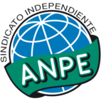

Solicitud de oposiciones 2016
======================================================

  
  
Este informe contiene un listado detallado de las localidades y centros por cada
localidad ordenando todo en función de la distancia/tiempo aproximados que se
necesitaría para desplazarte desde tu localidad de residencia (en tu caso,
nos has indicado **Montiel**).

Por favor, recuerda que el cálculo es aproximado y que aunque hemos
intentado verificar todos los códigos es posible que hayamos cometido algún
error. Dado que la solicitud electrónica también te muestra los pueblos, por
favor asegúrate de que introduces la petición de un centro o localidad que
te interese. En este documento
*no hemos incluido ningún codigo de centro penitenciario*, por lo que si deseas
solicitar alguno te rogamos los busques en la solicitud.

Si crees que hemos cometido algún error,te agradeceríamos que nos lo comentases
escribiendo a afiliados@anpecr.com.

Esperamos que este documento te resulte de utilidad.

Listado de códigos
-------------------

- ``130570001`` Montiel  (Tu localidad, 0 km)

  -``13002095C`` CEIP Gutiérrez de la Vega
    

- ``130890002`` VIllahermosa  (9 minutos, 8 km)

  -``13003385C`` CEIP San Agustín
    

- ``130040001`` Albaladejo  (11 minutos, 11 km)

  -``13012192C`` CRA Albaladejo
    

- ``130930001`` VIllanueva de los Infantes  (11 minutos, 14 km)

  -``13003440C`` CEIP Arqueólogo García Bellido
    

  -``13005175C`` CEPA Miguel de Cervantes (VIllanueva de los Infantes)
    

- ``130810001`` Terrinches  (13 minutos, 14 km)

  -``13003014C`` CEIP Miguel de Cervantes
    

- ``130920001`` VIllanueva de la Fuente  (19 minutos, 17 km)

  -``13003415C`` CEIP Inmaculada Concepción
    

- ``130080001`` Alcubillas  (21 minutos, 25 km)

  -``13000301C`` CEIP Nuestra Señora del Rosario
    

- ``130370001`` Cozar  (21 minutos, 24 km)

  -``13001455C`` CEIP Santísimo Cristo de la Veracruz
    

- ``130690001`` Puebla del Principe  (21 minutos, 24 km)

  -``13002423C`` CEIP Miguel González Calero
    

- ``130320001`` Carrizosa  (25 minutos, 28 km)

  -``13001054C`` CEIP Virgen del Salido
    

- ``130840001`` Torre de Juan Abad  (27 minutos, 23 km)

  -``13003178C`` CEIP Francisco de Quevedo
    

- ``130900001`` VIllamanrique  (28 minutos, 31 km)

  -``13003397C`` CEIP Nuestra Señora de Gracia
    

- ``130100002`` Pozo de la Serna  (29 minutos, 34 km)

  -``13000335C`` CEIP Sagrado Corazón
    

- ``020570002`` Ossa de Montiel  (33 minutos, 36 km)

  -``02002462C`` CEIP Enriqueta Sánchez
    

  -``02008853C`` AEPA Ossa de Montiel (Ossa de Montiel)
    

- ``130740001`` San Carlos del Valle  (35 minutos, 42 km)

  -``13002824C`` CEIP San Juan Bosco
    

- ``020080001`` Alcaraz  (36 minutos, 39 km)

  -``02001111C`` CEIP Nuestra Señora de Cortes
    

  -``02004902C`` AEPA Alcaraz (Alcaraz)
    

- ``020680003`` Robledo  (37 minutos, 43 km)

  -``02004574C`` CRA Sierra de Alcaraz
    

- ``020800001`` VIllapalacios  (37 minutos, 42 km)

  -``02004677C`` CRA los Olivos
    

- ``130100001`` Alhambra  (37 minutos, 39 km)

  -``13000323C`` CEIP Nuestra Señora de Fátima
    

- ``130790001`` Solana (La)  (38 minutos, 46 km)

  -``13002927C`` CEIP Sagrado Corazón
    

  -``13002939C`` CEIP Romero Peña
    

  -``13002940C`` CEIP el Santo
    

  -``13004833C`` CEIP el Humilladero
    

  -``13004894C`` CEIP Javier Paulino Pérez
    

  -``13010912C`` CEIP la Moheda
    

  -``13011001C`` CEIP Federico Romero
    

- ``130870001`` Valdepeñas  (39 minutos, 48 km)

  -``13010948C`` CEE María Luisa Navarro Margati
    

  -``13003211C`` CEIP Jesús Baeza
    

  -``13003221C`` CEIP Lorenzo Medina
    

  -``13003233C`` CEIP Jesús Castillo
    

  -``13003245C`` CEIP Lucero
    

  -``13003257C`` CEIP Luis Palacios
    

  -``13004006C`` CEIP Maestro Juan Alcaide
    

  -``13004225C`` CEPA Francisco de Quevedo (Valdepeñas)
    

- ``130330001`` Castellar de Santiago  (43 minutos, 43 km)

  -``13001066C`` CEIP San Juan de Ávila
    

- ``130540001`` Membrilla  (43 minutos, 56 km)

  -``13001996C`` CEIP Virgen del Espino
    

  -``13002009C`` CEIP San José de Calasanz
    

  -``13005102C`` AEPA Membrilla (Membrilla)
    

- ``139020001`` Ruidera  (44 minutos, 50 km)

  -``13000736C`` CEIP Juan Aguilar Molina
    

- ``130530003`` Manzanares  (48 minutos, 62 km)

  -``13001923C`` CEIP Divina Pastora
    

  -``13001935C`` CEIP Altagracia
    

  -``13003853C`` CEIP la Candelaria
    

  -``13004390C`` CEIP Enrique Tierno Galván
    

  -``13004079C`` CEPA San Blas (Manzanares)
    

- ``130770001`` Santa Cruz de Mudela  (52 minutos, 67 km)

  -``13002851C`` CEIP Cervantes
    

  -``13010869C`` AEPA Santa Cruz de Mudela (Santa Cruz de Mudela)
    

- ``130850001`` Torrenueva  (52 minutos, 64 km)

  -``13003181C`` CEIP Santiago el Mayor
    

- ``020190001`` Bonillo (El)  (53 minutos, 54 km)

  -``02001381C`` CEIP Antón Díaz
    

  -``02004896C`` AEPA Bonillo (El) (Bonillo (El))
    

- ``130870002`` Consolacion  (53 minutos, 68 km)

  -``13003348C`` CEIP Virgen de Consolación
    

- ``020530001`` Munera  (54 minutos, 63 km)

  -``02002334C`` CEIP Cervantes
    

  -``02004914C`` AEPA Munera (Munera)
    

- ``139040001`` Llanos del Caudillo  (54 minutos, 75 km)

  -``13003749C`` CEIP el Oasis
    

- ``020430001`` Lezuza  (57 minutos, 65 km)

  -``02007851C`` CRA Camino de Aníbal
    

  -``02008956C`` AEPA Lezuza (Lezuza)
    

- ``130160001`` Almuradiel  (57 minutos, 80 km)

  -``13000633C`` CEIP Santiago Apóstol
    

- ``130820002`` Tomelloso  (59 minutos, 77 km)

  -``13004080C`` CEE Ponce de León
    

  -``13003038C`` CEIP Miguel de Cervantes
    

  -``13003041C`` CEIP José María del Moral
    

  -``13003051C`` CEIP Carmelo Cortés
    

  -``13003075C`` CEIP Doña Crisanta
    

  -``13003087C`` CEIP José Antonio
    

  -``13003762C`` CEIP San José de Calasanz
    

  -``13003981C`` CEIP Embajadores
    

  -``13003993C`` CEIP San Isidro
    

  -``13004109C`` CEIP San Antonio
    

  -``13004328C`` CEIP Almirante Topete
    

  -``13004948C`` CEIP Virgen de las Viñas
    

  -``13009478C`` CEIP Felix Grande
    

  -``13004559C`` CEPA Simienza (Tomelloso)
    

- ``020670004`` Riopar  (59 minutos, 60 km)

  -``02004707C`` CRA Calar del Mundo
    

- ``130190001`` Argamasilla de Alba  (59 minutos, 74 km)

  -``13000700C`` CEIP Divino Maestro
    

  -``13000712C`` CEIP Nuestra Señora de Peñarroya
    

  -``13003831C`` CEIP Azorín
    

  -``13005151C`` AEPA Argamasilla de Alba (Argamasilla de Alba)
    

- ``020710004`` San Pedro  (1h 1min, 73 km)

  -``02002838C`` CEIP Margarita Sotos
    

- ``130970001`` VIllarta de San Juan  (1h 1min, 87 km)

  -``13003555C`` CEIP Nuestra Señora de la Paz
    

- ``130390001`` Daimiel  (1h 3min, 91 km)

  -``13001479C`` CEIP San Isidro
    

  -``13001480C`` CEIP Infante Don Felipe
    

  -``13001492C`` CEIP la Espinosa
    

  -``13004572C`` CEIP Calatrava
    

  -``13004663C`` CEIP Albuera
    

  -``13004641C`` CEPA Miguel de Cervantes (Daimiel)
    

- ``020650002`` Pozuelo  (1h 4min, 81 km)

  -``02004550C`` CRA los Llanos
    

- ``130050003`` Cinco Casas  (1h 4min, 87 km)

  -``13012052C`` CRA Alciares
    

- ``130980008`` VIso del Marques  (1h 4min, 86 km)

  -``13003634C`` CEIP Nuestra Señora del Valle
    

- ``130180001`` Arenas de San Juan  (1h 5min, 94 km)

  -``13000694C`` CEIP San Bernabé
    

- ``020150001`` Barrax  (1h 6min, 88 km)

  -``02001275C`` CEIP Benjamín Palencia
    

  -``02004811C`` AEPA Barrax (Barrax)
    

- ``130450001`` Granatula de Calatrava  (1h 6min, 84 km)

  -``13001662C`` CEIP Nuestra Señora Oreto y Zuqueca
    

- ``130700001`` Puerto Lapice  (1h 6min, 99 km)

  -``13002435C`` CEIP Juan Alcaide
    

- ``020120001`` Balazote  (1h 7min, 79 km)

  -``02001241C`` CEIP Nuestra Señora del Rosario
    

  -``02004768C`` AEPA Balazote (Balazote)
    

- ``130230001`` Bolaños de Calatrava  (1h 7min, 87 km)

  -``13000803C`` CEIP Fernando III el Santo
    

  -``13000815C`` CEIP Arzobispo Calzado
    

  -``13003786C`` CEIP Virgen del Monte
    

  -``13004936C`` CEIP Molino de Viento
    

  -``13010821C`` AEPA Bolaños de Calatrava (Bolaños de Calatrava)
    

- ``130580001`` Moral de Calatrava  (1h 7min, 87 km)

  -``13002113C`` CEIP Agustín Sanz
    

  -``13004869C`` CEIP Manuel Clemente
    

  -``13010985C`` AEPA Moral de Calatrava (Moral de Calatrava)
    

- ``020810003`` VIllarrobledo  (1h 8min, 77 km)

  -``02003065C`` CEIP Don Francisco Giner de los Ríos
    

  -``02003077C`` CEIP Graciano Atienza
    

  -``02003089C`` CEIP Jiménez de Córdoba
    

  -``02003090C`` CEIP Virrey Morcillo
    

  -``02003132C`` CEIP Virgen de la Caridad
    

  -``02004291C`` CEIP Diego Requena
    

  -``02008968C`` CEIP Barranco Cafetero
    

  -``02003880C`` CEPA Alonso Quijano (VIllarrobledo)
    

- ``130270001`` Calzada de Calatrava  (1h 8min, 91 km)

  -``13000888C`` CEIP Santa Teresa de Jesús
    

  -``13000891C`` CEIP Ignacio de Loyola
    

  -``13005141C`` AEPA Calzada de Calatrava (Calzada de Calatrava)
    

- ``130500001`` Labores (Las)  (1h 8min, 103 km)

  -``13001753C`` CEIP San José de Calasanz
    

- ``130830001`` Torralba de Calatrava  (1h 8min, 100 km)

  -``13003142C`` CEIP Cristo del Consuelo
    

- ``130780001`` Socuellamos  (1h 9min, 77 km)

  -``13002873C`` CEIP Gerardo Martínez
    

  -``13002885C`` CEIP el Coso
    

  -``13004316C`` CEIP Carmen Arias
    

  -``13005163C`` AEPA Socuellamos (Socuellamos)
    

- ``130310001`` Carrion de Calatrava  (1h 10min, 107 km)

  -``13001030C`` CEIP Nuestra Señora de la Encarnación
    

- ``130130001`` Almagro  (1h 11min, 88 km)

  -``13000402C`` CEIP Miguel de Cervantes Saavedra
    

  -``13000414C`` CEIP Diego de Almagro
    

  -``13004377C`` CEIP Paseo Viejo de la Florida
    

  -``13010811C`` AEPA Almagro (Almagro)
    

- ``130470001`` Herencia  (1h 12min, 110 km)

  -``13001698C`` CEIP Carrasco Alcalde
    

  -``13005023C`` AEPA Herencia (Herencia)
    

- ``130880001`` Valenzuela de Calatrava  (1h 13min, 92 km)

  -``13003361C`` CEIP Nuestra Señora del Rosario
    

- ``130560001`` Miguelturra  (1h 14min, 113 km)

  -``13002061C`` CEIP el Pradillo
    

  -``13002071C`` CEIP Santísimo Cristo de la Misericordia
    

  -``13004973C`` CEIP Benito Pérez Galdós
    

  -``13009521C`` CEIP Clara Campoamor
    

  -``13005047C`` AEPA Miguelturra (Miguelturra)
    

- ``130340002`` Ciudad Real  (1h 15min, 115 km)

  -``13001224C`` CEE Puerta de Santa María
    

  -``13001078C`` CEIP Alcalde José Cruz Prado
    

  -``13001091C`` CEIP Pérez Molina
    

  -``13001108C`` CEIP Ciudad Jardín
    

  -``13001111C`` CEIP Ángel Andrade
    

  -``13001121C`` CEIP Dulcinea del Toboso
    

  -``13001157C`` CEIP José María de la Fuente
    

  -``13001169C`` CEIP Jorge Manrique
    

  -``13001170C`` CEIP Pío XII
    

  -``13001391C`` CEIP Carlos Eraña
    

  -``13003889C`` CEIP Miguel de Cervantes
    

  -``13003890C`` CEIP Juan Alcaide
    

  -``13004389C`` CEIP Carlos Vázquez
    

  -``13004444C`` CEIP Ferroviario
    

  -``13004651C`` CEIP Cristóbal Colón
    

  -``13004754C`` CEIP Santo Tomás de Villanueva Nº 16
    

  -``13004857C`` CEIP María de Pacheco
    

  -``13004882C`` CEIP Alcalde José Maestro
    

  -``13009466C`` CEIP Don Quijote
    

  -``13004067C`` CEPA Antonio Gala (Ciudad Real)
    

  -``9999C`` En paro maestros
    

- ``020030013`` Santa Ana  (1h 15min, 94 km)

  -``02001007C`` CEIP Pedro Simón Abril
    

- ``130090001`` Aldea del Rey  (1h 15min, 97 km)

  -``13000311C`` CEIP Maestro Navas
    

- ``161710001`` Provencio (El)  (1h 15min, 95 km)

  -``16001995C`` CEIP Infanta Cristina
    

  -``16009416C`` AEPA Provencio (El) (Provencio (El))
    

- ``450870001`` Madridejos  (1h 16min, 117 km)

  -``45012062C`` CEE Mingoliva
    

  -``45001313C`` CEIP Garcilaso de la Vega
    

  -``45005185C`` CEIP Santa Ana
    

  -``45010478C`` AEPA Madridejos (Madridejos)
    

- ``020600007`` Peñas de San Pedro  (1h 16min, 95 km)

  -``02004690C`` CRA Peñas
    

- ``130520003`` Malagon  (1h 16min, 113 km)

  -``13001790C`` CEIP Cañada Real
    

  -``13001819C`` CEIP Santa Teresa
    

  -``13005035C`` AEPA Malagon (Malagon)
    

- ``130960001`` VIllarrubia de los Ojos  (1h 16min, 106 km)

  -``13003521C`` CEIP Rufino Blanco
    

  -``13003658C`` CEIP Virgen de la Sierra
    

  -``13005060C`` AEPA VIllarrubia de los Ojos (VIllarrubia de los Ojos)
    

- ``161900002`` San Clemente  (1h 16min, 99 km)

  -``16002151C`` CEIP Rafael López de Haro
    

  -``16004340C`` CEPA Campos del Záncara (San Clemente)
    

- ``130660001`` Pozuelo de Calatrava  (1h 17min, 100 km)

  -``13002368C`` CEIP José María de la Fuente
    

  -``13005059C`` AEPA Pozuelo de Calatrava (Pozuelo de Calatrava)
    

- ``450340001`` Camuñas  (1h 17min, 120 km)

  -``45000485C`` CEIP Cardenal Cisneros
    

- ``130640001`` Poblete  (1h 18min, 122 km)

  -``13002290C`` CEIP la Alameda
    

- ``450530001`` Consuegra  (1h 18min, 120 km)

  -``45000710C`` CEIP Santísimo Cristo de la Vera Cruz
    

  -``45000722C`` CEIP Miguel de Cervantes
    

  -``45004880C`` CEPA Castillo de Consuegra (Consuegra)
    

- ``451870001`` VIllafranca de los Caballeros  (1h 18min, 116 km)

  -``45004296C`` CEIP Miguel de Cervantes
    

- ``130050002`` Alcazar de San Juan  (1h 19min, 107 km)

  -``13000104C`` CEIP el Santo
    

  -``13000116C`` CEIP Juan de Austria
    

  -``13000128C`` CEIP Jesús Ruiz de la Fuente
    

  -``13000131C`` CEIP Santa Clara
    

  -``13003828C`` CEIP Alces
    

  -``13004092C`` CEIP Pablo Ruiz Picasso
    

  -``13004870C`` CEIP Gloria Fuertes
    

  -``13010900C`` CEIP Jardín de Arena
    

  -``13004055C`` CEPA Enrique Tierno Galván (Alcazar de San Juan)
    

- ``161240001`` Mesas (Las)  (1h 19min, 92 km)

  -``16001533C`` CEIP Hermanos Amorós Fernández
    

  -``16004303C`` AEPA Mesas (Las) (Mesas (Las))
    

- ``020630005`` Pozohondo  (1h 20min, 102 km)

  -``02004744C`` CRA Pozohondo
    

- ``020690001`` Roda (La)  (1h 21min, 102 km)

  -``02002711C`` CEIP José Antonio
    

  -``02002723C`` CEIP Juan Ramón Ramírez
    

  -``02002796C`` CEIP Tomás Navarro Tomás
    

  -``02004124C`` CEIP Miguel Hernández
    

  -``02004793C`` AEPA Roda (La) (Roda (La))
    

- ``130610001`` Pedro Muñoz  (1h 21min, 105 km)

  -``13002162C`` CEIP María Luisa Cañas
    

  -``13002174C`` CEIP Nuestra Señora de los Ángeles
    

  -``13004331C`` CEIP Maestro Juan de Ávila
    

  -``13011011C`` CEIP Hospitalillo
    

  -``13010808C`` AEPA Pedro Muñoz (Pedro Muñoz)
    

- ``130280002`` Campo de Criptana  (1h 22min, 110 km)

  -``13000943C`` CEIP Virgen de la Paz
    

  -``13000955C`` CEIP Virgen de Criptana
    

  -``13000967C`` CEIP Sagrado Corazón
    

  -``13003968C`` CEIP Domingo Miras
    

  -``13005011C`` AEPA Campo de Criptana (Campo de Criptana)
    

- ``020480001`` Minaya  (1h 22min, 94 km)

  -``02002255C`` CEIP Diego Ciller Montoya
    

- ``130440003`` Fuente el Fresno  (1h 22min, 122 km)

  -``13001650C`` CEIP Miguel Delibes
    

- ``160610001`` Casas de Fernando Alonso  (1h 23min, 111 km)

  -``16004170C`` CRA Tomás y Valiente
    

- ``020030001`` Aguas Nuevas  (1h 24min, 101 km)

  -``02000039C`` CEIP San Isidro Labrador
    

- ``130350001`` Corral de Calatrava  (1h 25min, 135 km)

  -``13001431C`` CEIP Nuestra Señora de la Paz
    

- ``130340004`` Valverde  (1h 25min, 127 km)

  -``13001421C`` CEIP Alarcos
    

- ``161980001`` Sisante  (1h 25min, 116 km)

  -``16002264C`` CEIP Fernández Turégano
    

- ``020350001`` Gineta (La)  (1h 26min, 115 km)

  -``02001743C`` CEIP Mariano Munera
    

- ``130340001`` Casas (Las)  (1h 26min, 123 km)

  -``13003774C`` CEIP Nuestra Señora del Rosario
    

- ``161540001`` Pedroñeras (Las)  (1h 26min, 108 km)

  -``16001831C`` CEIP Adolfo Martínez Chicano
    

  -``16004297C`` AEPA Pedroñeras (Las) (Pedroñeras (Las))
    

- ``020490011`` Molinicos  (1h 27min, 84 km)

  -``02002279C`` CEIP Molinicos
    

- ``020030012`` Salobral (El)  (1h 27min, 102 km)

  -``02000994C`` CEIP Príncipe Felipe
    

- ``160070001`` Alberca de Zancara (La)  (1h 27min, 116 km)

  -``16004111C`` CRA Jorge Manrique
    

- ``130200001`` Argamasilla de Calatrava  (1h 28min, 121 km)

  -``13000748C`` CEIP Rodríguez Marín
    

  -``13000773C`` CEIP Virgen del Socorro
    

  -``13005138C`` AEPA Argamasilla de Calatrava (Argamasilla de Calatrava)
    

- ``451660001`` Tembleque  (1h 28min, 141 km)

  -``45003361C`` CEIP Antonia González
    

- ``020030002`` Albacete  (1h 29min, 108 km)

  -``02003569C`` CEE Eloy Camino
    

  -``02000040C`` CEIP Carlos V
    

  -``02000052C`` CEIP Cristóbal Colón
    

  -``02000064C`` CEIP Cervantes
    

  -``02000076C`` CEIP Cristóbal Valera
    

  -``02000088C`` CEIP Diego Velázquez
    

  -``02000091C`` CEIP Doctor Fleming
    

  -``02000106C`` CEIP Severo Ochoa
    

  -``02000118C`` CEIP Inmaculada Concepción
    

  -``02000121C`` CEIP María de los Llanos Martínez
    

  -``02000131C`` CEIP Príncipe Felipe
    

  -``02000143C`` CEIP Reina Sofía
    

  -``02000155C`` CEIP San Fernando
    

  -``02000167C`` CEIP San Fulgencio
    

  -``02000180C`` CEIP Virgen de los Llanos
    

  -``02000805C`` CEIP Antonio Machado
    

  -``02000830C`` CEIP Castilla-la Mancha
    

  -``02000842C`` CEIP Benjamín Palencia
    

  -``02000854C`` CEIP Federico Mayor Zaragoza
    

  -``02000878C`` CEIP Ana Soto
    

  -``02003752C`` CEIP San Pablo
    

  -``02003764C`` CEIP Pedro Simón Abril
    

  -``02003879C`` CEIP Parque Sur
    

  -``02003909C`` CEIP San Antón
    

  -``02004021C`` CEIP Villacerrada
    

  -``02004112C`` CEIP José Prat García
    

  -``02004264C`` CEIP José Salustiano Serna
    

  -``02004409C`` CEIP Feria-Isabel Bonal
    

  -``02007757C`` CEIP la Paz
    

  -``02007769C`` CEIP Gloria Fuertes
    

  -``02008816C`` CEIP Francisco Giner de los Ríos
    

  -``02003673C`` CEPA los Llanos (Albacete)
    

  -``02010045C`` AEPA Albacete (Albacete)
    

- ``020210001`` Casas de Juan Nuñez  (1h 29min, 108 km)

  -``02001408C`` CEIP San Pedro Apóstol
    

- ``130070001`` Alcolea de Calatrava  (1h 29min, 135 km)

  -``13000293C`` CEIP Tomasa Gallardo
    

  -``13005072C`` AEPA Alcolea de Calatrava (Alcolea de Calatrava)
    

- ``161530001`` Pedernoso (El)  (1h 29min, 104 km)

  -``16001821C`` CEIP Juan Gualberto Avilés
    

- ``451770001`` Urda  (1h 29min, 135 km)

  -``45004132C`` CEIP Santo Cristo
    

- ``130220001`` Ballesteros de Calatrava  (1h 30min, 140 km)

  -``13000797C`` CEIP José María del Moral
    

- ``451750001`` Turleque  (1h 30min, 136 km)

  -``45004119C`` CEIP Fernán González
    

- ``451850001`` VIllacañas  (1h 31min, 139 km)

  -``45004259C`` CEIP Santa Bárbara
    

  -``45010338C`` AEPA VIllacañas (VIllacañas)
    

- ``020780001`` VIllalgordo del Júcar  (1h 32min, 118 km)

  -``02003016C`` CEIP San Roque
    

- ``130750001`` San Lorenzo de Calatrava  (1h 32min, 116 km)

  -``13010781C`` CRA Sierra Morena
    

- ``161020001`` Honrubia  (1h 32min, 130 km)

  -``16004561C`` CRA los Girasoles
    

- ``450900001`` Manzaneque  (1h 32min, 150 km)

  -``45001398C`` CEIP Álvarez de Toledo
    

- ``451410001`` Quero  (1h 32min, 131 km)

  -``45002421C`` CEIP Santiago Cabañas
    

- ``451490001`` Romeral (El)  (1h 32min, 147 km)

  -``45002627C`` CEIP Silvano Cirujano
    

- ``130620001`` Picon  (1h 33min, 131 km)

  -``13002204C`` CEIP José María del Moral
    

- ``130910001`` VIllamayor de Calatrava  (1h 33min, 145 km)

  -``13003403C`` CEIP Inocente Martín
    

- ``161330001`` Mota del Cuervo  (1h 33min, 119 km)

  -``16001624C`` CEIP Virgen de Manjavacas
    

  -``16009945C`` CEIP Santa Rita
    

  -``16004327C`` AEPA Mota del Cuervo (Mota del Cuervo)
    

- ``450710001`` Guardia (La)  (1h 33min, 152 km)

  -``45001052C`` CEIP Valentín Escobar
    

- ``451670001`` Toboso (El)  (1h 33min, 119 km)

  -``45003371C`` CEIP Miguel de Cervantes
    

- ``160330001`` Belmonte  (1h 34min, 112 km)

  -``16000280C`` CEIP Fray Luis de León
    

- ``020300001`` Elche de la Sierra  (1h 35min, 98 km)

  -``02001615C`` CEIP San Blas
    

  -``02004847C`` AEPA Elche de la Sierra (Elche de la Sierra)
    

- ``029010001`` Pozo Cañada  (1h 35min, 122 km)

  -``02000982C`` CEIP Virgen del Rosario
    

  -``02004771C`` AEPA Pozo Cañada (Pozo Cañada)
    

- ``020730001`` Tarazona de la Mancha  (1h 35min, 127 km)

  -``02002887C`` CEIP Eduardo Sanchiz
    

  -``02004801C`` AEPA Tarazona de la Mancha (Tarazona de la Mancha)
    

- ``160600002`` Casas de Benitez  (1h 35min, 123 km)

  -``16004601C`` CRA Molinos del Júcar
    

- ``130630002`` Piedrabuena  (1h 36min, 143 km)

  -``13002228C`` CEIP Miguel de Cervantes
    

  -``13003971C`` CEIP Luis Vives
    

  -``13009582C`` CEPA Montes Norte (Piedrabuena)
    

- ``130670001`` Pozuelos de Calatrava (Los)  (1h 36min, 145 km)

  -``13002371C`` CEIP Santa Quiteria
    

- ``451060001`` Mora  (1h 36min, 153 km)

  -``45001623C`` CEIP José Ramón Villa
    

  -``45001672C`` CEIP Fernando Martín
    

  -``45010466C`` AEPA Mora (Mora)
    

- ``451860001`` VIlla de Don Fadrique (La)  (1h 36min, 149 km)

  -``45004284C`` CEIP Ramón y Cajal
    

- ``130250001`` Cabezarados  (1h 37min, 154 km)

  -``13000864C`` CEIP Nuestra Señora de Finibusterre
    

- ``160660001`` Casasimarro  (1h 37min, 125 km)

  -``16000693C`` CEIP Luis de Mateo
    

  -``16004273C`` AEPA Casasimarro (Casasimarro)
    

- ``450840001`` Lillo  (1h 37min, 152 km)

  -``45001222C`` CEIP Marcelino Murillo
    

- ``450940001`` Mascaraque  (1h 37min, 158 km)

  -``45001441C`` CEIP Juan de Padilla
    

- ``451010001`` Miguel Esteban  (1h 37min, 128 km)

  -``45001532C`` CEIP Cervantes
    

- ``450590001`` Dosbarrios  (1h 38min, 163 km)

  -``45000862C`` CEIP San Isidro Labrador
    

- ``451240002`` Orgaz  (1h 38min, 158 km)

  -``45002093C`` CEIP Conde de Orgaz
    

- ``451900001`` VIllaminaya  (1h 38min, 159 km)

  -``45004338C`` CEIP Santo Domingo de Silos
    

- ``452000005`` Yebenes (Los)  (1h 38min, 149 km)

  -``45004478C`` CEIP San José de Calasanz
    

  -``45012050C`` AEPA Yebenes (Los) (Yebenes (Los))
    

- ``130710004`` Puertollano  (1h 39min, 125 km)

  -``13002459C`` CEIP Vicente Aleixandre
    

  -``13002472C`` CEIP Cervantes
    

  -``13002484C`` CEIP Calderón de la Barca
    

  -``13002502C`` CEIP Menéndez Pelayo
    

  -``13002538C`` CEIP Miguel de Unamuno
    

  -``13002541C`` CEIP Giner de los Ríos
    

  -``13002551C`` CEIP Gonzalo de Berceo
    

  -``13002563C`` CEIP Ramón y Cajal
    

  -``13002587C`` CEIP Doctor Limón
    

  -``13002599C`` CEIP Severo Ochoa
    

  -``13003646C`` CEIP Juan Ramón Jiménez
    

  -``13004274C`` CEIP David Jiménez Avendaño
    

  -``13004286C`` CEIP Ángel Andrade
    

  -``13004407C`` CEIP Enrique Tierno Galván
    

  -``13004213C`` CEPA Antonio Machado (Puertollano)
    

- ``020740006`` Tobarra  (1h 39min, 128 km)

  -``02002954C`` CEIP Cervantes
    

  -``02004288C`` CEIP Cristo de la Antigua
    

  -``02004719C`` CEIP Nuestra Señora de la Asunción
    

  -``02004872C`` AEPA Tobarra (Tobarra)
    

- ``130150001`` Almodovar del Campo  (1h 39min, 157 km)

  -``13000505C`` CEIP Maestro Juan de Ávila
    

  -``13000517C`` CEIP Virgen del Carmen
    

  -``13005126C`` AEPA Almodovar del Campo (Almodovar del Campo)
    

- ``450120001`` Almonacid de Toledo  (1h 39min, 163 km)

  -``45000187C`` CEIP Virgen de la Oliva
    

- ``020290002`` Chinchilla de Monte-Aragon  (1h 40min, 126 km)

  -``02001573C`` CEIP Alcalde Galindo
    

  -``02008890C`` AEPA Chinchilla de Monte-Aragon (Chinchilla de Monte-Aragon)
    

- ``020460001`` Mahora  (1h 40min, 133 km)

  -``02002218C`` CEIP Nuestra Señora de Gracia
    

- ``020750001`` Valdeganga  (1h 40min, 133 km)

  -``02005219C`` CRA Nuestra Señora del Rosario
    

- ``020170002`` Bogarra  (1h 41min, 95 km)

  -``02004689C`` CRA Almenara
    

- ``130010001`` Abenojar  (1h 41min, 160 km)

  -``13000013C`` CEIP Nuestra Señora de la Encarnación
    

- ``162510004`` VIllanueva de la Jara  (1h 41min, 138 km)

  -``16002823C`` CEIP Hermenegildo Moreno
    

- ``450920001`` Marjaliza  (1h 41min, 153 km)

  -``45006037C`` CEIP San Juan
    

- ``130650002`` Porzuna  (1h 42min, 143 km)

  -``13002320C`` CEIP Nuestra Señora del Rosario
    

  -``13005084C`` AEPA Porzuna (Porzuna)
    

- ``161750001`` Quintanar del Rey  (1h 42min, 137 km)

  -``16002033C`` CEIP Valdemembra
    

  -``16009957C`` CEIP Paula Soler Sanchiz
    

  -``16008655C`` AEPA Quintanar del Rey (Quintanar del Rey)
    

- ``162430002`` VIllaescusa de Haro  (1h 42min, 118 km)

  -``16004145C`` CRA Alonso Quijano
    

- ``020440005`` Lietor  (1h 43min, 125 km)

  -``02002191C`` CEIP Martínez Parras
    

- ``020610002`` Petrola  (1h 43min, 144 km)

  -``02004513C`` CRA Laguna de Pétrola
    

- ``161000001`` Hinojosos (Los)  (1h 43min, 132 km)

  -``16009362C`` CRA Airén
    

- ``162440002`` VIllagarcia del Llano  (1h 43min, 137 km)

  -``16002720C`` CEIP Virrey Núñez de Haro
    

- ``450780001`` Huerta de Valdecarabanos  (1h 43min, 167 km)

  -``45001121C`` CEIP Virgen del Rosario de Pastores
    

- ``451070001`` Nambroca  (1h 43min, 170 km)

  -``45001726C`` CEIP la Fuente
    

- ``451350001`` Puebla de Almoradiel (La)  (1h 43min, 158 km)

  -``45002287C`` CEIP Ramón y Cajal
    

  -``45012153C`` AEPA Puebla de Almoradiel (La) (Puebla de Almoradiel (La))
    

- ``451930001`` VIllanueva de Bogas  (1h 43min, 161 km)

  -``45004375C`` CEIP Santa Ana
    

- ``130510003`` Luciana  (1h 44min, 155 km)

  -``13001765C`` CEIP Isabel la Católica
    

- ``161340001`` Motilla del Palancar  (1h 44min, 153 km)

  -``16001651C`` CEIP San Gil Abad
    

  -``16004251C`` CEPA Cervantes (Motilla del Palancar)
    

- ``450230001`` Burguillos de Toledo  (1h 44min, 176 km)

  -``45000357C`` CEIP Victorio Macho
    

- ``451420001`` Quintanar de la Orden  (1h 44min, 130 km)

  -``45002457C`` CEIP Cristóbal Colón
    

  -``45012001C`` CEIP Antonio Machado
    

  -``45005288C`` CEPA Luis VIves (Quintanar de la Orden)
    

- ``020450001`` Madrigueras  (1h 45min, 137 km)

  -``02002206C`` CEIP Constitución Española
    

  -``02004835C`` AEPA Madrigueras (Madrigueras)
    

- ``130400001`` Fernan Caballero  (1h 45min, 143 km)

  -``13001601C`` CEIP Manuel Sastre Velasco
    

- ``450540001`` Corral de Almaguer  (1h 45min, 164 km)

  -``45000783C`` CEIP Nuestra Señora de la Muela
    

- ``451210001`` Ocaña  (1h 45min, 172 km)

  -``45002020C`` CEIP San José de Calasanz
    

  -``45012177C`` CEIP Pastor Poeta
    

  -``45005631C`` CEPA Gutierre de Cárdenas (Ocaña)
    

- ``450010001`` Ajofrin  (1h 46min, 171 km)

  -``45000011C`` CEIP Jacinto Guerrero
    

- ``450520001`` Cobisa  (1h 46min, 178 km)

  -``45000692C`` CEIP Cardenal Tavera
    

  -``45011793C`` CEIP Gloria Fuertes
    

- ``451630002`` Sonseca  (1h 46min, 170 km)

  -``45002883C`` CEIP San Juan Evangelista
    

  -``45012074C`` CEIP Peñamiel
    

  -``45005926C`` CEPA Cum Laude (Sonseca)
    

- ``020370005`` Hellin  (1h 47min, 134 km)

  -``02003739C`` CEE Cruz de Mayo
    

  -``02001810C`` CEIP Isabel la Católica
    

  -``02001822C`` CEIP Martínez Parras
    

  -``02001834C`` CEIP Nuestra Señora del Rosario
    

  -``02007770C`` CEIP la Olivarera
    

  -``02010112C`` CEIP Entre Culturas
    

  -``02003697C`` CEPA López del Oro (Hellin)
    

  -``02010161C`` AEPA Hellin (Hellin)
    

- ``451150001`` Noblejas  (1h 47min, 175 km)

  -``45001908C`` CEIP Santísimo Cristo de las Injurias
    

  -``45012037C`` AEPA Noblejas (Noblejas)
    

- ``020260001`` Cenizate  (1h 48min, 147 km)

  -``02004631C`` CRA Pinares de la Manchuela
    

  -``02008944C`` AEPA Cenizate (Cenizate)
    

- ``130480001`` Hinojosas de Calatrava  (1h 48min, 142 km)

  -``13004912C`` CRA Valle de Alcudia
    

- ``162690002`` VIllares del Saz  (1h 48min, 166 km)

  -``16004649C`` CRA el Quijote
    

- ``452020001`` Yepes  (1h 48min, 173 km)

  -``45004557C`` CEIP Rafael García Valiño
    

- ``020390003`` Higueruela  (1h 49min, 156 km)

  -``02008828C`` CRA los Molinos
    

- ``020370006`` Isso  (1h 49min, 138 km)

  -``02001986C`` CEIP Santiago Apóstol
    

- ``451910001`` VIllamuelas  (1h 49min, 172 km)

  -``45004341C`` CEIP Santa María Magdalena
    

- ``451920001`` VIllanueva de Alcardete  (1h 49min, 142 km)

  -``45004363C`` CEIP Nuestra Señora de la Piedad
    

- ``130240001`` Brazatortas  (1h 50min, 145 km)

  -``13000839C`` CEIP Cervantes
    

- ``450160001`` Arges  (1h 50min, 182 km)

  -``45000278C`` CEIP Tirso de Molina
    

  -``45011781C`` CEIP Miguel de Cervantes
    

- ``450960002`` Mazarambroz  (1h 50min, 173 km)

  -``45001477C`` CEIP Nuestra Señora del Sagrario
    

- ``451980001`` VIllatobas  (1h 50min, 180 km)

  -``45004454C`` CEIP Sagrado Corazón de Jesús
    

- ``451680001`` Toledo  (1h 51min, 184 km)

  -``45005574C`` CEE Ciudad de Toledo
    

  -``45003383C`` CEIP la Candelaria
    

  -``45003401C`` CEIP Ángel del Alcázar
    

  -``45003644C`` CEIP Fábrica de Armas
    

  -``45003668C`` CEIP Santa Teresa
    

  -``45003929C`` CEIP Jaime de Foxa
    

  -``45003942C`` CEIP Alfonso Vi
    

  -``45004806C`` CEIP Garcilaso de la Vega
    

  -``45004818C`` CEIP Gómez Manrique
    

  -``45004843C`` CEIP Ciudad de Nara
    

  -``45004892C`` CEIP San Lucas y María
    

  -``45004971C`` CEIP Juan de Padilla
    

  -``45005203C`` CEIP Escultor Alberto Sánchez
    

  -``45005239C`` CEIP Gregorio Marañón
    

  -``45005318C`` CEIP Ciudad de Aquisgrán
    

  -``45010296C`` CEIP Europa
    

  -``45010302C`` CEIP Valparaíso
    

  -``45004946C`` CEPA Gustavo Adolfo Bécquer (Toledo)
    

  -``45005641C`` CEPA Polígono (Toledo)
    

- ``020340003`` Fuentealbilla  (1h 51min, 150 km)

  -``02001731C`` CEIP Cristo del Valle
    

- ``451710001`` Torre de Esteban Hambran (La)  (1h 51min, 184 km)

  -``45004016C`` CEIP Juan Aguado
    

- ``451950001`` VIllarrubia de Santiago  (1h 51min, 182 km)

  -``45004399C`` CEIP Nuestra Señora del Castellar
    

- ``451970001`` VIllasequilla  (1h 51min, 177 km)

  -``45004442C`` CEIP San Isidro Labrador
    

- ``020180001`` Bonete  (1h 52min, 160 km)

  -``02001378C`` CEIP Pablo Picasso
    

- ``130360002`` Cortijos de Arriba  (1h 52min, 146 km)

  -``13001443C`` CEIP Nuestra Señora de las Mercedes
    

- ``160960001`` Graja de Iniesta  (1h 52min, 172 km)

  -``16004595C`` CRA Camino Real de Levante
    

- ``161180001`` Ledaña  (1h 52min, 147 km)

  -``16001478C`` CEIP San Roque
    

- ``161910001`` San Lorenzo de la Parrilla  (1h 52min, 164 km)

  -``16004455C`` CRA Gloria Fuertes
    

- ``450500001`` Ciruelos  (1h 52min, 188 km)

  -``45000679C`` CEIP Santísimo Cristo de la Misericordia
    

- ``451230001`` Ontigola  (1h 52min, 183 km)

  -``45002056C`` CEIP Virgen del Rosario
    

- ``161130003`` Iniesta  (1h 53min, 150 km)

  -``16001405C`` CEIP María Jover
    

  -``16004261C`` AEPA Iniesta (Iniesta)
    

- ``450830001`` Layos  (1h 53min, 186 km)

  -``45001210C`` CEIP María Magdalena
    

- ``160420001`` Campillo de Altobuey  (1h 54min, 166 km)

  -``16009349C`` CRA los Pinares
    

- ``162490001`` VIllamayor de Santiago  (1h 54min, 149 km)

  -``16002781C`` CEIP Gúzquez
    

  -``16004364C`` AEPA VIllamayor de Santiago (VIllamayor de Santiago)
    

- ``450700001`` Guadamur  (1h 54min, 189 km)

  -``45001040C`` CEIP Nuestra Señora de la Natividad
    

- ``451220001`` Olias del Rey  (1h 54min, 191 km)

  -``45002044C`` CEIP Pedro Melendo García
    

- ``450190003`` Perdices (Las)  (1h 54min, 188 km)

  -``45011771C`` CEIP Pintor Tomás Camarero
    

- ``020310001`` Ferez  (1h 55min, 116 km)

  -``02001688C`` CEIP Nuestra Señora del Rosario
    

- ``020860014`` Yeste  (1h 55min, 109 km)

  -``02010021C`` CRA Yeste
    

  -``02004884C`` AEPA Yeste (Yeste)
    

- ``139010001`` Robledo (El)  (1h 55min, 158 km)

  -``13010778C`` CRA Valle del Bullaque
    

  -``13005096C`` AEPA Robledo (El) (Robledo (El))
    

- ``450270001`` Cabezamesada  (1h 55min, 173 km)

  -``45000394C`` CEIP Alonso de Cárdenas
    

- ``130650005`` Torno (El)  (1h 56min, 159 km)

  -``13002356C`` CEIP Nuestra Señora de Guadalupe
    

- ``162360001`` Valverde de Jucar  (1h 56min, 171 km)

  -``16004625C`` CRA Ribera del Júcar
    

- ``162480001`` VIllalpardo  (1h 56min, 183 km)

  -``16004005C`` CRA Manchuela
    

- ``020370002`` Agramon  (1h 57min, 150 km)

  -``02004525C`` CRA Río Mundo
    

- ``020040001`` Albatana  (1h 57min, 149 km)

  -``02004537C`` CRA Laguna de Alboraj
    

- ``020790001`` VIllamalea  (1h 57min, 157 km)

  -``02003031C`` CEIP Ildefonso Navarro
    

  -``02004823C`` AEPA VIllamalea (VIllamalea)
    

- ``020510001`` Montealegre del Castillo  (1h 58min, 170 km)

  -``02002309C`` CEIP Virgen de Consolación
    

- ``020720004`` Socovos  (1h 58min, 120 km)

  -``02002875C`` CEIP León Felipe
    

- ``161250001`` Minglanilla  (1h 58min, 180 km)

  -``16001557C`` CEIP Princesa Sofía
    

- ``450190001`` Bargas  (1h 58min, 190 km)

  -``45000308C`` CEIP Santísimo Cristo de la Sala
    

- ``450250001`` Cabañas de la Sagra  (1h 58min, 198 km)

  -``45000370C`` CEIP San Isidro Labrador
    

- ``451020002`` Mocejon  (1h 58min, 194 km)

  -``45001544C`` CEIP Miguel de Cervantes
    

  -``45012049C`` AEPA Mocejon (Mocejon)
    

- ``451330001`` Polan  (1h 58min, 192 km)

  -``45002241C`` CEIP José María Corcuera
    

  -``45012141C`` AEPA Polan (Polan)
    

- ``020050001`` Alborea  (1h 59min, 164 km)

  -``02004549C`` CRA la Manchuela
    

- ``020240001`` Casas-Ibañez  (1h 59min, 164 km)

  -``02001433C`` CEIP San Agustín
    

  -``02004781C`` CEPA la Manchuela (Casas-Ibañez)
    

- ``020560001`` Ontur  (1h 59min, 148 km)

  -``02002450C`` CEIP San José de Calasanz
    

- ``130730001`` Saceruela  (1h 59min, 186 km)

  -``13002800C`` CEIP Virgen de las Cruces
    

- ``451560001`` Santa Cruz de la Zarza  (1h 59min, 199 km)

  -``45002721C`` CEIP Eduardo Palomo Rodríguez
    

- ``451610004`` Seseña Nuevo  (1h 59min, 199 km)

  -``45002810C`` CEIP Fernando de Rojas
    

  -``45010363C`` CEIP Gloria Fuertes
    

  -``45011951C`` CEIP el Quiñón
    

  -``45010399C`` CEPA Seseña Nuevo (Seseña Nuevo)
    

- ``451960002`` VIllaseca de la Sagra  (1h 59min, 198 km)

  -``45004429C`` CEIP Virgen de las Angustias
    

- ``450880001`` Magan  (2h, 196 km)

  -``45001349C`` CEIP Santa Marina
    

- ``452040001`` Yunclillos  (2h, 201 km)

  -``45004594C`` CEIP Nuestra Señora de la Salud
    

- ``020330001`` Fuente-Alamo  (2h 1min, 167 km)

  -``02001706C`` CEIP Don Quijote y Sancho
    

  -``02008907C`` AEPA Fuente-Alamo (Fuente-Alamo)
    

- ``450030001`` Albarreal de Tajo  (2h 1min, 202 km)

  -``45000035C`` CEIP Benjamín Escalonilla
    

- ``450140001`` Añover de Tajo  (2h 1min, 199 km)

  -``45000230C`` CEIP Conde de Mayalde
    

- ``450550001`` Cuerva  (2h 1min, 190 km)

  -``45000795C`` CEIP Soledad Alonso Dorado
    

- ``451400001`` Pulgar  (2h 1min, 188 km)

  -``45002411C`` CEIP Nuestra Señora de la Blanca
    

- ``161480001`` Palomares del Campo  (2h 2min, 190 km)

  -``16004121C`` CRA San José de Calasanz
    

- ``169030001`` Valera de Abajo  (2h 2min, 179 km)

  -``16002586C`` CEIP Virgen del Rosario
    

- ``450320001`` Camarenilla  (2h 2min, 202 km)

  -``45000451C`` CEIP Nuestra Señora del Rosario
    

- ``452030001`` Yuncler  (2h 2min, 205 km)

  -``45004582C`` CEIP Remigio Laín
    

- ``161060001`` Horcajo de Santiago  (2h 3min, 183 km)

  -``16001314C`` CEIP José Montalvo
    

  -``16004352C`` AEPA Horcajo de Santiago (Horcajo de Santiago)
    

- ``161860001`` Saelices  (2h 3min, 194 km)

  -``16009386C`` CRA Segóbriga
    

- ``450210001`` Borox  (2h 3min, 199 km)

  -``45000321C`` CEIP Nuestra Señora de la Salud
    

- ``451470001`` Rielves  (2h 3min, 205 km)

  -``45002551C`` CEIP Maximina Felisa Gómez Aguero
    

- ``451610003`` Seseña  (2h 3min, 202 km)

  -``45002809C`` CEIP Gabriel Uriarte
    

  -``45010442C`` CEIP Sisius
    

  -``45011823C`` CEIP Juan Carlos I
    

- ``451880001`` VIllaluenga de la Sagra  (2h 3min, 205 km)

  -``45004302C`` CEIP Juan Palarea
    

- ``020090001`` Almansa  (2h 4min, 183 km)

  -``02001147C`` CEIP Duque de Alba
    

  -``02001159C`` CEIP Príncipe de Asturias
    

  -``02001160C`` CEIP Nuestra Señora de Belén
    

  -``02004033C`` CEIP Claudio Sánchez Albornoz
    

  -``02004392C`` CEIP José Lloret Talens
    

  -``02004653C`` CEIP Miguel Pinilla
    

  -``02003685C`` CEPA Castillo de Almansa (Almansa)
    

- ``020100001`` Alpera  (2h 4min, 181 km)

  -``02001214C`` CEIP Vera Cruz
    

  -``02008920C`` AEPA Alpera (Alpera)
    

- ``020720006`` Tazona  (2h 4min, 128 km)

  -``02002863C`` CEIP Ramón y Cajal
    

- ``451160001`` Noez  (2h 4min, 200 km)

  -``45001945C`` CEIP Santísimo Cristo de la Salud
    

- ``451890001`` VIllamiel de Toledo  (2h 4min, 201 km)

  -``45004326C`` CEIP Nuestra Señora de la Redonda
    

- ``020420003`` Letur  (2h 5min, 128 km)

  -``02002140C`` CEIP Nuestra Señora de la Asunción
    

- ``450180001`` Barcience  (2h 5min, 207 km)

  -``45010405C`` CEIP Santa María la Blanca
    

- ``450510001`` Cobeja  (2h 5min, 211 km)

  -``45000680C`` CEIP San Juan Bautista
    

- ``450770001`` Huecas  (2h 5min, 206 km)

  -``45001118C`` CEIP Gregorio Marañón
    

- ``450850001`` Lominchar  (2h 5min, 210 km)

  -``45001234C`` CEIP Ramón y Cajal
    

- ``451190001`` Numancia de la Sagra  (2h 5min, 212 km)

  -``45001970C`` CEIP Santísimo Cristo de la Misericordia
    

- ``451450001`` Recas  (2h 5min, 205 km)

  -``45002536C`` CEIP Cesar Cabañas Caballero
    

- ``020070001`` Alcala del Jucar  (2h 6min, 170 km)

  -``02004483C`` CRA Ribera del Júcar
    

- ``130060001`` Alcoba  (2h 6min, 175 km)

  -``13000256C`` CEIP Don Rodrigo
    

- ``450150001`` Arcicollar  (2h 6min, 208 km)

  -``45000254C`` CEIP San Blas
    

- ``450670001`` Galvez  (2h 6min, 205 km)

  -``45000989C`` CEIP San Juan de la Cruz
    

- ``452050001`` Yuncos  (2h 6min, 210 km)

  -``45004600C`` CEIP Nuestra Señora del Consuelo
    

  -``45010511C`` CEIP Guillermo Plaza
    

  -``45012104C`` CEIP Villa de Yuncos
    

- ``450240001`` Burujon  (2h 7min, 210 km)

  -``45000369C`` CEIP Juan XXIII
    

- ``450980001`` Menasalbas  (2h 7min, 197 km)

  -``45001490C`` CEIP Nuestra Señora de Fátima
    

- ``451730001`` Torrijos  (2h 7min, 211 km)

  -``45004053C`` CEIP Villa de Torrijos
    

  -``45011835C`` CEIP Lazarillo de Tormes
    

  -``45005276C`` CEPA Teresa Enríquez (Torrijos)
    

- ``451740001`` Totanes  (2h 7min, 196 km)

  -``45004107C`` CEIP Inmaculada Concepción
    

- ``020200001`` Carcelen  (2h 8min, 162 km)

  -``02004628C`` CRA los Almendros
    

- ``450020001`` Alameda de la Sagra  (2h 8min, 203 km)

  -``45000023C`` CEIP Nuestra Señora de la Asunción
    

- ``450640001`` Esquivias  (2h 8min, 209 km)

  -``45000931C`` CEIP Miguel de Cervantes
    

  -``45011963C`` CEIP Catalina de Palacios
    

- ``451820001`` Ventas Con Peña Aguilera (Las)  (2h 8min, 197 km)

  -``45004181C`` CEIP Nuestra Señora del Águila
    

- ``130210001`` Arroba de los Montes  (2h 9min, 180 km)

  -``13010754C`` CRA Río San Marcos
    

- ``160860001`` Fuente de Pedro Naharro  (2h 9min, 192 km)

  -``16004182C`` CRA Retama
    

- ``162030001`` Tarancon  (2h 9min, 214 km)

  -``16002321C`` CEIP Duque de Riánsares
    

  -``16004443C`` CEIP Gloria Fuertes
    

  -``16003657C`` CEPA Altomira (Tarancon)
    

- ``450660001`` Fuensalida  (2h 9min, 210 km)

  -``45000977C`` CEIP Tomás Romojaro
    

  -``45011801C`` CEIP Condes de Fuensalida
    

  -``45011719C`` AEPA Fuensalida (Fuensalida)
    

- ``450690001`` Gerindote  (2h 9min, 213 km)

  -``45001039C`` CEIP San José
    

- ``459010001`` Santo Domingo-Caudilla  (2h 9min, 216 km)

  -``45004144C`` CEIP Santa Ana
    

- ``452010001`` Yeles  (2h 9min, 218 km)

  -``45004533C`` CEIP San Antonio
    

- ``450310001`` Camarena  (2h 10min, 212 km)

  -``45000448C`` CEIP María del Mar
    

  -``45011975C`` CEIP Alonso Rodríguez
    

- ``450810001`` Illescas  (2h 10min, 217 km)

  -``45001167C`` CEIP Martín Chico
    

  -``45005343C`` CEIP la Constitución
    

  -``45010454C`` CEIP Ilarcuris
    

  -``45011999C`` CEIP Clara Campoamor
    

  -``45005914C`` CEPA Pedro Gumiel (Illescas)
    

- ``450810008`` Señorio de Illescas (El)  (2h 10min, 218 km)

  -``45012190C`` CEIP el Greco
    

- ``450040001`` Alcabon  (2h 11min, 218 km)

  -``45000047C`` CEIP Nuestra Señora de la Aurora
    

- ``450470001`` Cedillo del Condado  (2h 11min, 215 km)

  -``45000631C`` CEIP Nuestra Señora de la Natividad
    

- ``451180001`` Noves  (2h 11min, 217 km)

  -``45001969C`` CEIP Nuestra Señora de la Monjia
    

- ``451280001`` Pantoja  (2h 11min, 216 km)

  -``45002196C`` CEIP Marqueses de Manzanedo
    

- ``130680001`` Puebla de Don Rodrigo  (2h 12min, 191 km)

  -``13002401C`` CEIP San Fermín
    

- ``450620001`` Escalonilla  (2h 12min, 218 km)

  -``45000904C`` CEIP Sagrados Corazones
    

- ``451270001`` Palomeque  (2h 12min, 216 km)

  -``45002184C`` CEIP San Juan Bautista
    

- ``162630003`` VIllar de Olalla  (2h 13min, 196 km)

  -``16004236C`` CRA Elena Fortún
    

- ``450560001`` Chozas de Canales  (2h 13min, 217 km)

  -``45000801C`` CEIP Santa María Magdalena
    

- ``451360001`` Puebla de Montalban (La)  (2h 13min, 214 km)

  -``45002330C`` CEIP Fernando de Rojas
    

  -``45005941C`` AEPA Puebla de Montalban (La) (Puebla de Montalban (La))
    

- ``450380001`` Carranque  (2h 14min, 229 km)

  -``45000527C`` CEIP Guadarrama
    

  -``45012098C`` CEIP Villa de Materno
    

- ``450910001`` Maqueda  (2h 14min, 222 km)

  -``45001416C`` CEIP Don Álvaro de Luna
    

- ``130420001`` Fuencaliente  (2h 15min, 183 km)

  -``13001625C`` CEIP Nuestra Señora de los Baños
    

- ``450370001`` Carpio de Tajo (El)  (2h 15min, 221 km)

  -``45000515C`` CEIP Nuestra Señora de Ronda
    

- ``451340001`` Portillo de Toledo  (2h 15min, 213 km)

  -``45002251C`` CEIP Conde de Ruiseñada
    

- ``451990001`` VIso de San Juan (El)  (2h 15min, 218 km)

  -``45004466C`` CEIP Fernando de Alarcón
    

  -``45011987C`` CEIP Miguel Delibes
    

- ``160550001`` Carboneras de Guadazaon  (2h 16min, 199 km)

  -``16009337C`` CRA Miguel Cervantes
    

- ``451510001`` San Martin de Montalban  (2h 16min, 220 km)

  -``45002652C`` CEIP Santísimo Cristo de la Luz
    

- ``451760001`` Ugena  (2h 16min, 222 km)

  -``45004120C`` CEIP Miguel de Cervantes
    

  -``45011847C`` CEIP Tres Torres
    

- ``169010001`` Carrascosa del Campo  (2h 16min, 174 km)

  -``16004376C`` AEPA Carrascosa del Campo (Carrascosa del Campo)
    

- ``160270001`` Barajas de Melo  (2h 17min, 233 km)

  -``16004248C`` CRA Fermín Caballero
    

- ``450360001`` Carmena  (2h 17min, 223 km)

  -``45000503C`` CEIP Cristo de la Cueva
    

- ``451430001`` Quismondo  (2h 17min, 230 km)

  -``45002512C`` CEIP Pedro Zamorano
    

- ``451580001`` Santa Olalla  (2h 17min, 228 km)

  -``45002779C`` CEIP Nuestra Señora de la Piedad
    

- ``130720003`` Retuerta del Bullaque  (2h 18min, 199 km)

  -``13010791C`` CRA Montes de Toledo
    

- ``450410001`` Casarrubios del Monte  (2h 18min, 228 km)

  -``45000576C`` CEIP San Juan de Dios
    

- ``451570003`` Santa Cruz del Retamar  (2h 18min, 226 km)

  -``45002767C`` CEIP Nuestra Señora de la Paz
    

- ``451830001`` Ventas de Retamosa (Las)  (2h 18min, 220 km)

  -``45004201C`` CEIP Santiago Paniego
    

- ``130110001`` Almaden  (2h 19min, 217 km)

  -``13000359C`` CEIP Jesús Nazareno
    

  -``13000360C`` CEIP Hijos de Obreros
    

  -``13004298C`` CEPA Almaden (Almaden)
    

- ``130490001`` Horcajo de los Montes  (2h 19min, 194 km)

  -``13010766C`` CRA San Isidro
    

- ``451530001`` San Pablo de los Montes  (2h 19min, 209 km)

  -``45002676C`` CEIP Nuestra Señora de Gracia
    

- ``020250001`` Caudete  (2h 20min, 212 km)

  -``02001494C`` CEIP Alcázar y Serrano
    

  -``02004732C`` CEIP el Paseo
    

  -``02004756C`` CEIP Gloria Fuertes
    

  -``02004926C`` AEPA Caudete (Caudete)
    

- ``130860001`` Valdemanco del Esteras  (2h 20min, 208 km)

  -``13003208C`` CEIP Virgen del Valle
    

- ``450400001`` Casar de Escalona (El)  (2h 21min, 238 km)

  -``45000552C`` CEIP Nuestra Señora de Hortum Sancho
    

- ``450760001`` Hormigos  (2h 21min, 234 km)

  -``45001091C`` CEIP Virgen de la Higuera
    

- ``450890002`` Malpica de Tajo  (2h 21min, 231 km)

  -``45001374C`` CEIP Fulgencio Sánchez Cabezudo
    

- ``450950001`` Mata (La)  (2h 21min, 227 km)

  -``45001453C`` CEIP Severo Ochoa
    

- ``451090001`` Navahermosa  (2h 21min, 226 km)

  -``45001763C`` CEIP San Miguel Arcángel
    

  -``45010341C`` CEPA la Raña (Navahermosa)
    

- ``450580001`` Domingo Perez  (2h 22min, 238 km)

  -``45011756C`` CRA Campos de Castilla
    

- ``451800001`` Valmojado  (2h 22min, 232 km)

  -``45004168C`` CEIP Santo Domingo de Guzmán
    

  -``45012165C`` AEPA Valmojado (Valmojado)
    

- ``130380001`` Chillon  (2h 23min, 220 km)

  -``13001467C`` CEIP Nuestra Señora del Castillo
    

- ``160780003`` Cuenca  (2h 24min, 204 km)

  -``16003281C`` CEE Infanta Elena
    

  -``16000802C`` CEIP el Carmen
    

  -``16000838C`` CEIP la Paz
    

  -``16000841C`` CEIP Ramón y Cajal
    

  -``16000863C`` CEIP Santa Ana
    

  -``16001041C`` CEIP Casablanca
    

  -``16003074C`` CEIP Fray Luis de León
    

  -``16003256C`` CEIP Santa Teresa
    

  -``16003487C`` CEIP Federico Muelas
    

  -``16003499C`` CEIP San Julian
    

  -``16003529C`` CEIP Fuente del Oro
    

  -``16003608C`` CEIP San Fernando
    

  -``16008643C`` CEIP Hermanos Valdés
    

  -``16008722C`` CEIP Ciudad Encantada
    

  -``16009878C`` CEIP Isaac Albéniz
    

  -``16003207C`` CEPA Lucas Aguirre (Cuenca)
    

- ``450410002`` Calypo Fado  (2h 24min, 239 km)

  -``45010375C`` CEIP Calypo
    

- ``450390001`` Carriches  (2h 24min, 230 km)

  -``45000540C`` CEIP Doctor Cesar González Gómez
    

- ``450610001`` Escalona  (2h 24min, 235 km)

  -``45000898C`` CEIP Inmaculada Concepción
    

- ``450460001`` Cebolla  (2h 25min, 235 km)

  -``45000621C`` CEIP Nuestra Señora de la Antigua
    

- ``450130001`` Almorox  (2h 26min, 242 km)

  -``45000229C`` CEIP Silvano Cirujano
    

- ``450450001`` Cazalegas  (2h 26min, 250 km)

  -``45000606C`` CEIP Miguel de Cervantes
    

- ``450480001`` Cerralbos (Los)  (2h 26min, 248 km)

  -``45011768C`` CRA Entrerríos
    

- ``130020001`` Agudo  (2h 27min, 214 km)

  -``13000025C`` CEIP Virgen de la Estrella
    

- ``130030001`` Alamillo  (2h 27min, 195 km)

  -``13012258C`` CRA Alamillo
    

- ``161120005`` Huete  (2h 27min, 188 km)

  -``16004571C`` CRA Campos de la Alcarria
    

  -``16008679C`` AEPA Huete (Huete)
    

- ``161260003`` Mira  (2h 27min, 220 km)

  -``16009374C`` CRA Fuente Vieja
    

- ``450990001`` Mentrida  (2h 28min, 243 km)

  -``45001507C`` CEIP Luis Solana
    

- ``451520001`` San Martin de Pusa  (2h 33min, 247 km)

  -``45013871C`` CRA Río Pusa
    

- ``451170001`` Nombela  (2h 34min, 245 km)

  -``45001957C`` CEIP Cristo de la Nava
    

- ``451570001`` Calalberche  (2h 35min, 248 km)

  -``45011811C`` CEIP Ribera del Alberche
    

- ``451370001`` Pueblanueva (La)  (2h 35min, 248 km)

  -``45002366C`` CEIP San Isidro
    

- ``451540001`` San Roman de los Montes  (2h 36min, 267 km)

  -``45010417C`` CEIP Nuestra Señora del Buen Camino
    

- ``190060001`` Albalate de Zorita  (2h 37min, 258 km)

  -``19003991C`` CRA la Colmena
    

  -``19003723C`` AEPA Albalate de Zorita (Albalate de Zorita)
    

- ``160520001`` Cañete  (2h 38min, 228 km)

  -``16004169C`` CRA Alto Cabriel
    

- ``450680001`` Garciotun  (2h 39min, 257 km)

  -``45001027C`` CEIP Santa María Magdalena
    

- ``451650006`` Talavera de la Reina  (2h 40min, 263 km)

  -``45005811C`` CEE Bios
    

  -``45002950C`` CEIP Federico García Lorca
    

  -``45002986C`` CEIP Santa María
    

  -``45003139C`` CEIP Nuestra Señora del Prado
    

  -``45003140C`` CEIP Fray Hernando de Talavera
    

  -``45003152C`` CEIP San Ildefonso
    

  -``45003164C`` CEIP San Juan de Dios
    

  -``45004624C`` CEIP Hernán Cortés
    

  -``45004831C`` CEIP José Bárcena
    

  -``45004855C`` CEIP Antonio Machado
    

  -``45005197C`` CEIP Pablo Iglesias
    

  -``45013583C`` CEIP Bartolomé Nicolau
    

  -``45004958C`` CEPA Río Tajo (Talavera de la Reina)
    

- ``451120001`` Navalmorales (Los)  (2h 40min, 246 km)

  -``45001805C`` CEIP San Francisco
    

- ``451440001`` Real de San VIcente (El)  (2h 40min, 261 km)

  -``45014022C`` CRA Real de San Vicente
    

- ``162450002`` VIllalba de la Sierra  (2h 41min, 227 km)

  -``16009398C`` CRA Miguel Delibes
    

- ``450970001`` Mejorada  (2h 41min, 273 km)

  -``45010429C`` CRA Ribera del Guadyerbas
    

- ``451650005`` Gamonal  (2h 42min, 278 km)

  -``45002962C`` CEIP Don Cristóbal López
    

- ``450280001`` Alberche del Caudillo  (2h 43min, 281 km)

  -``45000400C`` CEIP San Isidro
    

- ``451650007`` Talavera la Nueva  (2h 43min, 278 km)

  -``45003358C`` CEIP San Isidro
    

- ``451810001`` Velada  (2h 43min, 280 km)

  -``45004171C`` CEIP Andrés Arango
    

- ``190460001`` Azuqueca de Henares  (2h 44min, 273 km)

  -``19000333C`` CEIP la Paz
    

  -``19000357C`` CEIP Virgen de la Soledad
    

  -``19003863C`` CEIP Maestra Plácida Herranz
    

  -``19004004C`` CEIP Siglo XXI
    

  -``19008095C`` CEIP la Paloma
    

  -``19008745C`` CEIP la Espiga
    

  -``19002950C`` CEPA Clara Campoamor (Azuqueca de Henares)
    

- ``450280002`` Calera y Chozas  (2h 44min, 286 km)

  -``45000412C`` CEIP Santísimo Cristo de Chozas
    

- ``451130002`` Navalucillos (Los)  (2h 44min, 251 km)

  -``45001854C`` CEIP Nuestra Señora de las Saleras
    

- ``190240001`` Alovera  (2h 45min, 279 km)

  -``19000205C`` CEIP Virgen de la Paz
    

  -``19008034C`` CEIP Parque Vallejo
    

  -``19008186C`` CEIP Campiña Verde
    

  -``19008711C`` AEPA Alovera (Alovera)
    

- ``190210001`` Almoguera  (2h 46min, 261 km)

  -``19003565C`` CRA Pimafad
    

- ``193190001`` VIllanueva de la Torre  (2h 47min, 279 km)

  -``19004016C`` CEIP Paco Rabal
    

  -``19008071C`` CEIP Gloria Fuertes
    

- ``160500001`` Cañaveras  (2h 48min, 244 km)

  -``16009350C`` CRA los Olivos
    

- ``191050002`` Chiloeches  (2h 48min, 282 km)

  -``19000710C`` CEIP José Inglés
    

- ``191920001`` Mondejar  (2h 48min, 243 km)

  -``19001593C`` CEIP José Maldonado y Ayuso
    

  -``19003701C`` CEPA Alcarria Baja (Mondejar)
    

- ``192300001`` Quer  (2h 48min, 281 km)

  -``19008691C`` CEIP Villa de Quer
    

- ``020550009`` Nerpio  (2h 49min, 157 km)

  -``02004501C`` CRA Río Taibilla
    

  -``02008762C`` AEPA Nerpio (Nerpio)
    

- ``190580001`` Cabanillas del Campo  (2h 49min, 283 km)

  -``19000461C`` CEIP San Blas
    

  -``19008046C`` CEIP los Olivos
    

  -``19008216C`` CEIP la Senda
    

- ``192800002`` Torrejon del Rey  (2h 49min, 276 km)

  -``19002241C`` CEIP Virgen de las Candelas
    

- ``450720001`` Herencias (Las)  (2h 49min, 275 km)

  -``45001064C`` CEIP Vera Cruz
    

- ``191300001`` Guadalajara  (2h 50min, 286 km)

  -``19002603C`` CEE Virgen del Amparo
    

  -``19000989C`` CEIP Alcarria
    

  -``19000990C`` CEIP Cardenal Mendoza
    

  -``19001015C`` CEIP San Pedro Apóstol
    

  -``19001027C`` CEIP Isidro Almazán
    

  -``19001039C`` CEIP Pedro Sanz Vázquez
    

  -``19001052C`` CEIP Rufino Blanco
    

  -``19002639C`` CEIP Alvar Fáñez de Minaya
    

  -``19002706C`` CEIP Balconcillo
    

  -``19002718C`` CEIP el Doncel
    

  -``19002767C`` CEIP Badiel
    

  -``19002822C`` CEIP Ocejón
    

  -``19003097C`` CEIP Río Tajo
    

  -``19003164C`` CEIP Río Henares
    

  -``19008058C`` CEIP las Lomas
    

  -``19008794C`` CEIP Parque de la Muñeca
    

  -``19002858C`` CEPA Río Sorbe (Guadalajara)
    

- ``192200006`` Arboleda (La)  (2h 50min, 286 km)

  -``19008681C`` CEIP la Arboleda de Pioz
    

- ``190710007`` Arenales (Los)  (2h 50min, 286 km)

  -``19009427C`` CEIP María Montessori
    

- ``192250001`` Pozo de Guadalajara  (2h 50min, 281 km)

  -``19001817C`` CEIP Santa Brígida
    

- ``161170001`` Landete  (2h 51min, 267 km)

  -``16004583C`` CRA Ojos de Moya
    

- ``192120001`` Pastrana  (2h 51min, 274 km)

  -``19003541C`` CRA Pastrana
    

  -``19003693C`` AEPA Pastrana (Pastrana)
    

- ``190710003`` Coto (El)  (2h 52min, 284 km)

  -``19008162C`` CEIP el Coto
    

- ``451140001`` Navamorcuende  (2h 52min, 284 km)

  -``45006268C`` CRA Sierra de San Vicente
    

- ``190710001`` Casar (El)  (2h 53min, 285 km)

  -``19000552C`` CEIP Maestros del Casar
    

  -``19003681C`` AEPA Casar (El) (Casar (El))
    

- ``191260001`` Galapagos  (2h 53min, 282 km)

  -``19003000C`` CEIP Clara Sánchez
    

- ``191300002`` Iriepal  (2h 53min, 291 km)

  -``19003589C`` CRA Francisco Ibáñez
    

- ``191710001`` Marchamalo  (2h 53min, 289 km)

  -``19001441C`` CEIP Cristo de la Esperanza
    

  -``19008061C`` CEIP Maestra Teodora
    

  -``19008721C`` AEPA Marchamalo (Marchamalo)
    

- ``450060001`` Alcaudete de la Jara  (2h 53min, 274 km)

  -``45000096C`` CEIP Rufino Mansi
    

- ``450820001`` Lagartera  (2h 53min, 300 km)

  -``45001192C`` CEIP Jacinto Guerrero
    

- ``451250002`` Oropesa  (2h 53min, 301 km)

  -``45002123C`` CEIP Martín Gallinar
    

- ``192800001`` Parque de las Castillas  (2h 54min, 277 km)

  -``19008198C`` CEIP las Castillas
    

- ``192200001`` Pioz  (2h 54min, 284 km)

  -``19008149C`` CEIP Castillo de Pioz
    

- ``192860001`` Tortola de Henares  (2h 54min, 300 km)

  -``19002275C`` CEIP Sagrado Corazón de Jesús
    

- ``450720002`` Membrillo (El)  (2h 54min, 280 km)

  -``45005124C`` CEIP Ortega Pérez
    

- ``451300001`` Parrillas  (2h 54min, 296 km)

  -``45002202C`` CEIP Nuestra Señora de la Luz
    

- ``191170001`` Fontanar  (2h 55min, 296 km)

  -``19000795C`` CEIP Virgen de la Soledad
    

- ``450300001`` Calzada de Oropesa (La)  (2h 55min, 307 km)

  -``45012189C`` CRA Campo Arañuelo
    

- ``191430001`` Horche  (2h 57min, 296 km)

  -``19001246C`` CEIP San Roque
    

  -``19008757C`` CEIP Nº 2
    

- ``193310001`` Yunquera de Henares  (2h 57min, 299 km)

  -``19002500C`` CEIP Virgen de la Granja
    

  -``19008769C`` CEIP Nº 2
    

- ``450070001`` Alcolea de Tajo  (2h 57min, 302 km)

  -``45012086C`` CRA Río Tajo
    

- ``192740002`` Torija  (2h 58min, 304 km)

  -``19002214C`` CEIP Virgen del Amparo
    

- ``450200001`` Belvis de la Jara  (2h 58min, 282 km)

  -``45000311C`` CEIP Fernando Jiménez de Gregorio
    

- ``191610001`` Lupiana  (2h 59min, 296 km)

  -``19001386C`` CEIP Miguel de la Cuesta
    

- ``192450004`` Sacedon  (2h 59min, 269 km)

  -``19001933C`` CEIP la Isabela
    

  -``19003711C`` AEPA Sacedon (Sacedon)
    

- ``451100001`` Navalcan  (2h 59min, 298 km)

  -``45001787C`` CEIP Blas Tello
    

- ``192900001`` Trijueque  (3h 1min, 308 km)

  -``19002305C`` CEIP San Bernabé
    

  -``19003759C`` AEPA Trijueque (Trijueque)
    

- ``451380001`` Puente del Arzobispo (El)  (3h 1min, 306 km)

  -``45013984C`` CRA Villas del Tajo
    

- ``160480001`` Cañamares  (3h 2min, 257 km)

  -``16004157C`` CRA los Sauces
    

- ``161700001`` Priego  (3h 2min, 257 km)

  -``16004194C`` CRA Guadiela
    

- ``192660001`` Tendilla  (3h 4min, 309 km)

  -``19003577C`` CRA Valles del Tajuña
    

- ``191510002`` Humanes  (3h 5min, 308 km)

  -``19001261C`` CEIP Nuestra Señora de Peñahora
    

  -``19003760C`` AEPA Humanes (Humanes)
    

- ``190530003`` Brihuega  (3h 9min, 318 km)

  -``19000394C`` CEIP Nuestra Señora de la Peña
    

- ``192930002`` Uceda  (3h 10min, 303 km)

  -``19002329C`` CEIP García Lorca
    

- ``451080001`` Nava de Ricomalillo (La)  (3h 11min, 298 km)

  -``45010430C`` CRA Montes de Toledo
    

- ``190920003`` Cogolludo  (3h 16min, 325 km)

  -``19003531C`` CRA la Encina
    

- ``190540001`` Budia  (3h 18min, 307 km)

  -``19003590C`` CRA Santa Lucía
    

- ``191680002`` Mandayona  (3h 19min, 341 km)

  -``19001416C`` CEIP la Cobatilla
    

- ``450330001`` Campillo de la Jara (El)  (3h 19min, 308 km)

  -``45006271C`` CRA la Jara
    

- ``191560002`` Jadraque  (3h 25min, 332 km)

  -``19001313C`` CEIP Romualdo de Toledo
    

- ``190860002`` Cifuentes  (3h 27min, 353 km)

  -``19000618C`` CEIP San Francisco
    

- ``190110001`` Alcolea del Pinar  (3h 28min, 362 km)

  -``19003474C`` CRA Sierra Ministra
    

- ``160350001`` Beteta  (3h 30min, 283 km)

  -``16000358C`` CEIP Virgen de la Rosa
    

- ``192800003`` Señorio de Muriel  (3h 31min, 339 km)

  -``19009439C`` CEIP el Señorío de Muriel
    

- ``192570025`` Siguenza  (3h 31min, 357 km)

  -``19002056C`` CEIP San Antonio de Portaceli
    

  -``19003772C`` AEPA Siguenza (Siguenza)
    

- ``192910005`` Trillo  (3h 34min, 313 km)

  -``19002317C`` CEIP Ciudad de Capadocia
    

  -``19003796C`` AEPA Trillo (Trillo)
    

- ``192230001`` Poveda de la Sierra  (3h 38min, 295 km)

  -``19003504C`` CRA José Luis Sampedro
    

- ``190440002`` Atienza  (3h 53min, 377 km)

  -``19003486C`` CRA Serranía de Atienza
    

- ``193240001`` VIllel de Mesa  (4h 7min, 410 km)

  -``19003620C`` CRA el Rincón de Castilla
    

- ``191900004`` Molina  (4h 9min, 328 km)

  -``19001556C`` CEIP Virgen de la Hoz
    

  -``19003802C`` AEPA Molina (Molina)
    

- ``191030001`` Checa  (4h 15min, 326 km)

  -``19003498C`` CRA Sexma de la Sierra
    

